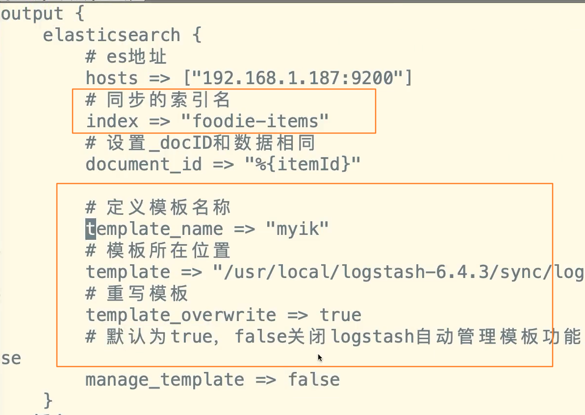

# springboot整合 Elasticsearch

引入依赖

==目前最新版本的es springboot启动器 对应的 es版本为  6.4.3   也就是说只能使用   6.4.3版本的es==

```xml
<dependency>
	<groupId>org.springframework.boot</groupId>
	<artifactId>spring-boot-starter-data-elasticsearch</artifactId>
	<version>2.3.7.RELEASE</version>
</dependency>
```

```yml
spring:
  data:
    elasticsearch:
	  cluster-name: es6
	  cluster-nodes: 192.168.1.187:9300
```


启动之后netty将会有一个报错

创建实体类

```java
@Document(indexName = "stu", type="_doc")
public class Stu{
	@Id
	private Long stuId;
	
	@Field(store = true)
	privete String name;
	
	@Field(store = true)
	private Integer age;
}
```

> 其中 @Id 注解，表示文档的 _id  会与 stuId一样， 如果没有该注解，则文档id会自动生成

## **创建索引**


可以指定es字段类型


## **删除**

    

==不建议使用ElasticsearchTemplate 对索引进行管理（创建索引，更新映射，删除索引）。==

索引就像是数据库或者数据库中的表，我们平时是不会是通过java代码频繁的去创建修改删除数据库或者表的。我们只会针对数据做CRUD的操作。
在es中也是同理，我们尽量使用ElasticsearchTemplate对文档数据做CRUD的操作

1.属性（FieldType)类型不灵活
2.主分片与副本分片数无法设置

## 更新

## 查询、分页


**分页搜索**


## 删除


## 高亮

```java
public List<Image> highLightQueryPlus(String search) {
        NativeSearchQueryBuilder queryBuilder = new NativeSearchQueryBuilder();

        NativeSearchQuery query = queryBuilder.withQuery(QueryBuilders.multiMatchQuery(search,"tag","description"))
                .withHighlightFields(new HighlightBuilder.Field("tag").preTags("<span style=\"color:red\">").postTags("</span>"),new HighlightBuilder.Field("description").preTags("<span style=\"color:red\">").postTags("</span>")).build();

        AggregatedPage<Image> images = elasticsearchTemplate.queryForPage(query, Image.class, new SearchResultMapper() {
            @Override
            public <T> AggregatedPage<T> mapResults(SearchResponse searchResponse, Class<T> aClass, Pageable pageable) {
                List<Image> imageTemp = new ArrayList<>();
                SearchHits hits = searchResponse.getHits();

                for (SearchHit hit : hits) {
                    if (hits.getHits().length <= 0) {
                        return null;
                    }

                    Image image = new Image();
                    image.setId(Integer.parseInt(hit.getId()));
                    image.setUrl(String.valueOf(hit.getSource().get("url")));
                    image.setDescription(String.valueOf(hit.getSource().get("description")));
                    image.setType(Integer.parseInt(String.valueOf(hit.getSource().get("type"))));
                    image.setTag(String.valueOf(hit.getSource().get("tag")));
                    setHighLight(hit,"tag",image);
                    setHighLight(hit,"description",image);
                    imageTemp.add(image);
                }
                return new AggregatedPageImpl<>((List<T>)imageTemp);
            }
        });


        List<Image> imagesContent = images.getContent();
        return imagesContent;
}


public void setHighLight(SearchHit searchHit, String field, Object object) {
        Map<String, HighlightField> highlightFieldMap = searchHit.getHighlightFields();
        HighlightField highlightField = highlightFieldMap.get(field);
        if (highlightField != null) {
            String highLightMessage = highlightField.fragments()[0].toString();
            String capitalize = StringUtils.capitalize(field);
            String methodName = "set"+capitalize;
            Class<?> clazz = object.getClass();
            try {
                Method setMethod = clazz.getMethod(methodName, String.class);
                setMethod.invoke(object, highLightMessage);

            } catch (Exception e) {
                e.printStackTrace();
            }

        }
    }
```


# LogStash

> - 数据采集
> - 以id或update_time作为同步边界
> - logstash-input-jdbc 插件 （低版本需要使用，目前已经集成）
> - 预先创建索引（索引的mapping，logstash会自动的创建）

在logstash解压目录，新建文件夹sync，在文件夹中创建配置文件   名称随意，以 conf结尾  例如    logstash-db-sync.conf， 同时将数据库驱动包，复制到该目录。


注意配置 

时间类型使用  timestamp  即使 数据库使用的是datetime

```json
input {
    jdbc {
        # 设置 MySql/MariaDB 数据库url以及数据库名称
        jdbc_connection_string => "jdbc:mysql://192.168.1.6:3306/foodie-shop-dev?useUnicode=true&characterEncoding=UTF-8&autoReconnect=true"
        # 用户名和密码
        jdbc_user => "root"
        jdbc_password => "root"
        # 数据库驱动所在位置，可以是绝对路径或者相对路径
        jdbc_driver_library => "/usr/local/logstash-6.4.3/sync/mysql-connector-java-5.1.41.jar"
        # 驱动类名
        jdbc_driver_class => "com.mysql.jdbc.Driver"
        # 开启分页
        jdbc_paging_enabled => "true"
        # 分页每页数量，可以自定义
        jdbc_page_size => "1000"
        # 执行的sql文件路径
        statement_filepath => "/usr/local/logstash-6.4.3/sync/foodie-items.sql"
        # 设置定时任务间隔  含义：分、时、天、月、年，全部为*默认含义为每分钟跑一次任务
        schedule => "* * * * *"
        # 索引类型
        type => "_doc"
        # 是否开启记录上次追踪的结果，也就是上次更新的时间，这个会记录到 last_run_metadata_path 的文件
        use_column_value => true
        # 记录上一次追踪的结果值
        last_run_metadata_path => "/usr/local/logstash-6.4.3/sync/track_time"
        # 如果 use_column_value 为true， 配置本参数，追踪的 column 名，可以是自增id或者时间
        tracking_column => "updated_time"
        # tracking_column 对应字段的类型
        tracking_column_type => "timestamp"
        # 是否清除 last_run_metadata_path 的记录，true则每次都从头开始查询所有的数据库记录
        clean_run => false
        # 数据库字段名称大写转小写
        lowercase_column_names => false
    }
}
output {
    elasticsearch {
        # es地址
        hosts => ["192.168.1.187:9200"]
        # 同步的索引名
        index => "foodie-items"
        # 设置_docID和数据相同
        document_id => "%{id}"
        # document_id => "%{itemId}"
    }
    # 日志输出
    stdout {
        codec => json_lines
    }
}
```


编写sql脚本  注意如果按时间作为边界值，需要在最后增加一个 查询条件   **:sql_last_value** 是一个变量用于记录同步的时间

select 查询字段中也需要update_time


启动


## logstash模板

查看es自带模板

```
GET _cat/templates
```

查看其中的logstash模板

```
GET _template/logstash
```

```json
{
  "logstash" : {
    "order" : 0,
    "version" : 60001,
    "index_patterns" : [
    #表示以logstash-开头的索引将会使用该模板
      "logstash-*"
    ],
    "settings" : {
      "index" : {
        "number_of_shards" : "1",
        "refresh_interval" : "5s"
      }
    },
    "mappings" : {
      "dynamic_templates" : [
        {
          "message_field" : {
            "path_match" : "message",
            "mapping" : {
              "norms" : false,
              "type" : "text"
            },
            "match_mapping_type" : "string"
          }
        },
        {
          "string_fields" : {
            "mapping" : {
              "norms" : false,
              "type" : "text",
              "fields" : {
                "keyword" : {
                  "ignore_above" : 256,
                  "type" : "keyword"
                }
              }
            },
            "match_mapping_type" : "string",
            "match" : "*"
          }
        }
      ],
      "properties" : {
        "@timestamp" : {
          "type" : "date"
        },
        "geoip" : {
          "dynamic" : true,
          "properties" : {
            "ip" : {
              "type" : "ip"
            },
            "latitude" : {
              "type" : "half_float"
            },
            "location" : {
              "type" : "geo_point"
            },
            "longitude" : {
              "type" : "half_float"
            }
          }
        },
        "@version" : {
          "type" : "keyword"
        }
      }
    },
    "aliases" : { }
  }
}
```

### 自定义模板，设置分词器

在前面创建的sync文件夹中创建文件   logstash-ik.json  名称随意

```json
{
    "order" : 0,
    "version" : 60001,
    "index_patterns" : [
      "*"
    ],
    "settings" : {
      "index" : {
        "number_of_shards" : "1",
        "refresh_interval" : "5s"
      }
    },
    "mappings" : {
      "dynamic_templates" : [
        {
          "message_field" : {
            "path_match" : "message",
            "mapping" : {
              "norms" : false,
              "type" : "text"
            },
            "match_mapping_type" : "string"
          }
        },
        {
          "string_fields" : {
            "mapping" : {
              "norms" : false,
              "type" : "text",
                /*分词器*/
               "analyzer":"ik_max_word",
              "fields" : {
                "keyword" : {
                  "ignore_above" : 256,
                  "type" : "keyword"
                }
              }
            },
            "match_mapping_type" : "string",
            "match" : "*"
          }
        }
      ],
      "properties" : {
        "@timestamp" : {
          "type" : "date"
        },
        "geoip" : {
          "dynamic" : true,
          "properties" : {
            "ip" : {
              "type" : "ip"
            },
            "latitude" : {
              "type" : "half_float"
            },
            "location" : {
              "type" : "geo_point"
            },
            "longitude" : {
              "type" : "half_float"
            }
          }
        },
        "@version" : {
          "type" : "keyword"
        }
      }
    },
    "aliases" : { }
}
```

修改前面设置的同步的配置文件   logstash-db-sync.conf

 在output中加入

```
#定义模板名称  随意
template_name=>"myikl"
#模板所在位置
template=>"/usr/local/logstash-6.4.3/sync/logstash-ik.json"
#重写模板，es默认是有模板的，需要重写
template_overwrite=>true
#默认为true，false关闭logstash自动管理模板功能，如果自定义模版则设置为false
manage_template => false
```

创建一个新索引， 重新设置一下需要同步的新索引



