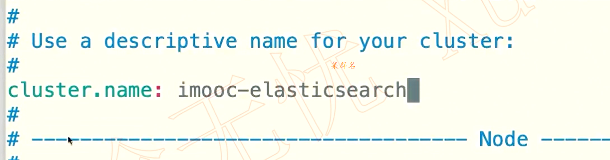

[TOC]

# **简介：**

**常用场景**

- 搜索类场景

  常见的搜索场景比如说电商网站、招聘网站、新闻资讯类网站、各种app内的搜索。

- 日志分析类

  场景经典的ELK组合（Elasticsearch/Logstash/Kibana），可以完成日志收集，日志存储，日志分析查询界面基本功能，目前该方案的实现很普及，大部分企业日志分析系统都是使用该方案。

- 数据预警平台及数据分析场景

  例如电商价格预警，在支持的电商平台设置价格预警，当优惠的价格低于某个值时，触发通知消息，通知用户购买。数据分析常见的比如分析电商平台销售量top 10的品牌，分析博客系统、头条网站top 10关注度、评论数、访问量的内容等等。

- 商业BI系统

  比大型零售超市，需要分析上一季度用户消费金额，年龄段，每天各时间段到店人数分布等信息，输出相应的报表数据，并预测下一季度的热卖商品，根据年龄段定向推荐适宜产品。Elasticsearch执行数据分析和挖掘，Kibana做数据可视化。

![(.assets/image-20200918191123136.png)


# 前期准备

## 安装与简单配置

> 我的CentOS启动 ES 真不容易啊，遇到了以下这些错误，都要一一解决：
>
> 1. seccomp unavailable 错误
>    解决方法：elasticsearch.yml 配置
>    bootstrap.memory_lock: false
>    bootstrap.system_call_filter: false
>
> 2. max file descriptors [4096] for elasticsearch process likely too low, increase to at least [65536]
>    解决方法：修改 /etc/security/limits.conf，配置：
>    hard nofile 80000
>    soft nofile 80000
>
> 3. max virtual memory areas vm.max_map_count [65530] is too low
>    解决方法：修改 /etc/sysctl.conf，添加 ：
>    vm.max_map_count = 262144
>    然后 sysctl -p 生效
>
> 4. the default discovery settings are unsuitable...., last least one of [....] must be configured
>    解决方法：elasticsearch.yml 开启配置：
>    node.name: node-1
>    cluster.initial_master_nodes: ["node-1"]
>
> 


**官网下载对应版本安装**

> 官网：https://www.elastic.co/downloads/elasticsearch

> es、kibana、logstash均可在华为云开源镜像站搜索下载，全版本，超快：
> https://mirrors.huaweicloud.com/
>
> 插件下载，以analysis-icu来说，需要离线下载安装：
> 下载地址（7.4.0版本）：
> https://artifacts.elastic.co/downloads/elasticsearch-plugins/analysis-icu/analysis-icu-7.4.0.zip
> 安装方法：
> unix：sudo bin/elasticsearch-plugin install file:///path/to/plugin.zip
> windows：bin\elasticsearch-plugin install file:///C:/path/to/plugin.zip

**目录结构**


**JVM配置**


**配置javahome**
Elasticsearch在7.0之后内置了jdk，但是如果你自己主机配置了环境变量javahome那么他默认走的就是你主机的jdk，此时如果主机的jdk版本过低将可能报错

```
D:\elasticsearch-7.9.1>bin\elasticsearch -E node.name=node1 -E cluster.name=geektime -E path.data=node1_data -d
future versions of Elasticsearch will require Java 11; your Java version from [D:\java\jdk1.8.0_91\jre] does not meet this requirement
future versions of Elasticsearch will require Java 11; your Java version from [D:\java\jdk1.8.0_91\jre] does not meet this requirement
Warning: with JDK 8 on Windows, Elasticsearch may be unable to derive correct
  ergonomic settings due to a JDK issue (JDK-8074459). Please use a newer
  version of Java.
Warning: MaxDirectMemorySize may have been miscalculated due to JDK-8074459.
  Please use a newer version of Java or set MaxDirectMemorySize explicitly.
```

解决方法：

windows：修改bin目录中的**elasticsearch-env.bat**文件，`在if "%JAVA_HOME%" == "" (...)` 上方添加

```bat
set JAVA_HOME="%ES_HOME%\jdk"
```


**启动elasticsearch**
进入安装目录


执行cmd命令

```bat
bin\elasticsearch
```

访问9200端口能看到对应页面


**配置文件设置**




- **jvm.options** 配置文件

  

  

**授权**

> root用户无法使用es，需要新建一个用户


**启动**
发现报错


这时候需要修改配置文件

```
vim /etc/security/limits.conf
```

在最后粘贴如下配置

```
soft nofile 65536 
hard nofile 131072 
soft nproc 2048 
hard nproc 4096
```

继续修改

```
vim /etc/sysctl.conf
```


**安装插件**

查看本机已安装插件

```
bin\elasticsearch-plugin list
```

安装一个分词插件

**windows**

```
bin\elasticsearch-plugin install analysis-icu
```

**linux**

进入容器

```
docker exec -it es72_01 /bin/bash  #es72_01 为容器名
```

安装插件

```
./bin/elasticsearch-plugin install https://github.com/medcl/elasticsearch-analysis-ik/releases/download/v7.2.0/elasticsearch-analysis-ik-7.2.0.zip    #其它版本替换版本号就行
```

或者

从git下载对应版本离线安装

```
https://github.com/medcl/elasticsearch-analysis-ik
```

**可通过浏览器查看安装插件的版本**

```http
http://localhost:9200/_cat/plugins
```

**如何在开发机上运行多个Elasticsearch实例**

```
bin\elasticsearch -E node.name=node1 -E cluster.name=geektime -E path.data=node1_data -d
bin\elasticsearch -E node.name=node2 -E cluster.name=geektime -E path.data=node2_data -d
bin\elasticsearch -E node.name=node3 -E cluster.name=geektime -E path.data=node3_data -d
```

==在windows上必须要使用多个cmd窗口分别执行==

**安装Kibana**

**什么是Kibana**

　　Kibana是一个针对Elasticsearch的开源分析及可视化平台，用来搜索、查看交互存储在Elasticsearch索引中的数据。使用Kibana，可以通过各种图表进行高级数据分析及展示。

　　Kibana让海量数据更容易理解。它操作简单，基于浏览器的用户界面可以快速创建仪表板（dashboard）实时显示Elasticsearch查询动态。

　　设置Kibana非常简单。无需编码或者额外的基础架构，几分钟内就可以完成Kibana安装并启动Elasticsearch索引监测。

**同上官网安装**

> 网址：https://www.elastic.co/downloads/kibana

使用：

```bash
// 启动 kibana
bin\kibana

// 查看插件
bin\kibana-plugin list
```

使用kibana需要先启动elasticsearch

访问localhost:5601/端口可以查看，在初始界面可以选择添加一些测试数据


可以查看添加数据的Dashboard


**插件**


 

**Dev Tools**


**在容器docker中运行**

安装docker和docker-compose

创建配置文件docker-compose.yml

```yaml

version: '3.7'    #这里的版本和你安装的docker-compose版本有关
services:
  cerebro:
    image: lmenezes/cerebro:0.8.3
    container_name: cerebro
    ports:
      - "9000:9000"
    command:
      - -Dhosts.0.host=http://elasticsearch:9200
    networks:
      - es72net
  kibana:
    image: docker.elastic.co/kibana/kibana:7.2.0   #这样相当于指定了下载的网址，会导致自己跟换的柜内镜像站不起作用，如果下载不了或者下载过慢，可以直接改为image: kibana:7.2.0
    container_name: kibana72
    environment:
      #- I18N_LOCALE=zh-CN
      - XPACK_GRAPH_ENABLED=true
      - TIMELION_ENABLED=true
      - XPACK_MONITORING_COLLECTION_ENABLED="true"
    ports:
      - "5601:5601"
    networks:
      - es72net
  elasticsearch:
    image: docker.elastic.co/elasticsearch/elasticsearch:7.2.0   #这里同样指定了下载地址，可以参照上面改为image: elasticsearch:7.2.0
    container_name: es72_01
    environment:
      - cluster.name=geektime
      - node.name=es72_01
      - bootstrap.memory_lock=true
      - "ES_JAVA_OPTS=-Xms512m -Xmx512m"
      - discovery.seed_hosts=es72_01,es72_02
      #- network.publish_host=elasticsearch    #7.2需要注释这一行，否则集群将启动不起来
      - cluster.initial_master_nodes=es72_01,es72_02
    ulimits:
      memlock:
        soft: -1
        hard: -1
    volumes:
      - es72data1:/usr/share/elasticsearch/data
    ports:
      - 9200:9200
    networks:
      - es72net
  elasticsearch2:
    image: docker.elastic.co/elasticsearch/elasticsearch:7.2.0
    container_name: es72_02
    environment:
      - cluster.name=geektime
      - node.name=es72_02
      - bootstrap.memory_lock=true
      - "ES_JAVA_OPTS=-Xms512m -Xmx512m"
      - discovery.seed_hosts=es72_01,es72_02
       #- network.publish_host=elasticsearch    #7.2需要注释这一行，否则集群将启动不起来
      - cluster.initial_master_nodes=es72_01,es72_02
    ulimits:
      memlock:
        soft: -1
        hard: -1
    volumes:
      - es72data2:/usr/share/elasticsearch/data
    networks:
      - es72net


volumes:
  es72data1:
    driver: local
  es72data2:
    driver: local

networks:
  es72net:
    driver: bridge
```

> 若访问Kibana提示没准备好，然后用docker ps -a发现挂了两个ES容器，用docker logs 容器名查看ES日志发现打印内存不足
> \> max virtual memory areas vm.max_map_count [65530] is too low, increase to at least [262144]
> 百度后看到有两种方式解决：
> \1. `sysctl -w vm.max_map_count=262144` # 一次性生效 重启将失效
> \2. 另一种就是 `echo 'vm.max_map_count=262144'>/etc/sysctl.conf & sysctl -p`
> Tips: 两种方式都需要使用root执行
> 处理完以后使用 `docker-compose down -v & docker-compose up` 重新启动docker，可能是机器性能问题，我启动后等了差不多一分钟才能成功登陆Kibana，好了，祝大家好运。

**安装Logstash，导入数据**

**windows**

官网下载安装

> 注意 在windows 中 第三行的path需要加[]
>
> sincedb_path => "NUL" 需要指定为null
>
> ==注意使用反斜杠   /==

logstash.conf

```
input {
  file {
    path => ["D:/logstash-7.9.1/bin/movies.csv]"
    start_position => "beginning"
    sincedb_path => "NUL"
  }
}
filter {
  csv {
    separator => ","
    columns => ["id","content","genre"]
  }

  mutate {
    split => { "genre" => "|" }
    remove_field => ["path", "host","@timestamp","message"]
  }

  mutate {

    split => ["content", "("]
    add_field => { "title" => "%{[content][0]}"}
    add_field => { "year" => "%{[content][1]}"}
  }

  mutate {
    convert => {
      "year" => "integer"
    }
    strip => ["title"]
    remove_field => ["path", "host","@timestamp","message","content"]
  }

}
output {
   elasticsearch {
     hosts => "http://localhost:9200"
     index => "movies"
     document_id => "%{id}"
   }
  stdout {}
}
```

在bin目录中启动

```shell
logstash -f logstash.conf
```

若发生报错

```
Logstash could not be started because there is already another instance usin
```

原因：之前运行的instance有缓冲，保存在path.data里面有.lock文件，删除掉就可以。
 解决办法：

- 在 logstash.yml 文件中找到 Data path 的路径(默认在安装目录的data目录下）
- 查看是否存在 .lock 文件，如果存在把它删除


**docker安装**

```
docker pull logstash:7.2.0
```

在服务器创建logstash.yml配置文件存放于/es/config文件夹

```yaml
http.host: "0.0.0.0"
xpack.monitoring.elasticsearch.url: ["es集群url"]
xpack.monitoring.enabled: true    # 收集监控数据
```

创建pipeline配置文件logstash.conf

==input一定要是绝对路径==

```yaml
input {
  file {
    path => "/usr/share/logstash/data/nfs/movies.csv"
    start_position => "beginning"
    sincedb_path => "/dev/null"
  }
}
filter {
  csv {
    separator => ","
    columns => ["id","content","genre"]
  }
  
  mutate {
    split => { "genre" => "|"}
    remove_field => ["path", "host", "@timestamp","message"]
  }

  mutate {
    split => ["content", "("]
    add_field => {"title" => "%{[content][0]}"}
    add_field => {"year" => "%{[content][1]}"}
  }

  mutate {
    convert => {
      "year" => "integer"
    }
    strip => ["title"]
    remove_field => ["path", "host", "@timestamp","message","content"]
  }
}

output {
  elasticsearch {
    hosts => ["192.168.75.133:9200"]
    index => "movies"
    document_id => "%{id}"
  }
  stdout {}
}

```

编写docker-compose文件

```yaml
version: '3.7'
services:
  logstash:
    image: logstash:7.2.0
    hostname: logstash
    container_name: logstash
    environment:
      - TZ="Asia/Shanghai"
      - "ES_JAVA_OPTS=-Xms512m -Xmx512m"
    volumes:
      - /es/config/logstash.yml
      - /es/config/logstash.conf:/usr/share/logstash/pipeline/logstash.conf
      - /root/nfs:/usr/share/logstash/data/nfs
    ports:
      - "5044:5044"
    networks:
      - esnet
networks:
  esnet:
```


## 基本概念

 

**字段Fields**

字段是ES中最小的独立单元数据，每一个字段有自己的数据类型（可以自己定义覆盖ES自动设置的数据类型），我们还可以对单个字段设置是否分析、分词器等等。

核心的数据类型有string、Numeric、DateDate、Boolean、Binary、Range等等，复杂类型有Object、Nested，详细的可以[参考官方的介绍](https://www.elastic.co/guide/en/elasticsearch/reference/current/mapping-types.html)

**文档Documents**

- Elasticsearch 是面向文档的，文档是所有可搜索数据的最小单位。
  - 日志文件中的日志项
  - MP3播放器里的一首歌/一篇PDF文档中的具体内容
- 文档会被序列化成JSON格式，保存在Elasticsearch中。
  - JSON对象由字段组成
  - 每个字段都有对应的字段类型（字符串/数值/布尔/日期/二进制/范围类型）
- 每个文档都有一个Unique ID
  - 你可以自己指定IDo或者通过Elasticsearch自动生成

**元数据**

**Document MetaData**

元数据，用于标注文档的相关信息

- _index：文档所在的索引名
- _type：文档所在的类型名
- _id：文档唯一id
- _uid：组合id，由_type和_id组成(6.X _type不再起作用，同_id一样)
- _source：文档的原始Json数据，可以从这里获取每个字段的内容
- _all：整合所有字段内容到该字段，默认禁用

**映射 mapping**

”Mapping is the process of defining how a document, and the fields it contains, are stored and indexed.“

也就是Mapping是定义文档和字段如何存储和索引，使用Mapping可以定义下面这些信息

- 哪些字段应该作为全文索引
- 哪些字段包括numbers, dates, geolocations.
- 时间类型的格式
- 定义规则控制动态增加字段的mapping

**索引 index** 

索引中存储具有相同结构的文档(Document)


==索引的不同语义==

 


**与关系型数据库的对比**


打开kibana查看索引


可以发现在前面导入的数据movies 状态为yellow, 原因如下


关于状态的说明

> 绿色——一切正常(集群功能齐全)
>
> 黄色——所有数据可用，但有些副本尚未分配(集群功能完全)
>
> 红色——有些数据由于某种原因不可用(集群部分功能)

其中：健康状态为yellow，因为es默认为每个index创建一个复本，而在我的机器中只启动了一个节点，无法为index创建复本，所以展示为yellow。同时，上面信息展示了它的主本（primary）和副本（replica）只有一个，文档的数量为零。

### 节点、分片、集群

**可用性与可拓展性**

- 高可用性
  - 服务可用性-允许有节点停止服务
  - 数据可用性-部分节点丢失，不会丢失数据
- 可扩展性
  - 请求量提升/数据的不断增长（将数据分布到所有节点上）

**分布式架构的好处**


**节点**


- 每个节点启动后，默认就是一个Master eligible节点
  - 可以设置node.master:false禁止
- Master-eligible节点可以参加选主流程，成为Master节点
- 当第一个节点启动时候，它会将自己选举成Master 节点
- 每个节点上都保存了集群的状态，只有Master节点才能修改集群的状态信息
  - 集群状态（Cluster State)，维护了一个集群中，必要的信息.
    - 所有的节点信息
    - 所有的索引和其相关的Mapping与Setting 信息
    - 分片的路由信息
  - 任意节点都能修改信息会导致数据的不一致性

假设当我们启动一个节点想加入已经存在的一个集群中时，可以在配置文件中配置改集群的名称，以及通信的`ip + port`，ES会自动通过“**单点传送**”的方式来自动发现集群并尝试加入这个集群。

各种节点类型


配置节点的类型


**分片**

每个分片都是一个Lucene索引实例，我们可以将其视作一个==独立的搜索引擎==，它能够对Elasticsearch集群中的数据子集进行索引并处理相关查询。

分片分为两种：**主分片（Primary Shard）、副本分片（Replica Shard）**

- 主分片：由于所有的数据都会在主分片中存储，所以==主分片决定了文档存储数量的上限==，但是一个索引的主分片数在创建时一旦指定，那么主分片的数量就不能改变，这是因为当索引一个文档时，它是通过其主键（默认）Hash到对应的主分片上（类似于RDBMS分库分表路由策略），所以我们一旦修改主分片数量，那么将无法定位到具体的主分片上。在mapping时我们可以设置`number_of_shards`值，最大值默认为1024。
- 副本分片：我们可以为一个主分片根据实际的硬件资源指定任意数量的副本分片，上边已经说过，每个分片都可以处理查询，所以我们可以==增加副本分片的资源（相应硬件资源提升）来提升系统的处理能力==。同样，在mapping时，可以通过`number_of_replicas`参数来设置每个主分片的副本分片数量

但是要注意，为了容错（节点主机宕机导致数据丢失），主分片和副本分片不能在同一个节点上，防止节点宕机导致部分数据丢失。


一个例子


对于分片的设定需要考虑


# 文档的基本操作

**CRUD**


**Create**

自动生成id


指定id  两种方法

 


 

**GET**


**Index**


**Update**

 


**Bulk API**

> rest 请求, 每次重新建立网络开销, 十分消耗性能, Bulk API 能在一次调用中, 对不同的索引进行操作, 提升性能

- 支持在一次API调用中，对不同的索引进行操作
- 支持四种类型操作
  -  Index
  -  Create
  - Update
  - Delete
- 可以再URI中指定Index,也可以在请求的Payload中进行
- 操作中单条操作失败，并不会影响其他操作
- 返回结果包括了每一条操作执行的结果

例如

```
POST _bulk
{ "index" : { "_index" : "test", "_id" : "1"}}
{ "field1" : "value1" }
{ "delete" : { "_index" : "test", "_id" : "2"}}
{ "create" : { "_index" : "test2", "_id" : "3"}}
{ "field1" : "value3"}
{ "update" : {"_id" : "1", "_index" : "test"}}
{ "doc" : {"field2" : "value2"}}
```


**批量读取 -mget**

>  批量操作可以减少网络连接所产生的开销


**批量查询   _msearch**
查询kibana 添加的自带的两个索引

```
POST kibana_sample_data_ecommerce/_msearch
{}
{"query" : {"match_all" : {}}, "size" : 1}
{"index" : "kibana_sample_data_flights"}
{"query" : {"match_all" : {}}, "size" : 2}
```

 

# 常用错误返回


# 倒排索引

   全文搜索过程根据关键词创建的索引叫倒排索引，顾名思义，建立正向关系“文本内容-关键词”叫正排索引，后续会介绍，倒排索引就是把原有关系倒过来，建立成“关键词-文本内容”的关系，这样的关系非常利于搜索。举个例子：

- 文本1：I have a friend who loves smile
- 文本2：I have a dream today

先进行英文分词，再建立倒排索引，得到一份简易的“关键词-文本”的映射关系如下：

| 关键词 | 文本编号 |
| ------ | -------- |
| I      | 1,2      |
| have   | 1,2      |
| a      | 1,2      |
| friend | 1        |
| who    | 1        |
| loves  | 1        |
| smile  | 1        |
| dream  | 2        |
| today  | 2        |

有了这个映射表，搜索"have"关键词时，立即就能返回id为1,2的两条记录，搜索today时，返回id为2的记录，这样的搜索性能非常高。当然Elasticsearch维护的倒排索引包含更多的信息，此处只是作简易的原理介绍。

> 转自https://juejin.im/post/6844903994054148110

简单的来说

**正排索引**  就是文档id到文档内容和单词的关联

**倒排索引**  就是单词到文档id的关系


Posting List 的一个例子

