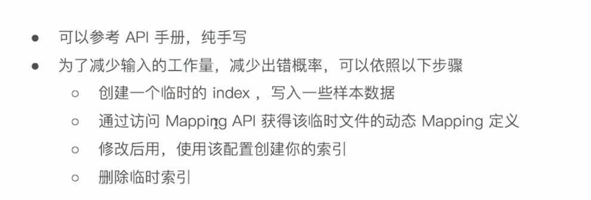

[TOC]

## Mapping

**简介**


**字段的数据类型**


**Dynamic Mapping**


- 类型的自动识别

  

例如


**能否更改Mapping的字段类型**


控制 Dynamic Mappings


例如


**自定义Mapping**

```
PUT testMapping
{
  "mappings": {
  }
}
```



- 控制当前字段是否能够被索引，默认为true，若设置为false，该字段不可被搜索

  


**倒排索引的级别**


**null_value**
如果需要对一个null的值进行搜索

只有keyword类型支持设定null_value


**copy_to设置**

> _all在7中已经被copy_to所替代，copy_to将字段的数值拷贝到目标字段，实现类似 _all的作用，copy_to的目标字段不出现在_  _source中

如下，可以通过fullName来搜索


**数组类型**

> 其实并不存在数组这种类型，不过字段可以存储多个相同类型的值


查看mapping 发现 类型仍然是test


## 多字段类型

> 对于原本text类型的字段，如果需要进行精确匹配，或者需要排序，则可以加一个keyword类型的字段变为多字段类型

主字段.子字段


对于需要排序的时候，需要  使用    **主字段.子字段**    

 和 Full Text (纯文本）

- Exact Values ：纯数字、日期、具体的一个字符串（例如：“Apple Store”)，一般没有必要分词

  ​	Elasticsearch中的keyWord

- 全文本：非结构化的文本数据

   	Elasticsearch中的text

例如


# Analysis与Analyzer

- Analysis-文本分析是把全文本转换一系列单词（term/token)的过程，也叫分词
- Analysis 是通过Analyzer来实现的
  o可使用Elasticsearch内置的分析器/或者按需定制化分析器
- 除了在数据写入时转换词条，匹配Query 语句时候也需要用相同的分析器对查询语句进行分析


**es内置的分词器**

- Standard Analyzer-默认分词器，按词切分，小写处理

  > 符号被过滤（数字会保留），停用词、数字不被过滤

- Simple Analyzer-按照非字母切分（符号被过滤），小写处理

  > 非单词被过滤

- Stop Analyzer-小写处理，停用词过滤(the,a,is)

  > 非单词被过滤

- Whitespace Analyzer    按照空格切分，不转小写

  > 符号数字都被保留

- Keyword Analyzer  不分词，直接将输入当作输出

- Patter Analyzer-正则表达式，默认\W+（安照非字符的符号分隔）、转小写

  > 符号被过滤（数字会保留）

- Language-提供了30多种常见语言的分词器

  **english**

  

  **中文**

  >     ·中文句子，切分成一个一个词（不是一个个字）·英文中，单词有自然的空格作为分隔·一句中文，在不同的上下文，有不通的理解			这个苹果，不大好吃/这个苹果，不大，好吃！

  **一些中文分词器**

  **ICU Analyzer**	需要安装plugin  `Elasticsearch-plugin install analysis-icu` 提供了Unicode的支持，更好的支持亚洲语言

  **IK**  支持自定义词库，支持热更新分词字典 https://github.com/medcl/elasticsearch-analysis-ik 

  > 使用方式
  >
  > - ik_max_word：会将文本做最细粒度的拆分， 比如会将“中华人民共和国国歌”拆分为"中华人民共和国， 中华人民， 中华， 华人， 人民
  >   共和国， 人民， 人， 民， 共和国， 共和， 和， 国国， 国歌"， 会穷尽各种可能的组合， 适合Term Query；
  > - ik_smart：会做最粗粒度的拆分， 比如会将"中华人民共和国国歌"拆分为“中华人民共和国， 国歌"， 适合Phrase查询。

  

  **THULAC**  THU Lexucal Analyzer for Chinese,清华大学自然语言处理和社会人文计算实验室的一套中文分词器 https://github.com/microbun/elasticsearch-thulac-plugin

- Customer Analyzer 自定义分词器

### 利用ik分词器实现自定义词库

`IKAnalyzer.cfg.xml` can be located at `{conf}/analysi-ik/config/IKAnalyzer.cfg.xml` or `{plugins}/elasticsearch-analysis-ik-*/config/IKAnalyzer.cfg.xml`

```XML
<?xml version="1.0" encoding="UTF-8"?>
<!DOCTYPE properties SYSTEM "http://java.sun.com/dtd/properties.dtd">
<properties>
	<comment>IK Analyzer 扩展配置</comment>
	<!--用户可以在这里配置自己的扩展字典 -->
	<entry key="ext_dict">custom/mydict.dic;custom/single_word_low_freq.dic</entry>
	 <!--用户可以在这里配置自己的扩展停止词字典-->
	<entry key="ext_stopwords">custom/ext_stopword.dic</entry>
 	<!--用户可以在这里配置远程扩展字典 -->
	<entry key="remote_ext_dict">location</entry>
 	<!--用户可以在这里配置远程扩展停止词字典-->
	<entry key="remote_ext_stopwords">http://xxx.com/xxx.dic</entry>
</properties>
```

例如：

# 配置自定义Analyzer

**当Elasticsearch 自带的分词器无法满足时，可以自定义分词器。通过自组合不同的组件实现**

- Character Filter Tokenizer Token Filter

- Character Filter 
- Tokenizer 
- Token Filter

### **Character Filter** 

> 在Tokenizer之前对文本进行处理，例如增加删除及替换字符。可以配置多个Character Filters。会影响Tokenizer的position和offset信息一些自带的Character Filters
>
> HTML strip-去除html标签
>
> Mapping-字符串替换
>
> Pattern replace-正则匹配替换

### **Tokenizer **

> 将原始的文本按照一定的规则，切分为词（term or token) 
>
> Elasticsearch 内置的Tokenizers ：
>
> whitespace/standard/uax url_email/pattern/keyword（不作处理） /path hierarchy （文件路径）
>
> 可以用Java开发插件，实现自己的Tokenizer

### **Token Filter**

> 将Tokenizer输出的单词（term)，进行增加，修改，删除 
>
> 自带的Token Filters 
>
> Lowercase（转小写）/stop（去除停用词）/synonym(添加近义词）

例如：

去除html标签


使用mapping 替换


Pattern replace 替换

> $1 表示匹配第一个小括号内的内容


lowercase stop

> ==注意filter有顺序==


自定义分词

```json
PUT my_index
{
  "settings": {
    "analysis": {
      "analyzer": {
        "my_custom_analyzer": {
          "type": "custom",
          "char_filter": [
            "emoticons"
          ],
          "tokenizer": "punctuation",
          "filter": [
            "lowercase",
            "english_stop"
          ]
        }
      },
      "char_filter": {
        "emoticons": {
          "type": "mapping",
          "mappings": [
            ":) => _happy_",
            ":( => _sad_"
          ]
        }
      },
      "tokenizer": {
        "punctuation": {
          "type": "pattern",
          "pattern": "[ .,!?]"
        }
      }, 
      "filter": {
        "english_stop": {
          "type": "stop",
          "stopwords":"english"
        }
      }
    }
  }
}
```

测试

```json
 POST my_index/_analyze
 {
   "analyzer": "my_custom_analyzer",
   "text": "english I'am a :) person, and you?"
 }
```


