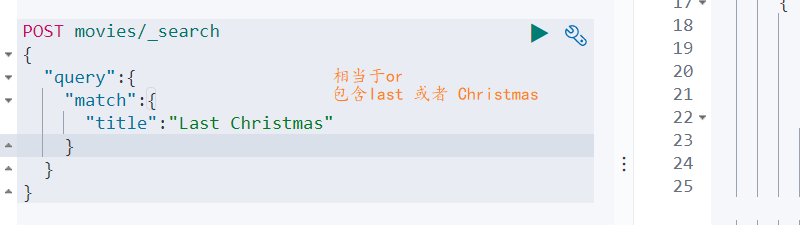
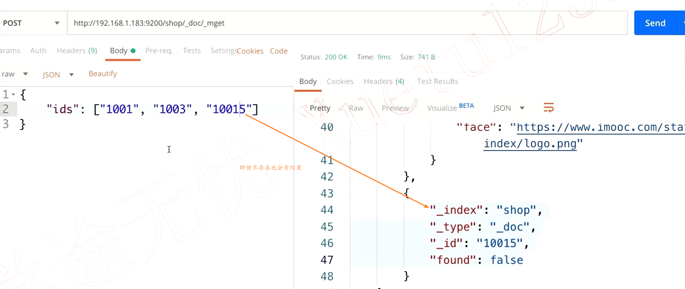

[TOC]


 

# Search API

分为两种

- URI Search 。在URL中使用查询参数 

   

-  Request Body Search 使用Elasticsearch提供的，基于JSON格式的更加完备的 Query Domain Specific Language(DSL)


**响应**


**match和term**


### 


## 相关性

**衡量相关性**

- Information Retrieve
  - Precision（查准率）-尽可能返回较少的无关文档
  - Recall（查全率） - 尽可能返回较多的相关文档


来看一幅图


## URL Search 详解

**通过url实现搜索**


**查询种类**

- 指定字段


- 泛查询

  


**term、phrase、bool**

- term query

  没有使用引号的单个查询

- phrase query

  使用引号，查询的对象必须都出现，并且顺序要一致

  

- bool query

  或者，title 中包含beautiful 或者 mind

  


- 通配符查询
  

- 正则表达式

- 模糊匹配与近似查询


>  title:"lord rings"~4 代表中间可以有最多可以有4个单词  例如
>
> 

## Request Body Search


**脚本字段**


**判断字段是否存在**


**匹配查询字段**


### **查询表达式 —Match 和 term**

> match会对需要搜索的词进行分词，然后再搜索
>
> term不会
>
> 比如使用match能搜索到该条记录‘，使用term则没有


**match**





还可以设置需要匹配的最小词的数量，**注意：使用百分比的时候向下取整**


**还以使用数组**


**根据id查找**

 


**在多个列中进行查询**


**match_phrase**

> 都包含，且按照顺序


> 中间可以多几个单词


先分词再搜索，结果中需要包含每个词，并且词语的顺序需要一致


> 默认的时候 match 使用的是or，表示对于分词的结果只要匹配到一个就能够查询出来，也可以手动指定。


### 权重

> 对于多个列的搜索，会有一种竞争的关系（哪一个结果排在前面）。可以对字段设置权重来提升它的位置。用户在对商品进行搜索的时候，肯定需要商品名称的权重更高，而简介可以低一些

没有设置权重的时候，nickname排的位置较为靠后，分数较低


提升nickname的权重


### bool查询

- must,   must 数组中可以存放多个条件，查询结果每个条件都要满足

  

- should，条件列表只要满足一个就行了

- must_not 所有条件都不满足的

加权

 

### **分页**  

es默认会进行分页，也可以指定分页


#### 深度分页


==当搜索的深度过深的时候将会报一个错==


由此可见，在前端分页的时候需要对页码进行一定的控制，保证不会超过范围


==如何拿到   9999-10009 条数据呢==

查看设置。如果没设置过 这个参数可能不会显示

 


进行修改


### 过滤


> 过滤只会对搜索结果过滤,不会计算文档相关性,相对于直接搜索来说,效率更高

### 排序

```java
{
    "query": {
        "match": {
            "desc": "天气真好"
        }
    }
    “sort": [
    	{
    		"age": "desc"
		},
		{
            "money": "asc" 
        }
    ]
}
```

对类型为text的字段排序会报错，因为text会进行分词，如果es要进行排序将会很杂乱，对keyword的类型排序则没有问题。如果非要对text进行排序，则可以加一个keyword的多字段类型


### 游标查询（滚动搜索）

### 批量操作

**查询**




#### bulk

 

### 高亮显示

默认会对需要高亮的增加一个   <em><em>    标签，  


**如果  前端不是通过对em设置高亮属性， 也可以自定义标签   **


## Query String & Simple Query String

>  term 之间的关系默认为or，但是可以指定Operator

- Query String

> 此处的and相当于+，能够正常使用


- Simple Query String

  

> 会将and当成一个字符串来处理


## 乐观锁


> __primary_term：_ primary_term也和_seq_no一样是一个整数，每当Primary Shard发生重新分配时，比如重启，Primary选举等，_primary_term会递增1。
>
> __primary_term主要是用来恢复数据时处理当多个文档的_seq_no一样时的冲突，比如当一个shard宕机了，raplica需要用到最新的数据，就会根据_primary_term和_seq_no这两个值来拿到最新的document


**使用者两个参数即可完成版本控制**


将if_seq_no 改为2 执行成功

