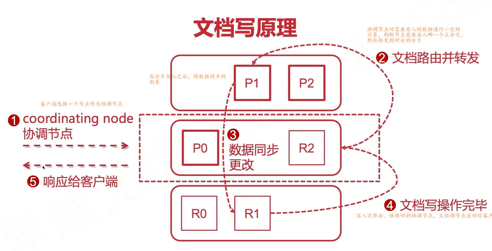
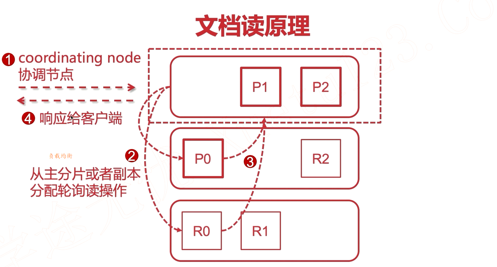

# 脑裂

> 由于某些节点的失效，部分节点的网络连接会断开，并形成一个与原集群一样名字的集群，这种情况成为集群脑裂（split-brain）现象。这个问题非常危险，因为两个新形成的集群会同时索引和修改集群的数据。

## 减缓脑裂的发生

设置discovery.zen.minimum_master_nodes（ 默认是 1） 

这个参数控制的是， 一个节点需要成为主节点，所需要获得投票的数量，。 官方的推荐值是(N/2)+1， 其中 N 是具有 master 资格的节点的数量

## **如果发生了脑裂， 如何解决?**

　　当脑裂发生后， 唯一的修复办法是解决这个问题并重启集群。 这儿有点复杂和可怕。 当elasticsearch 集群启动时， 会选出一个主节点（ 一般是启动的第一个节点被选为主） 。 由于索引的两份拷贝已经不一样了， elasticsearch 会认为选出来的主保留的分片是“主拷贝”并将这份拷贝推送给集群中的其他节点。 这很严重。 让我们设想下你是用的是 node 客户端并且一个节点保留了索引中的正确数据。 但如果是另外的一个节点先启动并被选为主， 它会将一份过期的索引数据推送给另一个节点， 覆盖它， 导致丢失了有效数据。

**最好的解决方式是：**

 第一个建议是给所有数据重新索引。

第二， 如果脑裂发生了， 要十分小心的重启你的集群。 停掉所有节点并决定哪一个节点第一个启动。 如果需要， 单独启动每个节点并分析它保存的数据。 如果不是有效的， 关掉它， 并删除它数据目录的内容（ 删前先做个备份） 。 如果你找到了你想要保存数据的节点， 启动它并且检查日志确保它被选为主节点。 这之后你可以安全的启动你集群里的其他节点了。

#  

# 文档的读写原理

**写入操作**

**读操作**

