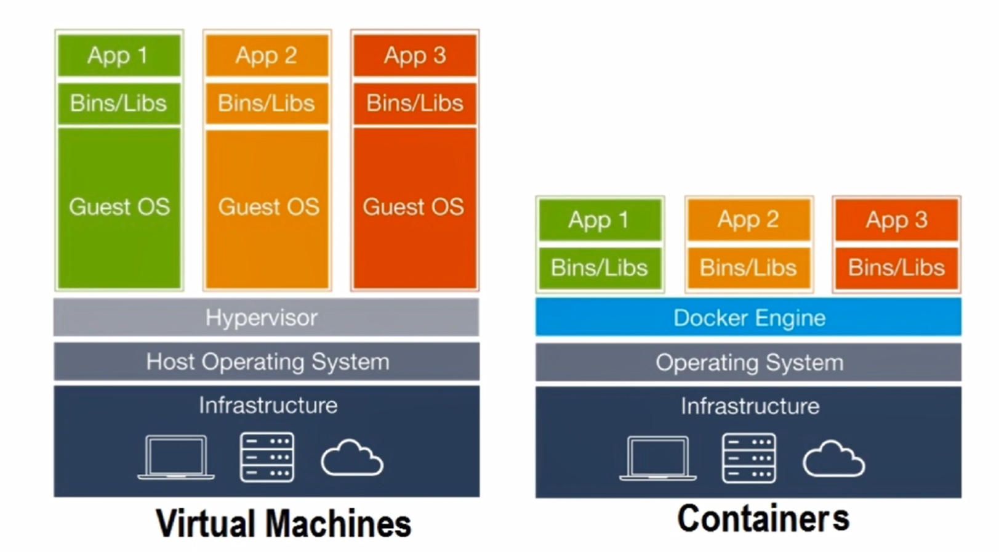

[TOC]

# 简介

## 什么是docker



## docker的目标

docker的主要目标是"Build,Ship and Run any App,Angwhere",构建，运输，处处运行

- **构建：**做一个docker镜像
- **运输：**docker pull
- **运行：**启动一个容器

每一个容器，他都有自己的文件系统rootfs.


# 使用

## 阿里镜像加速

```bash
sudo mkdir -p /etc/docker
sudo tee /etc/docker/daemon.json <<-'EOF'
{
  "registry-mirrors": ["https://0hook38l.mirror.aliyuncs.com"]
}
EOF
sudo systemctl daemon-reload
sudo systemctl restart docker
```

## 常用命令

**构建镜像**

```
docker build -t digital:3.1 .
```

端口映射

使用：docker run --name container-name:tag -d -p 服务器端口:Docker 端口 image-name

1.--name：自定义容器名，不指定时，docker 会自动生成一个名称

2.-d：表示后台运行容器

3.image-name：指定运行的镜像名称以及 Tag

4.-p 表示进行服务器与 Docker 容器的端口映射，默认情况下容器中镜像占用的端口是 Docker 容器中的端口与外界是隔绝的，必须进行端口映射才能访问

例如

```
docker run --name digital -d -p 7070:7070 digital:3.1
```

**导出镜像**

```
docker image save centos > docker-centos.tar.gz
```

**导入镜像**

```
docker image load -i docker-centos.tar.gz
```

**查看镜像详细信息**

```
docker image inspect centos
```

**删除镜像**

```
docker image rm centos:latest
```

**进入容器**

```
docker run -it #参数：-it 可交互终端
docker run -it nginx:latest  /bin/bash
```

**退出容器**

```
ctrl+p & ctrl+q
```

**查看容器详细信息  或者 ip**

```
docker  inspect  容器名称/id
```

```bash
#启动
docker-compose up

#停止容器
docker-compose down

#停止容器并且移除数据
docker-compose down -v

#一些docker 命令
docker ps
docker stop Name/ContainerId
docker start Name/ContainerId

#删除单个容器
$docker rm Name/ID
-f, –force=false; -l, –link=false Remove the specified link and not the underlying container; -v, –volumes=false Remove the volumes associated to the container

#删除所有容器
$docker rm `docker ps -a -q`  
停止、启动、杀死、重启一个容器
$docker stop Name/ID  
$docker start Name/ID  
$docker kill Name/ID  
$docker restart name/ID
```

