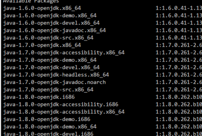

[TOC]

## 安装java

### yum方式

查看所有java版本

`yum -y list java`



==注意安装带有devel的版本，不带devel的只装jre==

`yum install java-1.8.0-openjdk-devel.x86_64`

完成安装后验证

`java -version`

### 官网下载jdk

创建目录

在/usr/目录下创建java目录，

```bash
mkdir /usr/local/java
cd /usr/local/java
```


把下载的文件 jdk-8u151-linux-x64.tar.gz 放在/usr/local/java/目录下。

`tar -zxvf jdk-8u151-linux-x64.tar.gz`

设置环境变量

 `vi /etc/profile`

在 profile 文件中添加如下内容并保存：

```bash
JAVA_HOME=/usr/local/java/jdk1.8.0_151        
JRE_HOME=/usr/local/java/jdk1.8.0_151/jre     
CLASS_PATH=.:$JAVA_HOME/lib/dt.jar:$JAVA_HOME/lib/tools.jar:$JRE_HOME/lib
PATH=$PATH:$JAVA_HOME/bin:$JRE_HOME/bin
```


注意：其中 JAVA_HOME， JRE_HOME 请根据自己的实际安装路径及 JDK 版本配置。

让修改生效：

`source /etc/profile`

测试
java -version


## 安装maven

### 下载安装包上传到/usr/local

解压

`tar -zxvf apache-maven-3.6.1-bin.tar.gz`

配置环境变量

`vi /etc/profile`

```bash
export MAVEN_HOME=/usr/local/apache-maven-3.6.1
export PATH=$MAVEN_HOME/bin:$PATH 
```

刷新环境变量 

`source /etc/profile`

**检查版本**

`mvn -v`