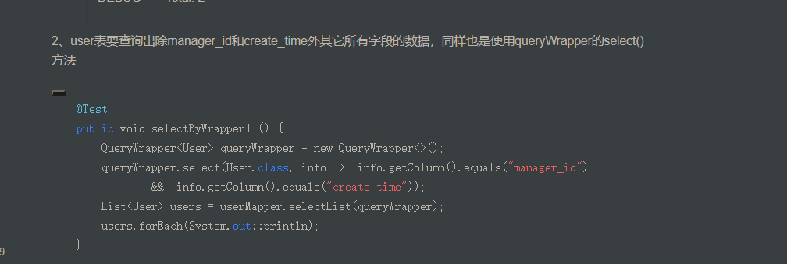

[TOC]

# MybatisPlus

### 使用 Wrapper 自定义SQL

> 需求来源:
>
> 在使用了`mybatis-plus`之后, 自定义SQL的同时也想使用`Wrapper`的便利应该怎么办？ 在`mybatis-plus`版本`3.0.7`得到了完美解决 版本需要大于或等于`3.0.7`, 以下两种方案取其一即可

Service.java

```java
mysqlMapper.getAll(Wrappers.<MysqlData>lambdaQuery().eq(MysqlData::getGroup, 1));
```

- 方案一 注解方式 Mapper.java

```java
@Select("select * from mysql_data ${ew.customSqlSegment}")
List<MysqlData> getAll(@Param(Constants.WRAPPER) Wrapper wrapper);
```

- 方案二 XML形式 Mapper.xml

```xml
<select id="getAll" resultType="MysqlData">
	SELECT * FROM mysql_data ${ew.customSqlSegment}
</select>
```

```java
List<BsProject> bsProjectList = bsProjectMapper.selectList(Wrappers.<BsProject>lambdaQuery().eq(BsProject::getProjectName, projectName).ne(BsProject::getId, id));

```



## 常用方法

```java
mybatis-plus 一些通用方法
insert相关

boolean insert(T entity); //插入

boolean insertSelective(T entity); //选择性插入，null字段不插入

boolean insertBatch(List<T> entityList); //批量插入

delete相关

boolean deleteById(I id); //通过ID删除

boolean deleteByMap(Map<String, Object> columnMap); // 通过自定义MAP删除

boolean deleteSelective(T entity); //通过entity实体选择性删除，null字段不作为条件

boolean deleteBatchIds(List<I> idList); //批量删除

update相关

boolean updateById(T entity); //通过实体的ID更新，

boolean updateSelectiveById(T entity); //通过ID选择性更新，null字段不更新

boolean update(T entity, T whereEntity); //通过whereEntity实体构造where条件进行更新

boolean updateSelective(T entity, T whereEntity); //通过whereEntity实体构造where条件进行选择性更新

boolean updateBatchById(List<T> entityList); //批量更新

select相关

T selectById(I id); //通过ID查询

List<T> selectBatchIds(List<I> idList); //通过ID集合批量查询

List<T> selectByMap(Map<String, Object> columnMap); //通过自定义MAP查询

T selectOne(T entity); //通过实体entity查询

int selectCount(T entity); //统计查询

List<T> selectList(EntityWrapper<T> entityWrapper); //List查询，entityWrapper为查询条件构造器

Page<T> selectPage(Page<T> page, EntityWrapper<T> entityWrapper); //分页查询，page为分页实体，entityWrapper为查询条件构造器

// 分页查询 10 条姓名为‘张三’的用户记录
 List<User> userList = userMapper.selectPage( new Page<User>(1, 10), new EntityWrapper<User>().eq("name", "张三") );

【
// 分页查询 10 条姓名为‘张三’、性别为男，且年龄在18至50之间的用户记录
List<User> userList = userMapper.selectPage(
        new Page<User>(1, 10),
        new EntityWrapper<User>().eq("name", "张三")
                .eq("sex", 0)
                .between("age", "18", "50")
);
等价于
SELECT *
FROM sys_user
WHERE (name='张三' AND sex=0 AND age BETWEEN '18' AND '50') .eq等同于where条件
LIMIT 0,10
】
new Query<>(params) params(1，5) 第2页，五行记录  limit 0,5


 umsMemberMapper.update(umr, new EntityWrapper<UmsMember>().eq("mobile", mobile)); 将手机号=mobile的数据库内容修改为umr里的实体（将umr放到数据库） 
```


​			

