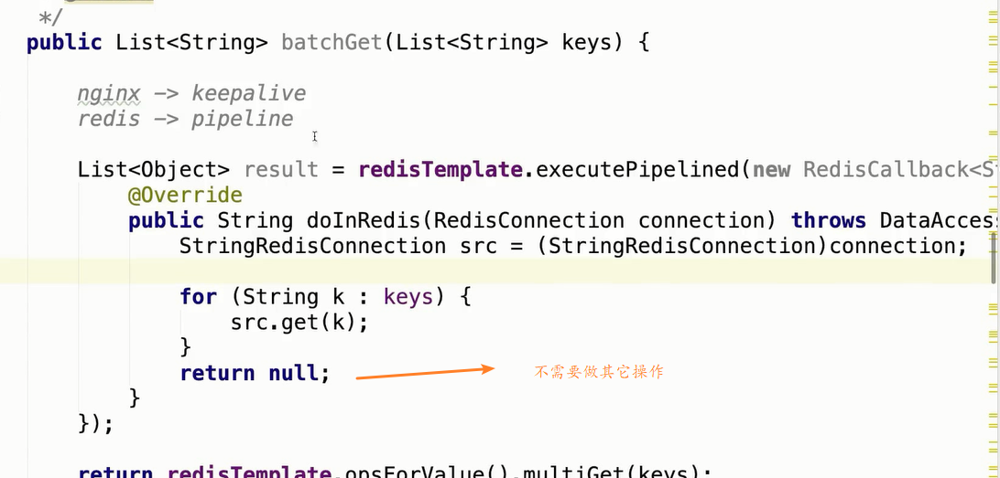

**运行redis**

```
redis-server redis.windows.conf
```

**将redis注册为服务**

```bash
redis‐server ‐‐service‐install redis.windows‐service.conf ‐‐loglevel verbose
```

**常用的redis服务命令如下：** 

进入redis安装目录： 

卸载服务：redis-server.exe --service-uninstall 

开启服务：redis-server.exe --service-start 

停止服务：redis-server.exe --service-stop

```
docker run -d --privileged=true -p 6379:6379 --restart always -v /home/redis/conf/redis.conf:/etc/redis/redis.conf -v /home/redis/data:/data --name myredis redis redis-server /etc/redis/redis.conf --appendonly yes
```


**redis管道操作**




