## Eureka入门案例

### 基本术语

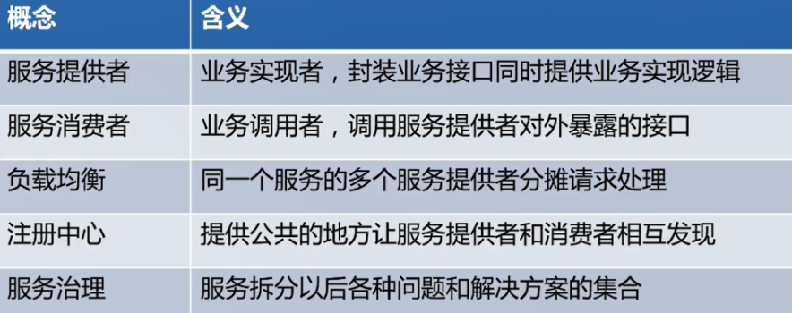

### 原理图

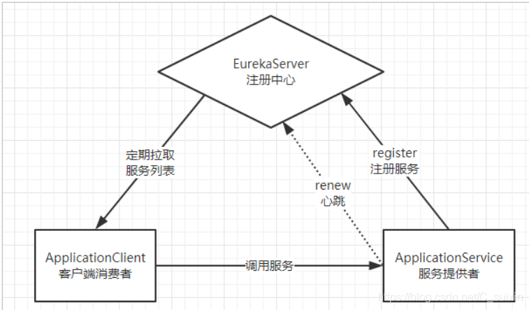

### **使用**

创建子工程eureka
添加eureka依赖

```
<dependencies>
            <!-- Eureka服务端 -->
            <dependency>
                <groupId>org.springframework.cloud</groupId>
                <artifactId>spring-cloud-starter-netflix-eureka-server</artifactId>
            </dependency>
    </dependencies>
```
配置yml

```yaml
server:
  port: 10086 # 端口
spring:
  application:
    name: eureka-server # 应用名称，会在Eureka中显示
eureka:
  client:
    register-with-eureka: false # 是否注册自己的信息到EurekaServer，默认是true （这里因为自己本身就是注册中心，不需要将自己注册，所以设为false）
    fetch-registry: false # 是否拉取其它服务的信息，默认是true
    service-url: # EurekaServer的地址，现在是自己的地址，如果是集群，需要加上其它Server的地址。
      defaultZone: http://127.0.0.1:${server.port}/eureka
  server:
  	#自我保护模式，默认开启，开发中可以关闭
    enable-self-preservation: false
```
在启动类中添加注解

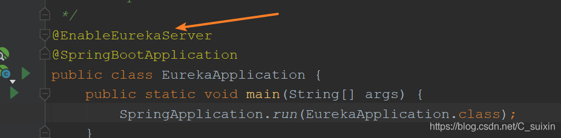

配置eureka的client
在需要使用eureka的服务提供者或服务消费者中添加依赖

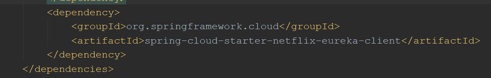

配置yml（通过查看源码可以得知，url以map的形式存储，key默认为defaultZone），注意url最后一定要加eureka

```yaml
server:
  port: 8080
spring:
  application:
    name: consumer-server
eureka:
  client:
    service-url:
      defaultZone: http://127.0.0.1:10086/eureka
```
在启动类中添加注解

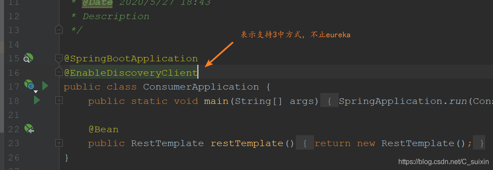

启动服务

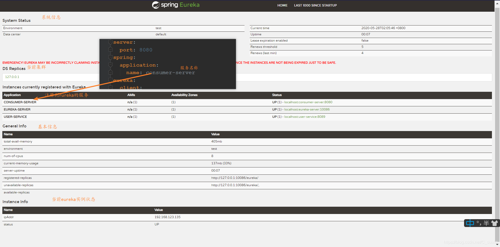

### 在命令行直接启动eureka服务（这样就不用使用ideal启动了）

  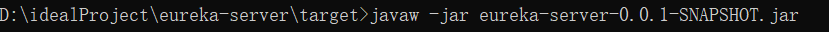

**javaw**  为后台启动，  也可以使用java命令

### 高可用

多个eureka相互注册形成集群

```yaml
server:
  port: 10086 # 端口
spring:
  application:
    name: eureka-server # 应用名称，会在Eureka中显示
eureka:
  client:
    service-url: # 配置其他Eureka服务的地址，而不是自己，比如10087
      defaultZone: http://127.0.0.1:10087/eureka
```
可以向多个eureka注册 **相互注册的eureka服务之间能够同步**

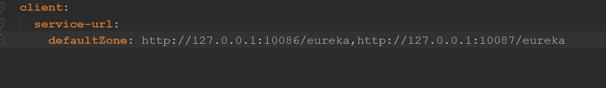

==多个eurekaServer中的服务可以同步==  

### **服务注册发现**

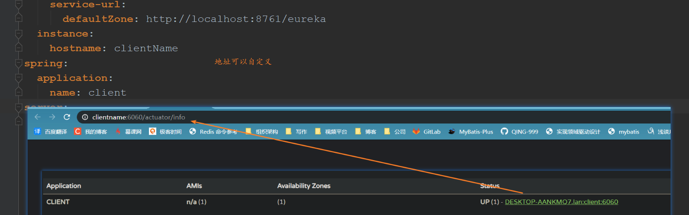

#### 心跳周期

在开发时可以将数据调小

```yaml
eureka:
  instance:
    lease-expiration-duration-in-seconds: 90  #服务失效时间，默认值90秒
    lease-renewal-interval-in-seconds: 30	#服务续约(renew)的间隔，默认为30秒
```

#### 拉取周期

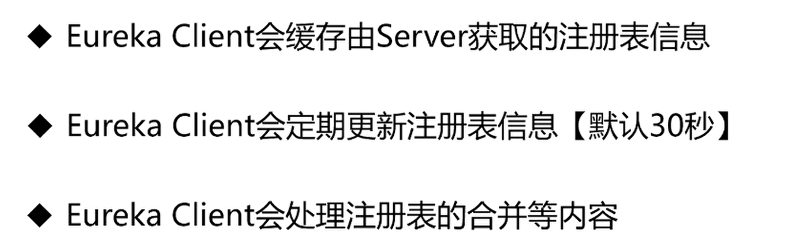

```yaml
eureka:
  client:
    registry-fetch-interval-seconds: 5 	#默认为30，在开发时可以相应调小
```

#### 下线

**异常退出不会发送命令**

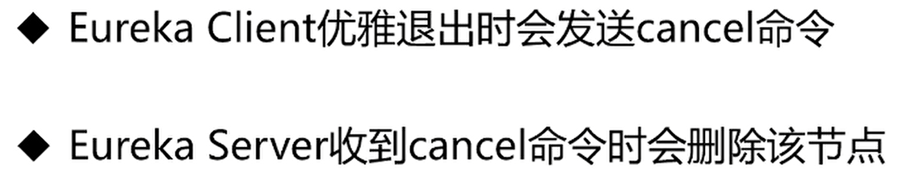

#### 失效剔除

有些时候，我们的服务提供方并不一定会正常下线，可能因为内存溢出、网络故障等原因导致服务无法正常工作。Eureka Server需要将这样的服务剔除出服务列表。因此它会开启一个定时任务，每隔60秒对所有失效的服务（超过90秒未响应）进行剔除。

#### 自我保护

我们关停一个服务，就会在Eureka面板看到一条警告：
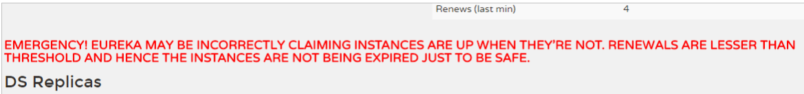
这是触发了Eureka的自我保护机制。当一个服务未按时进行心跳续约时，Eureka会统计最近15分钟心跳失败的服务实例的比例是否超过了85%。在生产环境下，因为网络延迟等原因，心跳失败实例的比例很有可能超标，但是此时就把服务剔除列表并不妥当，因为服务可能没有宕机。Eureka就会把当前实例的注册信息保护起来，不予剔除。生产环境下这很有效，保证了大多数服务依然可用。
但是这给我们的开发带来了麻烦， 因此开发阶段我们都会关闭自我保护模式：

```yaml
eureka:
  server:
    enable-self-preservation: false # 关闭自我保护模式（缺省为打开）
    eviction-interval-timer-in-ms: 1000 # 扫描失效服务的间隔时间，开发时可以调小（缺省为60*1000ms）
```

### 负载均衡ribbon

- ServerList           获取所有可用服务列表

- ServerListFilter      过滤一部分地址

- IRule          在剩下的地址中通过规则选择一个实例作为最终目标


**使用**

添加依赖

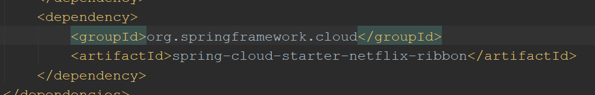

方法一：添加注解

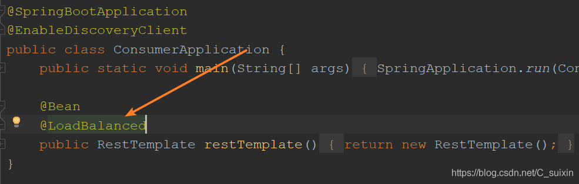

修改调用方式，直接使用服务名称调用

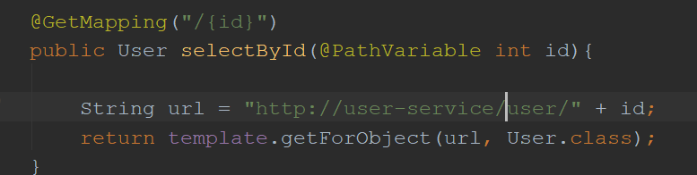

方法二：

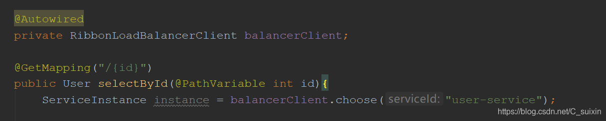

配置，默认为轮循方式

```yaml
user-service:   #user-service 为应用名
  ribbon:
    NFLoadBalancerRuleClassName: com.netflix.loadbalancer.RandomRule  #随机
```

# 多注册中心比较

**CAP理论**

> CAP原则又称CAP定理，指的是在一个[分布式系统](https://baike.baidu.com/item/分布式系统/4905336)中， Consistency（一致性）、 Availability（可用性）、Partition tolerance（分区容错性），三者不可得兼。
>
> - 一致性（C）：在[分布式系统](https://baike.baidu.com/item/分布式系统/4905336)中的所有数据备份，在同一时刻是否同样的值。（等同于所有节点访问同一份最新的数据副本）
>
> - 可用性（A）：保证每个请求不管成功或者失败都有响应。
>
> - 分区容错性（P）：系统中任意信息的丢失或失败不会影响系统的继续运作。 [1] 
>
> CAP原则的精髓就是要么AP，要么CP，要么AC，但是不存在CAP。如果在某个分布式系统中数据无副本， 那么系统必然满足强一致性条件， 因为只有独一数据，不会出现数据不一致的情况，此时C和P两要素具备，但是如果系统发生了网络分区状况或者宕机，必然导致某些数据不可以访问，此时可用性条件就不能被满足，即在此情况下获得了CP系统，但是CAP不可同时满足

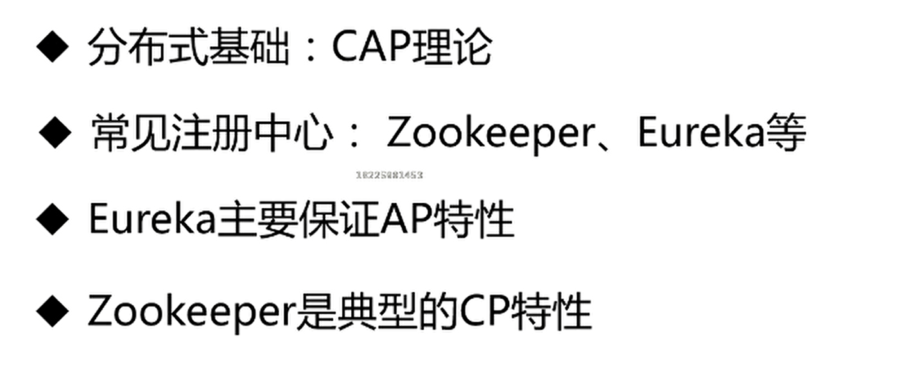

