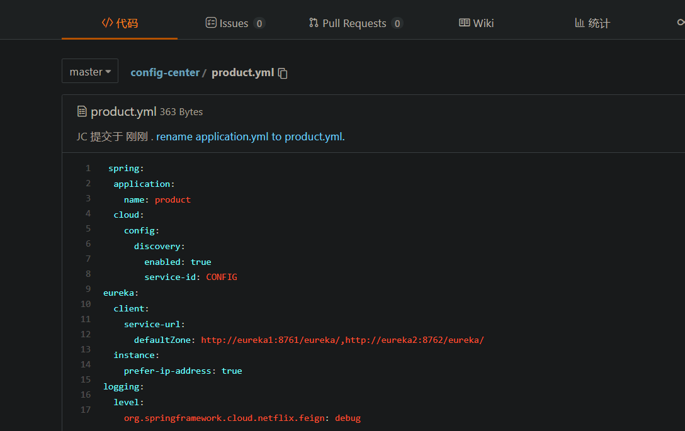
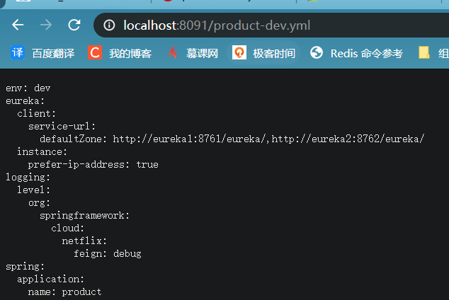

# 为什么要用统一配置中心

**不使用配置中心**

- 方便维护
- 配置内容安全与权限
- 更新配置项目需重启

# 使用

## Config Service

**新建项目Config-Server**

**添加依赖**

```xml
<dependency>
    <groupId>org.springframework.cloud</groupId>
    <artifactId>spring-cloud-config-server</artifactId>
</dependency>
```

**创建一个远程仓库,将需要管理的配置文件加入仓库,例如**



项目会将远端的配置文件拉到本地的git仓库,可以==配置存放地址==，注意不要直接使用项目的路径，防止代码被git清空


如果没有配置则可以在日志中查看


Config-Server的配置文件

```yaml
spring:
  application:
    name: config
  cloud:
    config:
      server:
        git:
          uri: https://gitee.com/JC777/config-center.git
          username: 1578340873@qq.com
          password: Jc1117..
```

访问

==注意配置文件必须要  加 -XXX  比如配置文件为order.xml.  则在网页访问时,需要使用 order-a.xml  或者order-b.xml 等==


### 配置文件的命名规则

/{name}-{profiles}.yml
/{label}/{name}-{profiles}.yml

**name**   服务名

**profiles** 环境

**label**  git分支名(branch) 默认为master分支


**环境配置  profiles**

修改仓库中的配置文件


再新建一个配置文件   product-test.yml


访问




## Config Client

**引入依赖**

```xml
<dependency>
    <groupId>org.springframework.cloud</groupId>
    <artifactId>spring-cloud-config-client</artifactId>
</dependency>
```

**配置文件**

```yaml
spring:
  application:
    name: product
  cloud:
    config:
      discovery:
        service-id: config
        enabled: true
      profile: dev
```

这里需要注意，配置文件的名字需要改为bootstrap.yml ，因为需要让它最先加载，这样才不会出现数据库配置等错误。因为数据库配置等信息在仓库中，需要先拉取才能获取连接信息

### 高可用

统一配置中心同样有高可用，只需要启动多个实例即可

### 注意

- 如果eureka的地址不是默认的8761，则需要在bootstrap.yml中配置eureka的地址，如果没有配置则讲无法获取配置文件。（在仓库中的yml中配置的eureka地址不起作用，因为一个顺序问题，没有eureka就找不到配置中心的服务，也就无法获取仓库中的配置文件）。没有配置地址时，默认为


- 配置中心会将配置合并，比如，访问http://localhost:8091/order-test.yml，获取product-dev的配置文件会将 order-test和order 的配置文件合并

  

  解决方法：只将所有配置文件公共的配置存放于order.yml

  

# SpringCloud Bus  自动刷新配置

> 使用springcloudbus  来操作消息队列，当仓库中的配置文件更新后，会在configserver和configclient之间传递信息


接口由远端仓库进行调用。使用webhook


**依赖**


