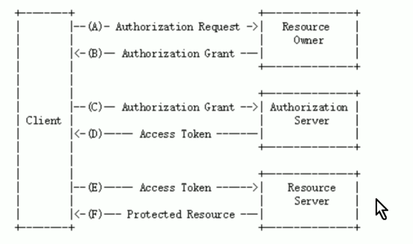
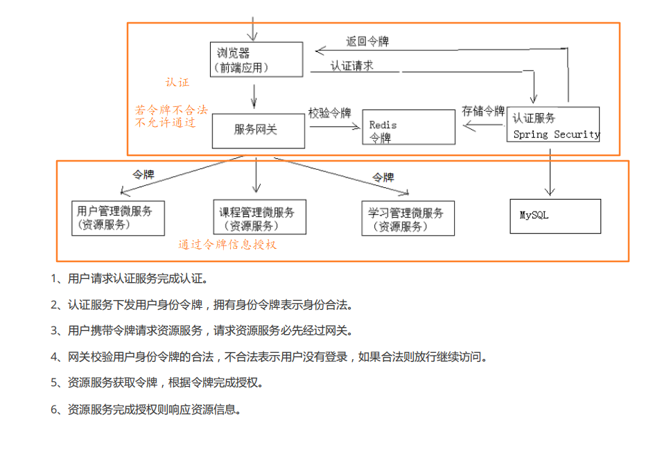

# OAuth2

**kOauth2包括以下角色：**

- 客户端

   本身不存储资源，需要通过资源拥有者的授权去请求资源服务器的资源，比如：学成在线Android客户端、学成在线Web客户端（浏览器端）、微信客户端等。

- 资源拥有者

  通常为用户，也可是应用程序，即该资源的拥有者。

- 授权服务器（也称认证服务器）

  用来对资源拥有的身份进行认证、对访问资源进行授权。客户端要想访问资源需要通过认证服务器由资源拥有者授权后方可访问。

- 资源服务器

  存储资源的服务器比如，学成网用户管理服务器存储了学成网的用户信息，学成网学习服务器存储了学生的学习信息，微信的资源服务存储了微信的用户信息等。客户端最终访问资源服务器获取资源信息。

**认证流程**

