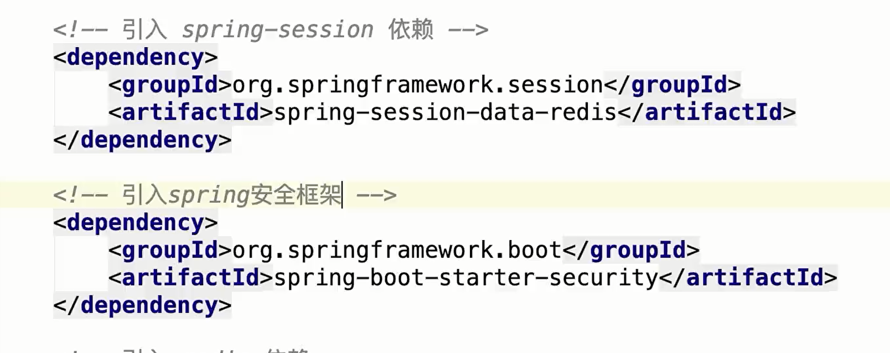
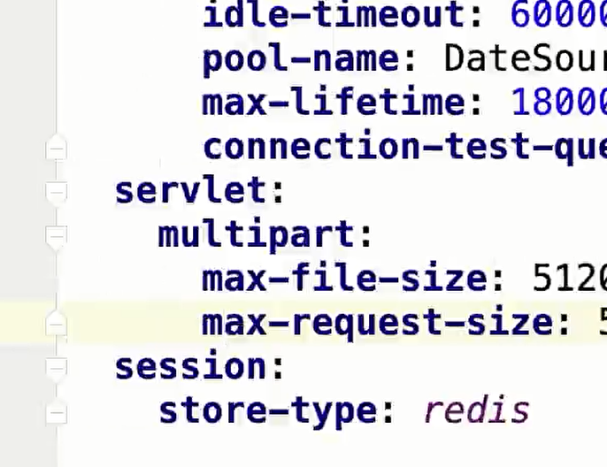
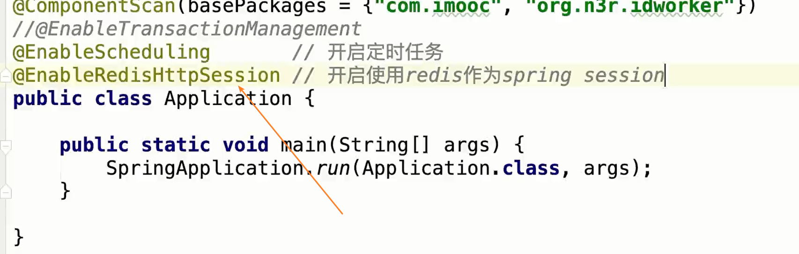
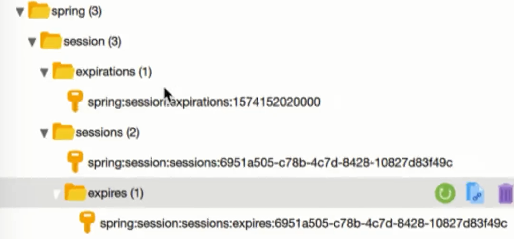
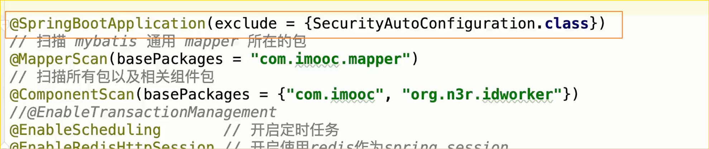
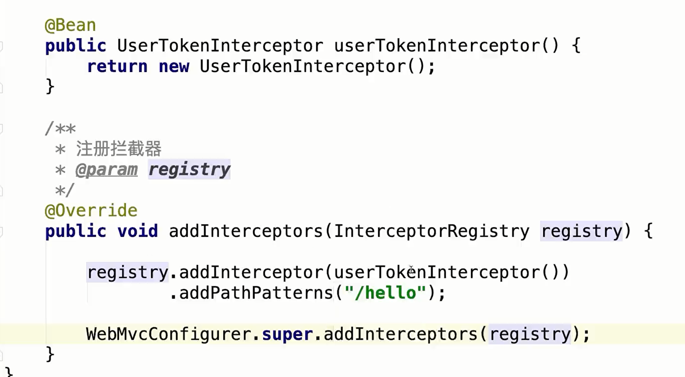
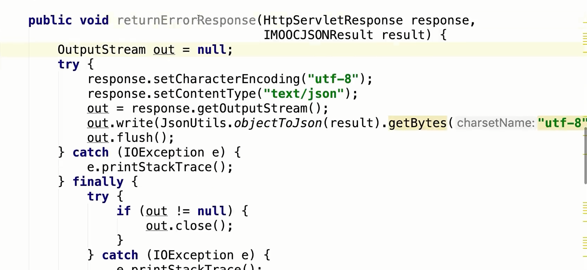
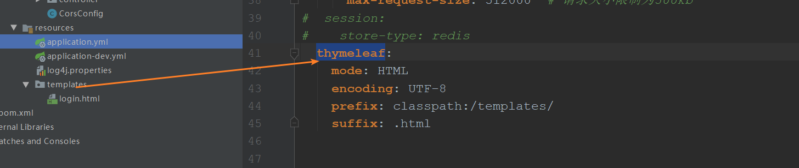

# 分布式会话

**springsession 实现分布式会话**

修改配置文件

开启

项目启动后spring会自动在redis中存入一些值

由于使用了security框架，必须要登录，可以使用springboot排除security的自动装配

# 分布式会话拦截器

**拦截器注册**

利用HttpServletResponse返回错误信息 

# SSO单点登录

## 构建工程

使用themeleaf 模板需要在spring配置文件中配置

