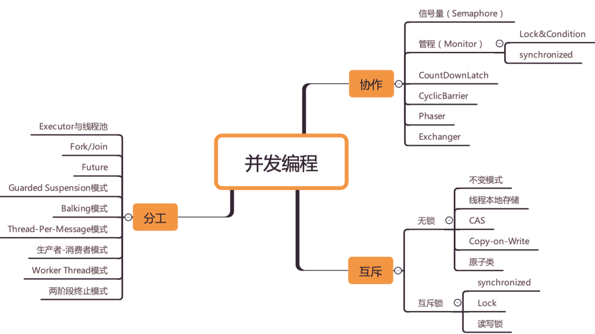

  并发编程核心问题：分工、同步、互斥

**分工**

> 所谓分工指的是如何高效地拆解任务并分配给线程
>
> 并发编程领域还总结了一些设计模式，基本 上都是和分工方法相关的，例如生产者 - 消费者、Thread-Per-Message、Worker Thread 模式等都是用来指导你如何分工的

**同步**

> 指的是线程之间如何协作，在并发编程领域里的同步，主要指的就是线程间的协作，本质上和现实生活中的协作没区 别，不过是一个线程执行完了一个任务，如何通知执行后续任务的线程开工而已。
>
> 工作中遇到的线程协作问题，基本上都可以描述为这样的一个问题：当某个条件不满足时， 线程需要等待，当某个条件满足时，线程需要被唤醒执行。例如，在生产者 - 消费者模型 里，也有类似的描述，“当队列满时，生产者线程等待，当队列不满时，生产者线程需要被 唤醒执行；当队列空时，消费者线程等待，当队列不空时，消费者线程需要被唤醒执行。”

**互斥**

> 是保证同一时刻只允许一个线程访问共享资源
>
> Java SDK 并发包很大部分内容都是按照这三个维度组织的，例如 Fork/Join 框架就是一种分工模式，CountDownLatch 就是一种典型的同步方式，而可重入锁则是一种互斥手段。



# 为何要有并发

有一个核心矛盾一直存在，就是三者的速度差异,cpu>内存>I/O，程序执行的快慢很大程度的取决于读写。

为了合理利用 CPU 的高性能，平衡这三者的速度差异，计算机体系机构、操作系统、编译 程序都做出了贡献，主要体现为： 1. CPU 增加了缓存，以均衡与内存的速度差异； 2. 操作系统增加了进程、线程，以分时复用 CPU，进而均衡 CPU 与 I/O 设备的速度差 异； 3. 编译程序优化指令执行次序，使得缓存能够得到更加合理地利用。

# 并发导致的问题

## 缓存导致的可见性问题

> 一个线程对共享变量的修改，另外一个线程能够立刻看到，我们称为**可见性**。

在单核时代，所有的线程都是在一颗 CPU 上执行，CPU 缓存与内存的数据一致性容易解决。因为所有线程都是操作同一个 CPU 的缓存，一个线程对缓存的写，对另外一个线程来说一定是可见的。例如在下面的图中，线程 A 和线程 B 都是操作同一个 CPU 里面的缓存，所以线程 A 更新了变量 V 的值，那么线程 B 之后再访问变量 V，得到的一定是 V 的最新值（线程 A 写过的值）。


多核时代，每颗 CPU 都有自己的缓存，这时 CPU 缓存与内存的数据一致性就没那么容易解决了，当多个线程在不同的 CPU 上执行时，这些线程操作的是不同的 CPU 缓存。


## 线程切换带来的原子性问题

> 由于 IO 太慢，早期的操作系统就发明了多进程，即便在单核的 CPU 上我们也可以一边听着歌，一边写 Bug，这个就是多进程的功劳。

操作系统允许某个进程执行一小段时间，例如 50 毫秒，过了 50 毫秒操作系统就会重新选择一个进程来执行（我们称为“任务切换”），这个 50 毫秒称为“**时间片**”。


在一个时间片内，如果一个进程进行一个 IO 操作，例如读个文件，这个时候该进程可以把自己标记为“休眠状态”并出让 CPU 的使用权，待文件读进内存，操作系统会把这个休眠的进程唤醒，唤醒后的进程就有机会重新获得 CPU 的使用权了。

这里的进程在等待 IO 时之所以会释放 CPU 使用权，是为了让 CPU 在这段等待时间里可以做别的事情，这样一来 CPU 的使用率就上来了；此外，如果这时有另外一个进程也读文件，读文件的操作就会排队，磁盘驱动在完成一个进程的读操作后，发现有排队的任务，就会立即启动下一个读操作，这样 IO 的使用率也上来了。

早期的操作系统基于进程来调度 CPU，不同进程间是不共享内存空间的，所以进程要做任务切换就要切换内存映射地址，而一个进程创建的所有线程，都是共享一个内存空间的，所以线程做任务切换成本就很低了。现代的操作系统都基于更轻量的线程来调度，现在我们提到的“任务切换”都是指**“线程切换”**。

Java 并发程序都是基于多线程的，自然也会涉及到任务切换，**任务切换也是并发编程里诡异 Bug 的源头之一**。任务切换的时机大多数是在时间片结束的时候，我们现在基本都使用高级语言编程，高级语言里一条语句往往需要多条 CPU 指令完成，例如上面代码中的`count += 1`，至少需要三条 CPU 指令。

- 指令 1：首先，需要把变量 count 从内存加载到 CPU 的寄存器；

- 指令 2：之后，在寄存器中执行 +1 操作；

- 指令 3：最后，将结果写入内存（缓存机制导致可能写入的是 CPU 缓存而不是内存）。

  

**操作系统做任务切换，可以发生在任何一条CPU 指令执行完，是的，是 CPU 指令，而不是高级语言里的一条语句。**对于上面的三条指令来说，我们假设 count=0，如果线程 A 在指令 1 执行完后做线程切换，线程 A 和线程 B 按照下图的序列执行，那么我们会发现两个线程都执行了 count+=1 的操作，但是得到的结果不是我们期望的 2，而是 1。


**我们把一个或者多个操作在 CPU 执行的过程中不被中断的特性称为原子性**。CPU 能保证的原子操作是 CPU 指令级别的，而不是高级语言的操作符。

## 编译优化带来的有序性问题

> 有序性指的是程序按照代码的先后顺序执行。编译器为了优化性能，有时候会改变程序中语句的先后顺序，例如程序中：“a=6；b=7；”编译器优化后可能变成“b=7；a=6；”，在这个例子中，编译器调整了语句的顺序，但是不影响程序的最终结果。不过有时候编译器及解释器的优化可能导致意想不到的 Bug。

在 Java 领域一个经典的案例就是利用双重检查创建单例对象，例如下面的代码：在获取实例 getInstance() 的方法中，我们首先判断 instance 是否为空，如果为空，则锁定 Singleton.class 并再次检查 instance 是否为空，如果还为空则创建 Singleton 的一个实例。

```java
public class Singleton {
  static Singleton instance;
  static Singleton getInstance(){
    if (instance == null) {
      synchronized(Singleton.class) {
        if (instance == null)
          instance = new Singleton();
        }
    }
    return instance;
  }
}
```

假设有两个线程 A、B 同时调用 getInstance() 方法，他们会同时发现 instance == null，于是同时对 Singleton.class 加锁，此时 JVM 保证只有一个线程能够加锁成功（假设是线程 A），另外一个线程则会处于等待状态（假设是线程 B）；线程 A 会创建一个 Singleton 实例，之后释放锁，锁释放后，线程 B 被唤醒，线程 B 再次尝试加锁，此时是可以加锁成功的，加锁成功后，线程 B 检查 instance == null 时会发现，已经创建过 Singleton 实例了，所以线程 B 不会再创建一个 Singleton 实例。

**这样看起来很完美，但实际上并不是这样**

在 new 操作上，我们以为的 new 操作应该是：

1. 分配一块内存 M；
2. 在内存 M 上初始化 Singleton 对象；
3. 然后 M 的地址赋值给 instance 变量。

但是实际上优化后的执行路径却是这样的：

1. 分配一块内存 M；
2. 将 M 的地址赋值给 instance 变量；
3. 最后在内存 M 上初始化 Singleton 对象。

假设线程 A 先执行 getInstance() 方法，当执行完指令 2 时恰好发生了线程切换，切换到了线程 B 上；如果此时线程 B 也执行 getInstance() 方法，那么线程 B 在执行第一个判断时会发现 instance != null，所以直接返回 instance，而此时的 instance 是没有初始化过的，如果我们这个时候访问 instance 的成员变量就可能触发空指针异常。


要解决双重检查锁模式带来空指针异常的问题，只需要使用volatile关键字，volatile关键字严格遵循happens-before原则，即：在读操作前，写操作必须全部完成

# java解决有序性和可见性的问题

> 导致可见性的原因是缓存，导致有序性的原因是编译优化，那解决可见性、有序性最直接的办法就是**禁用缓存和编译优化**，但这样就极大的影响了性能。合理的方案应该是**按需禁用缓存以及编译优化**。ava 内存模型规范了 JVM 如何提供按需禁用缓存和编译优化的方法。具体来说，这些方法包括 **volatile**、**synchronized** 和 **final** 三个关键字，以及六项 **Happens-Before 规则**

## volatile 

> volatile 关键字并不是 Java 语言的特产，古老的 C 语言里也有，它最原始的意义就是禁用 CPU 缓存。例如，我们声明一个 volatile 变量 volatile int x = 0，它表达的是：告诉编译器，对这个变量的读写，不能使用 CPU 缓存，必须从内存中读取或者写入。这个语义看上去相当明确，但是在实际使用的时候却会带来困惑。

```java
class VolatileExample {
  int x = 0;
  volatile boolean v = false;
  public void writer() {
    x = 42;
    v = true;
  }
  public void reader() {
    if (v == true) {
      // 这里 x 会是多少呢？
    }
  }
}
```

假设线程 A 执行 writer() 方法，按照 volatile 语义，会把变量 “v=true” 写入内存；假设线程 B 执行 reader() 方法，同样按照 volatile 语义，线程 B 会从内存中读取变量 v，如果线程 B 看到 “v == true” 时，那么线程 B 看到的变量 x 是多少呢？

直觉上看，应该是 42，但是，这个要看 Java 的版本，**如果在低于 1.5 版本上运行，x 可能是 42，也有可能是 0；如果在 1.5 以上的版本上运行，x 就是等于 42。**

变量 x 可能被 CPU 缓存而导致可见性问题。这个问题在 1.5 版本已经被圆满解决了。Java 内存模型在 1.5 版本对 volatile 语义进行了增强。也就是 **Happens-Before** 规则。

## Happens-Before 规则

> Happens-Before 并不是说前面一个操作发生在后续操作的前面，它真正要表达的是：**前面一个操作的结果对后续操作是可见的**。所以比较正式的说法是：Happens-Before 约束了编译器的优化行为，虽允许编译器优化，但是要求编译器优化后一定遵守 Happens-Before 规则。


1. **程序的顺序性规则**

   在一个线程中，按照程序顺序，前面的操作 Happens-Before 于后续的任意操作。第 5行代码 “x = 42;” Happens-Before 于第 7 行代码 “v = true;”，这就是规则 1 的内容，也比较符合单线程里面的思维：程序前面对某个变量的修改一定是对后续操作可见的。

2. **volatile 变量规则**

   一个 volatile 变量的写操作， Happens-Before 于后续对这个 volatile 变量的读操作。如果一个线程先去写一个volatile变量，然后一个线程去读这个变量，那么这个写操作的结果一定对读的这个线程可见。看着像是禁用缓存，貌似和 1.5 版本以前的语义没有变化，但是结合第三条，就不一样了

3. **传递性**

   如果A Happens-Before B，且 B Happens-Before C，那么 A Happens-Before C。

4. **管程中锁的规则**

   在单线程环境还是多线程环境，对于同一个锁来说，一个线程对这个锁解锁之后，另一个线程获取了这个锁都能看到前一个线程的操作结果！(管程是一种通用的同步原语，synchronized就是管程的实现）

5. **线程start() 原则**

   在主线程A执行过程中，启动子线程B，那么线程A在启动子线程B之前对共享变量的修改结果对线程B可见。

6. **线程join() 规则**

   这条是关于线程等待的。它是指主线程 A 等待子线程 B 完成（主线程 A 通过调用子线程 B 的 join() 方法实现），当子线程 B 完成后（主线程 A 中 join() 方法返回），主线程能够看到子线程的操作。当然所谓的“看到”，指的是对**共享变量**的操作。

7. **线程中断规则**

   对线程interrupt()方法的调用先行发生于被中断线程的代码检测到中断事件的发生

   表现为：如果在线程一(t1)上面调用 interrupted(), t1.interrupted(). 线程一就会停止，不会触发InterruptedException.

8. **对象终结规则**

   一个对象的初始化完成先行发生于他的finalize()方法的开始。

   初始化没有完成，无法调用finalized()方法

## final

> volatile 为的是禁用缓存以及编译优化，从另外一个方面来看，final 关键字就是告诉编译器优化得更好一点。

**final 修饰变量时，初衷是告诉编译器：这个变量生而不变，可以可劲儿优化。**Java 编译器在 1.5 以前的版本的确优化得很努力，以至于都优化错了。问题类似于上一期提到的利用双重检查方法创建单例，构造函数的错误重排导致线程可能看到 final 变量的值会变化。

# 原子性

> 一个或者多个操作在 CPU 执行的过程中不被中断的特性，称为“原子性”。

原子性问题的源头是**线程切换**，如果能够禁用线程切换那就能解决这个问题。而操作系统做线程切换是依赖 CPU 中断的，所以禁止 CPU 发生中断就能够禁止线程切换。在早期单核 CPU 时代，这个方案的确是可行的，而且也有很多应用案例，但是并不适合多核场景。

例如在32位的机器上执行long类型的写操作，该操作会分为两步，写高32位和底32位。


在多核场景下，同一时刻，有可能有两个线程同时在执行，一个线程执行在 CPU-1 上，一个线程执行在 CPU-2 上，此时禁止 CPU 中断，只能保证 CPU 上的线程连续执行，并不能保证同一时刻只有一个线程执行，如果这两个线程同时写 long 型变量高 32 位的话，那就有可能 Bug 了。

“**同一时刻只有一个线程执行**”这个条件非常重要，我们称之为**互斥**。如果我们能够保证对共享变量的修改是互斥的，那么，无论是单核 CPU 还是多核 CPU，就都能保证原子性了。

# 锁

把一段需要互斥执行的代码称为**临界区**。线程在进入临界区之前，首先尝试加锁 lock()，如果成功，则进入临界区，此时我们称这个线程持有锁；否则呢就等待，直到持有锁的线程解锁；持有锁的线程执行完临界区的代码后，执行解锁 unlock()。

两个非常重要的点：1.锁的是什么  2.保护的又是什么

锁和要锁的资源是有对应关系的


对应关系非常重要 ，不正确的话很容易出**现类似锁自家门来保护他家资产的事情，这样的 Bug 非常不好诊断，因为潜意识里我们认为已经正确加锁了。**

## Java 语言提供的锁技术：synchronized

```java
class X {
  // 修饰非静态方法
  synchronized void foo() {
    // 临界区
  }
  // 修饰静态方法
  synchronized static void bar() {
    // 临界区
  }
  // 修饰代码块
  Object obj = new Object()；
  void baz() {
    synchronized(obj) {
      // 临界区
    }
  }
}  
```

加锁 lock() 和解锁 unlock() 这两个操作是被 Java 默默加上的，Java 编译器会在 synchronized 修饰的方法或代码块前后自动加上加锁 lock() 和解锁 unlock()，这样做的好处就是加锁 lock() 和解锁 unlock() 一定是成对出现的，毕竟忘记解锁 unlock() 可是个致命的 Bug（意味着其他线程只能死等下去了）。

上面代码只能看到在修饰代码块的时候锁定了一个obj对象，那么其他两个方法锁定了什么呢？

**当修饰静态方法的时候，锁定的是当前类的 Class 对象，在上面的例子中就是 Class X；**
**当修饰非静态方法的时候，锁定的是当前实例对象 this。**

```java
class X {
  // 修饰静态方法
  synchronized(X.class) static void bar() {
    // 临界区
  }
}

class X {
  // 修饰非静态方法
  synchronized(this) void foo() {
    // 临界区
  }
}
```

### 利用synchronized 解决 count+=1

```java
class SafeCalc {
  long value = 0L;
  long get() {
    return value;
  }
  synchronized void addOne() {
    value += 1;
  }
}
```

被 synchronized 修饰后，无论是单核 CPU 还是多核 CPU，只有一个线程能够执行 addOne() 方法，保证了原子操作，happens-before 中的管程中锁的规则——对一个锁的解锁 Happens-Before 于后续对这个锁的加锁。再结合传递性规则，就能得出，前一个线程在临界区对共享变量的修改，也就是解锁前的修改，对于后一个进入临界区的线程是可见的。

**但是这里执行了add之后value的值对get方法的可见性是没法保证的**，所以需要对get也加锁

```java
class SafeCalc {
  long value = 0L;
  synchronized long get() {
    return value;
  }
  synchronized void addOne() {
    value += 1;
  }
}
```


## 锁和搜保护资源之间的关系

**受保护资源和锁之间的关联关系是 N:1 的关系**。一个资源只能被一把锁保护，就和座位一样，一个座位只能又一张票来保护，如果有多张就会冲突。但是一把锁能保护多个资源，类似于现实中的包场。

将上面代码 的value 改成静态变量。

```java
class SafeCalc {
  static long value = 0L;
  synchronized long get() {
    return value;
  }
  synchronized static void addOne() {
    value += 1;
  }
}
```

这时候就是用两把锁了，add的操作对get操作不能保证可见，会导致并发问题


## 如何用一把锁保护多个资源

### 保护没有关联关系的多个资源

在现实世界里，球场的座位和电影院的座位就是没有关联关系的，这种场景非常容易解决，那就是球赛有球赛的门票，电影院有电影院的门票，各自管理各自的。

同样这对应到编程领域，也很容易解决。例如，银行业务中有针对账户余额（余额是一种资源）的取款操作，也有针对账户密码（密码也是一种资源）的更改操作，我们可以为账户余额和账户密码分配不同的锁来解决并发问题，这个还是很简单的。


创建锁balLock用于保护余额，创建锁pwLock用于保护密码

```java
class Account {
  // 锁：保护账户余额
  private final Object balLock
    = new Object();
  // 账户余额  
  private Integer balance;
  // 锁：保护账户密码
  private final Object pwLock
    = new Object();
  // 账户密码
  private String password;
 
  // 取款
  void withdraw(Integer amt) {
    synchronized(balLock) {
      if (this.balance > amt){
        this.balance -= amt;
      }
    }
  } 
  // 查看余额
  Integer getBalance() {
    synchronized(balLock) {
      return balance;
    }
  }
 
  // 更改密码
  void updatePassword(String pw){
    synchronized(pwLock) {
      this.password = pw;
    }
  } 
  // 查看密码
  String getPassword() {
    synchronized(pwLock) {
      return password;
    }
  }
}

```

也可以只用一把锁，比如使用this，然后为每个方法都加上synchronized关键字。但是用一把锁会导致性能问题，上面4个操作只能串行。

**用不同的锁对受保护资源进行精细化管理，能够提升性能**。这种锁还有个名字，叫**细粒度锁**。

### 保护有关联关系的多个资源

例如银行业务里面的转账操作，账户 A 减少 100 元，账户 B 增加 100 元。


```java
class Account {
  private int balance;
  // 转账
  void transfer(
      Account target, int amt){
    if (this.balance > amt) {
      this.balance -= amt;
      target.balance += amt;
    }
  } 
}
```

可以在Account中增加一个带Object lock 的构造函数，并把无参构造函数私有化。这样在创建Account的同时传入同一个lock对象，就能共享这个对象并加锁了。

```java
class Account {
  private Object lock；
  private int balance;
  private Account();
  // 创建 Account 时传入同一个 lock 对象
  public Account(Object lock) {
    this.lock = lock;
  } 
  // 转账
  void transfer(Account target, int amt){
    // 此处检查所有对象共享的锁
    synchronized(lock) {
      if (this.balance > amt) {
        this.balance -= amt;
        target.balance += amt;
      }
    }
  }
```

还有一种方法就是用Account.class作为共享的锁。

## 死锁

上面使用Account.class 作为锁，虽然这个不存在并发问题，但是所有账户的转账操作都是串行的，例如账户 A 转账户 B、账户 C 转账户 D 这两个转账操作现实世界里是可以并行的，但是在这个方案里却被串行化了，这样的话，性能太差。

要实现并发。可以用两把锁，首先尝试锁定转出账户 this，然后尝试锁定转入账户 target，只有当两者都成功时，才执行转账操作。


```java
class Account {
  private int balance;
  // 转账
  void transfer(Account target, int amt){
    // 锁定转出账户
    synchronized(this) {              
      // 锁定转入账户
      synchronized(target) {           
        if (this.balance > amt) {
          this.balance -= amt;
          target.balance += amt;
        }
      }
    }
  } 
}
```

**但是这样就可能会导致死锁问题**

假设线程 T1 执行账户 A 转账户 B 的操作，账户 A.transfer(账户 B)；同时线程 T2 执行账户 B 转账户 A 的操作，账户 B.transfer(账户 A)。当 T1 和 T2 同时执行完①处的代码时，T1 获得了账户 A 的锁（对于 T1，this 是账户 A），而 T2 获得了账户 B 的锁（对于 T2，this 是账户 B）。之后 T1 和 T2 在执行②处的代码时，T1 试图获取账户 B 的锁时，发现账户 B 已经被锁定（被 T2 锁定），所以 T1 开始等待；T2 则试图获取账户 A 的锁时，发现账户 A 已经被锁定（被 T1 锁定），所以 T2 也开始等待。于是 T1 和 T2 会无期限地等待下去，也就是我们所说的死锁了。

### 如何预防死锁

一旦死锁，没有什么特别好的方法，很多时候只能重启应用。最好方法就能够规避死锁

**发生死锁的条件**

1.互斥，共享变量X和Y只能被一个线程占用

2.占有且等待，线程T1已经取得共享资源X，在等待共享资源Y的时候，不释放X

3.不可抢占，其他线程不可抢占线程T1的资源

4.循环等待，T1等待T2占用的资源，T2等待T1占用的资源。

**只要避免其中的一个就能避免死锁的发生**

其中互斥是没法避免的，因为使用的锁就是互斥锁

1.对于占有且等待，可以一次性申请所有资源，就无需等待了

2.对于不可抢占，占用部分资源在申请其他资源的时候，如果其他资源被占用，那么就释放自己占用的资源。

3.对于循环等待，可以使用按顺序申请资源的方法来预防，给资源设定一个顺序，先申请序号小的。线性化之后，就不存在循环了


**占有且等待**

可以把同时申请 这个操作看成是一个临界区，需要一个对象来管理这个临界区，把这个角色定为 Allocator。它有两个重要功能，分别是：同时申请资源 apply() 和同时释放资源 free()。账户 Account 类里面持有一个 Allocator 的单例（必须是单例，只能由一个人来分配资源）。当账户 Account 在执行转账操作的时候，首先向 Allocator 同时申请转出账户和转入账户这两个资源，成功后再锁定这两个资源；当转账操作执行完，释放锁之后，我们需通知 Allocator 同时释放转出账户和转入账户这两个资源。

```java
class Allocator {
  private List<Object> als =
    new ArrayList<>();
  // 一次性申请所有资源
  synchronized boolean apply(
    Object from, Object to){
    if(als.contains(from) ||
         als.contains(to)){
      return false;  
    } else {
      als.add(from);
      als.add(to);  
    }
    return true;
  }
  // 归还资源
  synchronized void free(
    Object from, Object to){
    als.remove(from);
    als.remove(to);
  }
}
 
class Account {
  // actr 应该为单例
  private Allocator actr;
  private int balance;
  // 转账
  void transfer(Account target, int amt){
    // 一次性申请转出账户和转入账户，直到成功
    while(!actr.apply(this, target))
      ；
    try{
      // 锁定转出账户
      synchronized(this){              
        // 锁定转入账户
        synchronized(target){           
          if (this.balance > amt){
            this.balance -= amt;
            target.balance += amt;
          }
        }
      }
    } finally {
      actr.free(this, target)
    }
  } 
}
```


**破幻不可抢占条件**

> 破坏不可抢占条件看上去很简单，核心是要能够主动释放它占有的资源，这一点 synchronized 是做不到的。原因是 synchronized 申请资源的时候，如果申请不到，线程直接进入阻塞状态了，而线程进入阻塞状态，啥都干不了，也释放不了线程已经占有的资源。
>
> **但是可以使用SDK中的Lock** 后面会提到


**破坏循环等待**

> 破坏这个条件，需要对资源进行排序，然后按序申请资源。这个实现非常简单，我们假设每个账户都有不同的属性 id，这个 id 可以作为排序字段，申请的时候，我们可以按照从小到大的顺序来申请。

```java
class Account {
  private int id;
  private int balance;
  // 转账
  void transfer(Account target, int amt){
    Account left = this        ①
    Account right = target;    ②
    if (this.id > target.id) { ③
      left = target;           ④
      right = this;            ⑤
    }                          ⑥
    // 锁定序号小的账户
    synchronized(left){
      // 锁定序号大的账户
      synchronized(right){ 
        if (this.balance > amt){
          this.balance -= amt;
          target.balance += amt;
        }
      }
    }
  } 
}
```

### 

### 优化占用切等待

原来的代码

```java
// 一次性申请转出账户和转入账户，直到成功
while(!actr.apply(this, target))
```

如果 apply() 操作耗时非常短，而且并发冲突量也不大时，这个方案还挺不错的，因为这种场景下，循环上几次或者几十次就能一次性获取转出账户和转入账户了。但是如果 apply() 操作耗时长，或者并发冲突量大的时候，循环等待这种方案就不适用了，因为在这种场景下，可能要循环上万次才能获取到锁，太消耗 CPU 了。

最好的方案应该是：如果线程要求的条件不满足，则线程阻塞自己，进入**等待**状态；当线程要求的条件满足后，**通知**等待的线程重新执行。其中，使用线程阻塞的方式就能避免循环等待消耗 CPU 的问题。

#### **使用java的 等待 - 通知机制**

等待 - 通知机制可以有多种实现方式，比如 Java 语言内置的 synchronized 配合 wait()、notify()、notifyAll() 

**等待队列和互斥锁是一对一的关系，每个互斥锁都有自己独立的等待队列。**


在并发程序中，当一个线程进入临界区后，由于某些条件不满足，需要进入等待状态。如上图所示，当调用 wait() 方法后，当前线程就会被阻塞，并且进入到右边的等待队列中，**这个等待队列也是互斥锁的等待队列**。 线程在进入等待队列的同时，**会释放持有的互斥锁**，线程释放锁后，其他线程就有机会获得锁，并进入临界区了。

线程要求的条件满足时， Java 对象的 notify() 和 notifyAll() 方法就能通知等待队列中的线程，**这个条件曾经满足过**，**notify() 只能保证在通知时间点，条件是满足的**。而被通知线程的**执行时间点和通知的时间点**基本上不会重合，所以当线程执行的时候，很可能条件已经不满足了（保不齐有其他线程插队）。**并且，被通知线程如果要重新运行，任然需要获取互斥锁，因为这个锁已经在wait() 的时候释放了**


如果线程没有持有对应的锁，那么调用wait或者notify等的时候就会抛出`java.lang.IllegalMonitorStateException`。异常

```java
class Allocator {
  private List<Object> als;
  // 一次性申请所有资源
  synchronized void apply(
    Object from, Object to){
    // 经典写法
    while(als.contains(from) ||
         als.contains(to)){
      try{
        wait();
      }catch(Exception e){
      }   
    } 
    als.add(from);
    als.add(to);  
  }
  // 归还资源
  synchronized void free(
    Object from, Object to){
    als.remove(from);
    als.remove(to);
    notifyAll();
  }
}
```

注意尽量使用notifyAll() 方法，如果线程T1申请到了AB，线程T2申请到了CD。此时线程T3，T4，分别申请AB和CD，T3和T4都会进入等待队列。如果此时T1释放了AB并使用notify()方法只通知T4线程，T4申请的是CD，所以T4还会继续等待。而这样真正应该唤醒的线程T3就永远没有被唤醒的机会了。

# 安全性、活跃性和性能问题

## 安全性问题

> 通常有这种说法：这个方法不是线程安全的，这个类不是线程安全的，等等

线程安全本质上就是正确性。程序按照我们的期望执行，不要让我们感到意外。理论上线程安全的程序，就要避免出现原子性问题、可见性问题和有序性问题。

并不是任何时候都要考虑这三个问题，其实只有一种情况需要：**存在共享数据并且该数据会发生变化，通俗地讲就是有多个线程会同时读写同一数据**。如果能够做到不共享数据或者数据状态不发生变化，就能够保证线程的安全性。有不少技术方案都是基于这个理论的，例如线程本地存储（Thread Local Storage，TLS）、不变模式等等，

**但是必须共享会发生变化的数据的场景还是很多的**

当多个线程同时访问同一数据，并且至少有一个线程会写这个数据的时候，如果我们不采取防护措施，那么就会导致并发 Bug，对此还有一个专业的术语，叫做**数据竞争**（Data Race）。

但并不是再数据竞争的地方加上锁就能解决所有并发问题，比如

```java
public class Test {
  private long count = 0;
  synchronized long get(){
    return count；
  }
  synchronized void set(long v){
    count = v;
  } 
  void add10K() {
    int idx = 0;
    while(idx++ < 10000) {
      set(get()+1)      
    }
  }
}
```

在get() ,set() 方法上都加了锁，但是显然 add10K() 的方法不是线程安全的（get完数据还没存回去的时候，这个数据有可能被其他线程改了）。这种问题，叫做 **竞态条件**，指的是程序的执行结果依赖 线程的执行顺序。

转账操作里面有个判断条件——转出金额不能大于账户余额，但在并发环境里面，如果不加控制，当多个线程同时对一个账号执行转出操作时，就有可能出现超额转出问题。假设账户 A 有余额 200，线程 1 和线程 2 都要从账户 A 转出 150，在下面的代码里，有可能线程 1 和线程 2 同时执行到第 6 行，这样线程 1 和线程 2 都会发现转出金额 150 小于账户余额 200，于是就会发生超额转出的情况。

```java
class Account {
  private int balance;
  // 转账
  void transfer(
      Account target, int amt){
    if (this.balance > amt) {
      this.balance -= amt;
      target.balance += amt;
    }
  } 
}
```

也可以按照下面这样来理解**竞态条件**。在并发场景中，程序的执行依赖于某个状态变量

```java
if (状态变量 满足 执行条件) {
  执行操作
}
```

在执行操作的过程中，有可能其它线程修改了这个状态变量，导致状态变量不满足条件。**在add10k()的例子中隐式的依赖了get() 的结果。**

## 活跃性问题

> 所谓活跃性问题，指的是某个操作无法执行下去。我们常见的“死锁”就是一种典型的活跃性问题，当然**除了死锁外，还有两种情况，分别是“活锁”和“饥饿”**。

- 活锁

  **有时线程虽然没有发生阻塞，但仍然会存在执行不下去的情况，这就是所谓的“活锁”** 。路人甲从左手边出门，路人乙从右手边进门，两人为了不相撞，互相谦让，路人甲让路走右手边，路人乙也让路走左手边，结果是两人又相撞了。这种情况，基本上谦让几次就解决了，因为人会交流啊。可是如果这种情况发生在编程世界了，就有可能会一直没完没了地“谦让”下去，成为没有发生阻塞但依然执行不下去的“活锁”。

  要解决活锁问题，只需要为程序设置一个随机的等待时间，要谦让的时候等待一个时间就行了。

- 饥饿

  **饥饿”指的是线程因无法访问所需资源而无法执行下去的情况**。在 CPU 繁忙的情况下，优先级低的线程得到执行的机会很小，就可能发生线程“饥饿”；持有锁的线程，如果执行的时间过长，也可能导致“饥饿”问题。

  解决“**饥饿**”问题的方案很简单，有三种方案：一是保证资源充足，二是公平地分配资源，三就是避免持有锁的线程长时间执行。这三个方案中，方案一和方案三的适用场景比较有限，因为很多场景下，资源的稀缺性是没办法解决的，持有锁的线程执行的时间也很难缩短。倒是方案二的适用场景相对来说更多一些。使用公平锁，后面会有。

## 性能问题

> 锁”的过度使用可能导致串行化的范围过大，这样就不能够发挥多线程的优势了，而我们之所以使用多线程搞并发程序，为的就是提升性能。

有个阿姆达尔（Amdahl）定律，代表了处理器并行运算之后效率提升的能力，它正好可以解决这个问题，具体公式如下：

S=1(1−p)+pnS=1(1−p)+pn

公式里的 n 可以理解为 CPU 的核数，p 可以理解为并行百分比，那（1-p）就是串行百分比了，也就是我们假设的 5%。我们再假设 CPU 的核数（也就是 n）无穷大，那加速比 S 的极限就是 20。也就是说，如果我们的串行率是 5%，那么我们无论采用什么技术，最高也就只能提高 20 倍的性能。

# 管程

> 所谓**管程，指的是管理共享变量以及对共享变量的操作过程，让他们支持并发**。翻译为 Java 领域的语言，就是管理类的成员变量和成员方法，让这个类是线程安全的。Java 采用的是管程技术，synchronized 关键字及 wait()、notify()、notifyAll() 这三个方法都是管程的组成部分**管程和信号量是等价的，所谓等价指的是用管程能够实现信号量，也能用信号量实现管程**。

## MESA模型

> 在管程的发展史上，先后出现过三种不同的管程模型，分别是：Hasen 模型、Hoare 模型和 MESA 模型。其中，现在广泛应用的是 MESA 模型，并且 Java 管程的实现参考的也是 MESA 模型。

解决**互斥**问题

将共享变量及其对共享变量的操作统一封装起来，例如

管程 X 将共享变量 queue 这个队列和相关的操作入队 enq()、出队 deq() 都封装起来了；线程 A 和线程 B 如果想访问共享变量 queue，只能通过调用管程提供的 enq()、deq() 方法来实现；enq()、deq() 保证互斥性，只允许一个线程进入管程。


**同步**问题


共享变量和对共享变量的操作是被封装起来的，图中最外层的框就代表封装的意思。并且有一个**入口等待队列**。当多个线程同时试图进入管程内部时，只允许一个线程进入，其他线程则在入口等待队列中等待。这个过程类似就医流程的分诊，只允许一个患者就诊，其他患者都在门口等待。**每个条件变量都对应有一个等待队列**，如下图，条件变量 A 和条件变量 B 分别都有自己的等待队列。

假设有个线程 T1 执行出队操作，有个前提条件，就是队列不能是空的，而队列不空这个前提条件就是管程里的条件变量。 如果线程 T1 进入管程后恰好发现队列是空的，就去条件变量对应的等待队列里面等。此时线程 T1 就去“队列不空”这个条件变量的等待队列中等待。这个过程类似于大夫发现你要去验个血，于是给你开了个验血的单子，你呢就去验血的队伍里排队。线程 T1 进入条件变量的等待队列后，是允许其他线程进入管程的。这和你去验血的时候，医生可以给其他患者诊治，道理都是一样的。

再假设之后另外一个线程 T2 执行入队操作，入队操作执行成功之后，“队列不空”这个条件对于线程 T1 来说已经满足了，此时线程 T2 要通知 T1，告诉它需要的条件已经满足了。当线程 T1 得到通知后，会从等待队列里面出来，但是出来之后不是马上执行，而是重新进入到入口等待队列里面。这个过程类似你验血完，回来找大夫，需要重新分诊。

```java
public class BlockedQueue<T>{
  final Lock lock =
    new ReentrantLock();
  // 条件变量：队列不满  
  final Condition notFull =
    lock.newCondition();
  // 条件变量：队列不空  
  final Condition notEmpty =
    lock.newCondition();
 
  // 入队
  void enq(T x) {
    lock.lock();
    try {
      while (队列已满){
        // 等待队列不满 
        notFull.await();
      }  
      // 省略入队操作...
      // 入队后, 通知可出队
      notEmpty.signal();
    }finally {
      lock.unlock();
    }
  }
  // 出队
  void deq(){
    lock.lock();
    try {
      while (队列已空){
        // 等待队列不空
        notEmpty.await();
      }
      // 省略出队操作...
      // 出队后，通知可入队
      notFull.signal();
    }finally {
      lock.unlock();
    }  
  }
}
```

**await() 和前面我们提到的 wait() 语义是一样的；signal() 和前面我们提到的 notify() 语义是一样的**。

## wait() 的正确姿势

但是有一点，需要再次提醒，对于 MESA 管程来说，有一个编程范式，就是需要在一个 while 循环里面调用 wait()。**这个是 MESA 管程特有的**。

```java
while(条件不满足) {
  wait();
}
```

Hasen 模型、Hoare 模型和 MESA 模型的一个核心区别就是当条件满足后，如何通知相关线程。当线程 T2 的操作使线程 T1 等待的条件满足时，T1 和 T2 究竟谁可以执行呢？

1. Hasen 模型里面，要求 notify() 放在代码的最后，这样 T2 通知完 T1 后，T2 就结束了，然后 T1 再执行，这样就能保证同一时刻只有一个线程执行。
2. Hoare 模型里面，T2 通知完 T1 后，T2 阻塞，T1 马上执行；等 T1 执行完，再唤醒 T2，也能保证同一时刻只有一个线程执行。但是相比 Hasen 模型，T2 多了一次阻塞唤醒操作。
3. MESA 管程里面，T2 通知完 T1 后，T2 还是会接着执行，T1 并不立即执行，仅仅是从条件变量的等待队列进到入口等待队列里面。这样做的好处是 notify() 不用放到代码的最后，T2 也没有多余的阻塞唤醒操作。但是也有个副作用，就是当 T1 再次执行的时候，可能曾经满足的条件，现在已经不满足了，所以需要以循环方式检验条件变量。

## notify() 何时可以使用

还有一个需要注意的地方，就是 notify() 和 notifyAll() 的使用，前面章节，我曾经介绍过，**除非经过深思熟虑，否则尽量使用 notifyAll()**。那什么时候可以使用 notify() 呢？需要满足以下三个条件：

1. 所有等待线程拥有相同的等待条件；
2. 所有等待线程被唤醒后，执行相同的操作；
3. 只需要唤醒一个线程。

比如上面阻塞队列的例子中，对于“队列不满”这个条件变量，其阻塞队列里的线程都是在等待“队列不满”这个条件，反映在代码里就是下面这 3 行代码。对所有等待线程来说，都是执行这 3 行代码，**重点是 while 里面的等待条件是完全相同的**。

```java
while (队列已满){
  // 等待队列不满
  notFull.await();
}
```

所有等待线程被唤醒后执行的操作也是相同的，都是下面这几行：

```java
// 省略入队操作...
// 入队后, 通知可出队
notEmpty.signal();
```

同时也满足第 3 条，只需要唤醒一个线程。所以上面阻塞队列的代码，使用 signal() 是可以的。

## 总结

Java 参考了 MESA 模型，语言内置的管程（synchronized）对 MESA 模型进行了精简。MESA 模型中，条件变量可以有多个，Java 语言内置的管程里只有一个条件变量。具体如下图所示。


**Java 内置的管程方案（synchronized）使用简单，synchronized 关键字修饰的代码块，在编译期会自动生成相关加锁和解锁的代码，但是仅支持一个条件变量；而 Java SDK 并发包实现的管程支持多个条件变量，不过并发包里的锁，需要开发人员自己进行加锁和解锁操作。**

# java线程的生命周期


1. NEW（初始化状态）
2. RUNNABLE（可运行 / 运行状态）
3. BLOCKED（阻塞状态）
4. WAITING（无时限等待）
5. TIMED_WAITING（有时限等待）
6. TERMINATED（终止状态）

其实在操作系统层面，Java 线程中的 BLOCKED、WAITING、TIMED_WAITING 是一种状态，即前面我们提到的休眠状态。也就是说**只要 Java 线程处于这三种状态之一，那么这个线程就永远没有 CPU 的使用权**。

- **RUNNABLE 与 BLOCKED 的状态转换**

  只有一种场景会触发这种转换，就是线程等待 synchronized 的隐式锁。等待的线程就会从 RUNNABLE 转换到 BLOCKED 状态。而当等待的线程获得 synchronized 隐式锁时，就又会从 BLOCKED 转换到 RUNNABLE 状态。

- **RUNNABLE 与 WAITING 的状态转换**
  - 第一种场景，获得 synchronized 隐式锁的线程，调用无参数的 Object.wait() 方法。
  - 第二种场景，调用无参数的 Thread.join() 方法。其中的 join() 是一种线程同步方法，例如有一个线程对象 thread A，当调用 A.join() 的时候，执行这条语句的线程会等待 thread A 执行完，而等待中的这个线程，其状态会从 RUNNABLE 转换到 WAITING。当线程 thread A 执行完，原来等待它的线程又会从 WAITING 状态转换到 RUNNABLE。
  - 第三种场景，调用 LockSupport.park() 方法。其中的 LockSupport 对象， Java 并发包中的锁，都是基于它实现的。调用 LockSupport.park() 方法，当前线程会阻塞，线程的状态会从 RUNNABLE 转换到 WAITING。调用 LockSupport.unpark(Thread thread) 可唤醒目标线程，目标线程的状态又会从 WAITING 状态转换到 RUNNABLE。

- **RUNNABLE 与 TIMED_WAITING 的状态转换**

   TIMED_WAITING 和 WAITING 状态的区别，仅仅是触发条件多了**超时参数**。
  - 调用**带超时参数**的 Thread.sleep(long millis) 方法；
  - 获得 synchronized 隐式锁的线程，调用**带超时参数**的 Object.wait(long timeout) 方法；
  - 调用**带超时参数**的 Thread.join(long millis) 方法；
  - 调用**带超时参数**的 LockSupport.parkNanos(Object blocker, long deadline) 方法；
  - 调用**带超时参数**的 LockSupport.parkUntil(long deadline) 方法。

- **从 NEW 到 RUNNABLE 状态**

  NEW 状态的线程，不会被操作系统调度，因此不会执行。Java 线程要执行，就必须转换到 RUNNABLE 状态。从 NEW 状态转换到 RUNNABLE 状态很简单，只要调用线程对象的 start() 方法就可以了

- **从 RUNNABLE 到 TERMINATED 状态**

  线程执行完 run() 方法后，会自动转换到 TERMINATED 状态，当然如果执行 run() 方法的时候异常抛出，也会导致线程终止。有时候我们需要强制中断 run() 方法的执行，例如 run() 方法访问一个很慢的网络，等不下去了,Java 的 Thread 类里面倒是有个 stop() 方法，不过已经标记为 @Deprecated，所以不建议使用了。正确的姿势其实是调用 interrupt() 方法。

  - 那 stop() 和 interrupt() 方法的主要区别

    stop() 方法会真的杀死线程，不给线程喘息的机会，如果线程持有 ReentrantLock 锁，被 stop() 的线程并不会自动调用 ReentrantLock 的 unlock() 去释放锁，那其他线程就再也没机会获得 ReentrantLock 锁，类似的方法还有 suspend() 和 resume() 方法，这两个方法同样也都不建议使用了。

    interrupt() 方法仅仅是通知线程，线程有机会执行一些后续操作，同时也可以无视这个通知。被 interrupt 的线程，是怎么收到通知的呢？**一种是异常，另一种是主动检测**。

    - 当线程 A 处于 WAITING、TIMED_WAITING 状态时，如果其他线程调用线程 A 的 interrupt() 方法，会使线程 A 返回到 RUNNABLE 状态，同时线程 A 的代码会触发 InterruptedException 异常。 查看wait()、join()、sleep() 这样的方法签名，发现都会 throws InterruptedException 这个异常。这个异常的触发条件就是：其他线程调用了该线程的 interrupt() 方法。

      

    - 当线程 A 处于 RUNNABLE 状态时，并且阻塞在 java.nio.channels.InterruptibleChannel 上时，如果其他线程调用线程 A 的 interrupt() 方法，线程 A 会触发 java.nio.channels.ClosedByInterruptException 这个异常；而阻塞在 java.nio.channels.Selector 上时，如果其他线程调用线程 A 的 interrupt() 方法，线程 A 的 java.nio.channels.Selector 会立即返回。上面这两种情况属于被中断的线程通过异常的方式获得了通知

    - 还有一种是主动检测，如果线程处于 RUNNABLE 状态，并且没有阻塞在某个 I/O 操作上，例如中断计算圆周率的线程 A，这时就得依赖线程 A 主动检测中断状态了。如果其他线程调用线程 A 的 interrupt() 方法，那么线程 A 可以通过 isInterrupted() 方法，检测是不是自己被中断了。

**可以通过 `jstack` 命令或者`Java VisualVM`这个可视化工具将 JVM 所有的线程栈信息导出来，完整的线程栈信息不仅包括线程的当前状态、调用栈，还包括了锁的信息。**


==下面代码的本意是当前线程被中断之后，退出`while(true)`==

```java
Thread th = Thread.currentThread();
while(true) {
  if(th.isInterrupted()) {
    break;
  }
  // 省略业务代码无数
  try {
    Thread.sleep(100);
  }catch (InterruptedException e){
    e.printStackTrace();
  }
}
```

但是其实是不正确的。这个代码的执行，大部分都会挺在sleep这里，当发起中断之后，会抛出InterruptedException异常，而这个抛出这个异常会清除当前线程的中断标识，导致th.isInterrupted()一直都是返回false的。

正确的应该是在捕获到异常的时候重新设置终端标志

```java
try {
  Thread.sleep(100);
}catch(InterruptedException e){
  // 重新设置中断标志位
  th.interrupt();
}
```


# 创建多少线程合适

> 对于 CPU 密集型计算，多线程本质上是提升多核 CPU 的利用率，所以对于一个 4 核的 CPU，每个核一个线程，理论上创建 4 个线程就可以了，一个核对应一个线程。但是通常会在这基础上加一个线程，当线程因为偶尔的内存页失效或其他原因导致阻塞时，这个额外的线程可以顶上，从而保证 CPU 的利用率。
>
> 对于 I/O 密集型的计算场景，如果 CPU 计算和 I/O 操作的耗时是 1:1，那么 2 个线程是最合适的。如果 CPU 计算和 I/O 操作的耗时是 1:2，则是是 3 个线程。（一个在进行IO的时候，另外两个继续cpu计算）


计算和 I/O 操作的耗时比相关的，我们可以总结出这样一个公式：

单核：

```
最佳线程数 =1 +（I/O 耗时 / CPU 耗时）
```

多核

```
最佳线程数 =CPU 核数 * [ 1 +（I/O 耗时 / CPU 耗时）]
```


# 为什么局部变量是线程安全的

下面代码里的 fibonacci() 这个方法，会根据传入的参数 n ，返回 1 到 n 的斐波那契数列，在这个方法里面，有个局部变量：数组 r 用来保存数列的结果，每次计算完一项，都会更新数组 r 对应位置中的值。当多个线程调用 fibonacci() 这个方法的时候，数组 r 是否存在数据竞争（Data Race）呢？

```java
// 返回斐波那契数列
int[] fibonacci(int n) {
  // 创建结果数组
  int[] r = new int[n];
  // 初始化第一、第二个数
  r[0] = r[1] = 1;  // ①
  // 计算 2..n
  for(int i = 2; i < n; i++) {
      r[i] = r[i-2] + r[i-1];
  }
  return r;
}
```

**局部变量不存在数据竞争的**

**方法的执行**

在 CPU 层面，是没有方法概念的，CPU 的眼里，只有一条条的指令。

第 1 行，声明一个 int 变量 a；第 2 行，调用方法 fibonacci(a)；第 3 行，将 b 赋值给 c。

```java
int a = 7；
int[] b = fibonacci(a);
int[] c = b;
```

调用 fibonacci(a) 的时候，CPU 要先找到方法 fibonacci() 的地址，然后跳转到这个地址去执行代码，最后 CPU 执行完方法 fibonacci() 之后，要能够返回。首先找到调用方法的下一条语句的地址：也就是`int[] c=b;`的地址，再跳转到这个地址去执行。


其中调用方法的参数和返回地址是通过**CPU 的堆栈寄存器 查找的**。CPU 支持一种栈结构，栈你一定很熟悉了，就像手枪的弹夹，先入后出。因为这个栈是和方法调用相关的，因此经常被称为**调用栈**。

有三个方法 A、B、C，他们的调用关系是 A->B->C（A 调用 B，B 调用 C），运行时将会构建调用栈。每个方法在调用栈里都有自己的独立空间，称为**栈帧**，每个栈帧里都有对应方法需要的参数和返回地址。当调用方法时，会创建新的栈帧，并压入调用栈；当方法返回时，对应的栈帧就会被自动弹出。也就是说，**栈帧和方法是同生共死的**。


Java 语言虽然是靠虚拟机解释执行的，但是方法的调用也是利用栈结构解决的。

**局部变量存在哪里**

局部变量的作用域是方法内部，也就是说当方法执行完，局部变量就没用了，局部变量应该和方法同生共死。所以局部变量放到调用栈里那儿是相当的合理。事实上，的确是这样的，**局部变量就是放到了调用栈里**。


**调用栈与线程**

两个线程可以同时用不同的参数调用相同的方法，**每个线程都有自己独立的调用栈**。


**线程封闭**

方法里的局部变量，因为不会和其他线程共享，所以没有并发问题，已经成为解决并发问题的一个重要技术，同时还有个响当当的名字叫做**线程封闭**，比较官方的解释是：**仅在单线程内访问数据**。由于不存在共享，所以即便不同步也不会有并发问题，性能杠杠的。

采用线程封闭技术的案例非常多，例如从数据库连接池里获取的连接 Connection，在 JDBC 规范里并没有要求这个 Connection 必须是线程安全的。数据库连接池通过线程封闭技术，保证一个 Connection 一旦被一个线程获取之后，在这个线程关闭 Connection 之前的这段时间里，不会再分配给其他线程，从而保证了 Connection 不会有并发问题。