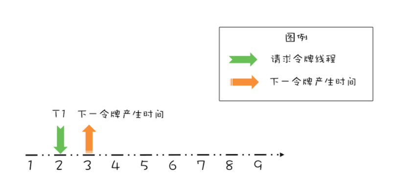
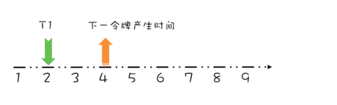
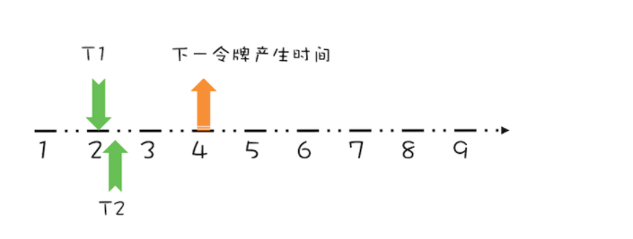
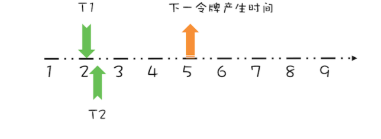
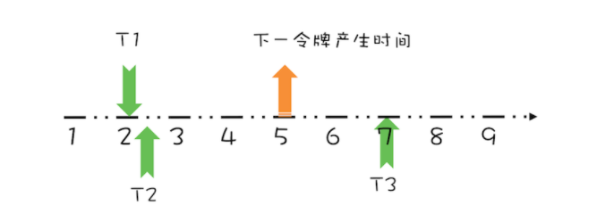
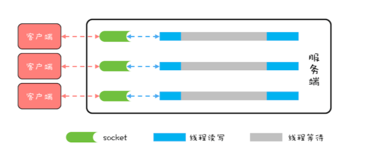
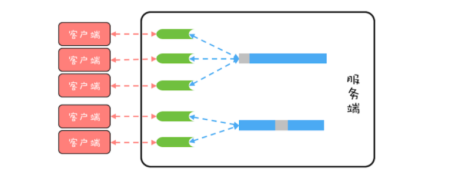

# 高性能限流器

## Guava RateLimiter

一个流速为 2个请求/s 的RateLimiter，直观上看是每秒最多允许两个请求，但是在Guava中还有一层匀速的意思，相当于 1个请求/500毫秒

```java
// 限流器流速：2 个请求 / 秒
RateLimiter limiter = 
  RateLimiter.create(2.0);
// 执行任务的线程池
ExecutorService es = Executors
  .newFixedThreadPool(1);
// 记录上一次执行时间
prev = System.nanoTime();
// 测试执行 20 次
for (int i=0; i<20; i++){
  // 限流器限流
  limiter.acquire();
  // 提交任务异步执行
  es.execute(()->{
    long cur=System.nanoTime();
    // 打印时间间隔：毫秒
    System.out.println(
      (cur-prev)/1000_000);
    prev = cur;
  });
}

输出结果：
...
500
499
499
500
499
```

## 经典限流算法，令牌桶算法

> **令牌桶算法**，其**核心是要想通过限流器，必须拿到令牌**。也就是说，只要我们能够限制发放令牌的速率，那么就能控制流速了

1. 令牌以固定的速率添加到令牌桶中，假设限流的速率是 r/ 秒，则令牌每 1/r 秒会添加一个；
2. 假设令牌桶的容量是 b ，如果令牌桶已满，则新的令牌会被丢弃；
3. 请求能够通过限流器的前提是令牌桶中有令牌。

b 其实是 burst 的简写，意义是**限流器允许的最大突发流量**。比如 b=10，而且令牌桶中的令牌已满，此时限流器允许 10 个请求同时通过限流器，当然只是突发流量而已，这 10 个请求会带走 10 个令牌，所以后续的流量只能按照速率 r 通过限流器。

令牌桶这个算法，如何用 Java 实现呢？很可能你的直觉会告诉你生产者 - 消费者模式：一个生产者线程定时向阻塞队列中添加令牌，而试图通过限流器的线程则作为消费者线程，只有从阻塞队列中获取到令牌，才允许通过限流器。

这个算法看上去非常完美，而且实现起来非常简单，如果并发量不大，这个实现并没有什么问题。可实际情况却是使用限流的场景大部分都是高并发场景，而且系统压力已经临近极限了，此时这个实现就有问题了。问题就出在定时器上，**在高并发场景下，当系统压力已经临近极限的时候，定时器的精度误差会非常大**，同时定时器本身会创建调度线程，也会对系统的性能产生影响。

**guava的实现**

关键是**记录并动态计算下一令牌发放的时间**。不适用定时器，而是直接计算下一次的时间。

假设令牌桶的容量为 b=1，限流速率 r = 1 个请求 / 秒，如下图所示，如果当前令牌桶中没有令牌，下一个令牌的发放时间是在第 3 秒，而在第 2 秒的时候有一个线程 T1 请求令牌



这个请求显然需要等待1s，因为第3s时它才能拿到令牌。而这时，第3s的令牌相当于已经被T1预占了。那么再下一次产生的令牌时间就需要增加1s也就是4s



这时，假设T1之后又有一个线程T2马上请求



由于下一个令牌产生的时间是4s，则T2需要等待2s，同样的再下个令牌的产生时间+1变为5s



上面线程 T1、T2 都是在**下一令牌产生时间之前**请求令牌，如果线程在**下一令牌产生时间之后**请求令牌,假设在线程 T1 请求令牌之后的 5 秒，也就是第 7 秒，线程 T3 请求令牌，如下图所示。




由于在第5s已经产生了一个令牌，那么T3就不需要等待，能够字节完成请求。实际上在5、6、7s 各会产生一个令牌，但是由于令牌桶的容量限制，除了5s的被保留，其他的都被丢弃了。

## 实现

### 容量为1

```java
public class SimpleLimiter {
    /**
     * 下一令次能够获取牌的时间
     */
    long next = System.nanoTime();

    /**
     * 发放令牌间隔：纳秒
     */
    long interval = 1000_000_000;

    /**
     * 预占令牌，并设置预占之后下一次令牌产生的时间
     *
     * @param now
     * @return
     */
    synchronized long reserve(long now) {
        if (now > next) {
            //重置为当前时间，相当于当前时间产生了一个令牌
            next = now;
        }
        //能够获取令牌的时间
        long at = next;

        //下一令牌产生时间
        next += interval;
        return at;
    }

    /**
     * 申请令牌
     */
    void acquire() {
        long now = System.nanoTime();
        long at = reserve(now);

        //等待时间
        long wait = Math.max(at - now, 0);
        if (wait > 0) {
            try {
                TimeUnit.NANOSECONDS.sleep(wait);
            } catch (InterruptedException e) {
                e.printStackTrace();
            }
        }
    }

    @Test
    public void test() {
        SimpleLimiter simpleLimiter = new SimpleLimiter();

        //上一次时间
        AtomicLong pre = new AtomicLong(System.nanoTime());
        for (int i = 0; i < 20; i++) {
            new Thread(() -> {
                simpleLimiter.acquire();
                long now = System.nanoTime();
                System.out.println((now - pre.get()) / 1000_000);
                pre.set(now);
            }).start();
        }

        try {
            Thread.sleep(10000);
        } catch (InterruptedException e) {
            e.printStackTrace();
        }
    }
}
```

### 容量大于1

```java
public class RateLimit {
    /**
     * 令牌桶容量
     */
    final long maxPermits = 3;
    /**
     * 下一个令牌产生的时间
     */
    long next = System.nanoTime();

    /**
     * 当前令牌桶中令牌数量
     */
    long storePermits = 0;

    /**
     * 时间间隔
     */
    long interval = 1000_000_000;


    /**
     * 重置桶中令牌数，和下次令牌产生时间
     *
     * @param now
     */
    void rsync(long now) {
        if (now > next) {
            //在此期间产生的令牌数
            long add = (now - next) / interval;
            storePermits = Math.min(maxPermits, storePermits + add);
            next = now;
        }
    }

    /**
     * 预占令牌
     *
     * @return
     */
    synchronized long reserve(long now) {
        rsync(now);

        if (storePermits > 0) {
            //令牌桶中有令牌
            storePermits -= 1;
        } else {
            //令牌桶中没有令牌，预占next时间产生的令牌，并设置下一次产生令牌的时间
            next += interval;
        }

        return next;
    }


    void acquire() {
        long now = System.nanoTime();
        long reserve = reserve(now);
        if (now < reserve) {
            try {
                TimeUnit.NANOSECONDS.sleep(reserve - now);
            } catch (InterruptedException e) {
                e.printStackTrace();
            }
        }
    }


    @Test
    public void test() throws InterruptedException {
        RateLimit rateLimit = new RateLimit();
        //上一次时间
        AtomicLong pre = new AtomicLong(System.nanoTime());
        for (int i = 0; i < 10; i++) {
            if (i == 1) {
                Thread.sleep(5000);
            }

            new Thread(() -> {
                rateLimit.acquire();
                long now = System.nanoTime();
                System.out.println((now - pre.get()) / 1000_000);
                pre.set(now);
            }).start();
        }

        Thread.sleep(100000);
    }
}
```

# 高性能网络应用框架Netty

> Netty 是一个高性能网络应用框架，应用非常普遍，目前在 Java 领域里，Netty 基本上成为网络程序的标配了。Netty 框架功能丰富，也非常复杂，今天我们主要分析 Netty 框架中的线程模型，而**线程模型直接影响着网络程序的性能**。

## 网络编程的性能瓶颈

BIO 模型里，所有 read() 操作和 write() 操作都会阻塞当前线程的，如果客户端已经和服务端建立了一个连接，而迟迟不发送数据，那么服务端的 read() 操作会一直阻塞，所以**使用 BIO 模型，一般都会为每个 socket 分配一个独立的线程**，这样就不会因为线程阻塞在一个 socket 上而影响对其他 socket 的读写。BIO 的线程模型如下图所示，每一个 socket 都对应一个独立的线程；为了避免频繁创建、消耗线程，可以采用线程池，但是 socket 和线程之间的对应关系并不会变化。




BIO 这种线程模型适用于 socket 连接不是很多的场景；但是现在的互联网场景，往往需要服务器能够支撑十万甚至百万连接，而创建十万甚至上百万个线程显然并不现实，所以 BIO 线程模型无法解决百万连接的问题。在联网场景中，虽然连接多，但是每个连接上的请求并不频繁，所以线程大部分时间都在等待 I/O 就绪。也就是说线程大部分时间都阻塞在那里，这完全是浪费，解决这个问题，那就不需要这么多线程了。

理想的线程模型如下，可以用一个线程来处理多个连接，这样线程的利用率就上来了，同时所需的线程数量也跟着降下来了。这个思路很好，可是使用 BIO 相关的 API 是无法实现的，因为 BIO 相关的 socket 读写操作都是阻塞式的，而一旦调用了阻塞式 API，在 I/O 就绪前，调用线程会一直阻塞，也就无法处理其他的 socket 连接了。



好在 Java 里还提供了非阻塞式（NIO）API，**利用非阻塞式 API 就能够实现一个线程处理多个连接了**。现在普遍都是**采用 Reactor模式**，包括 Netty 的实现。所以，要想理解 Netty 的实现，接下来我们就需要先了解一下 Reactor 模式。


