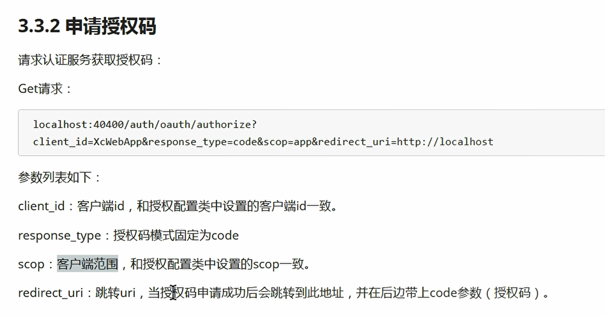
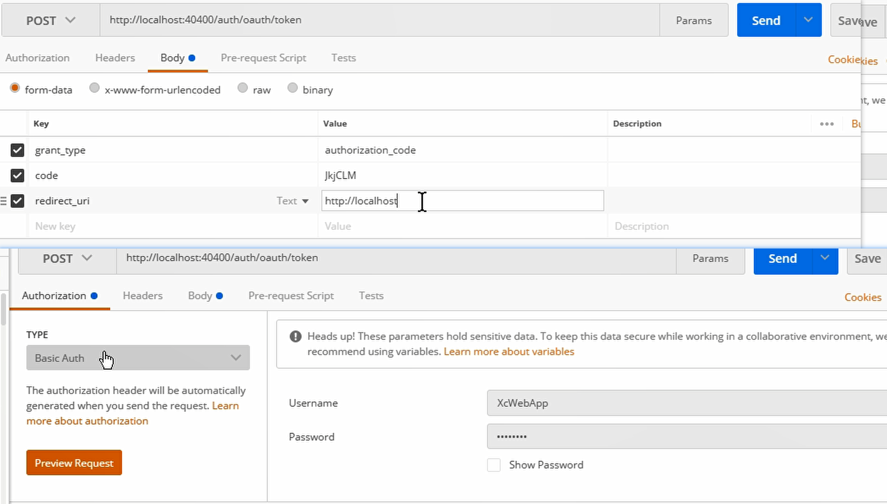
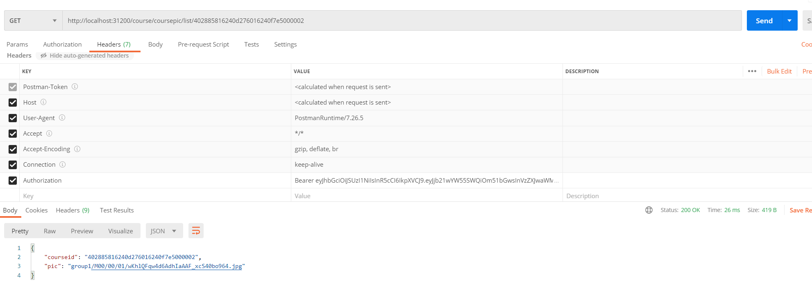
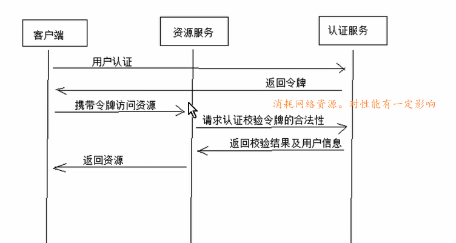
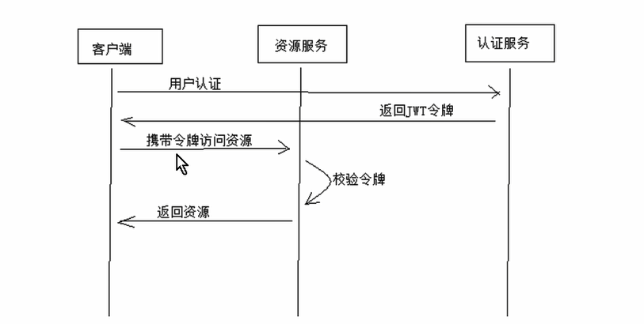
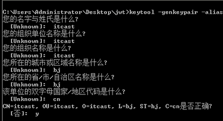
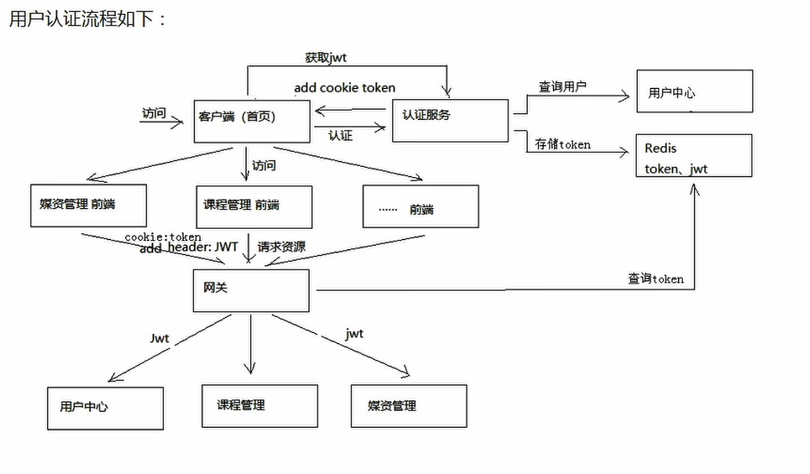
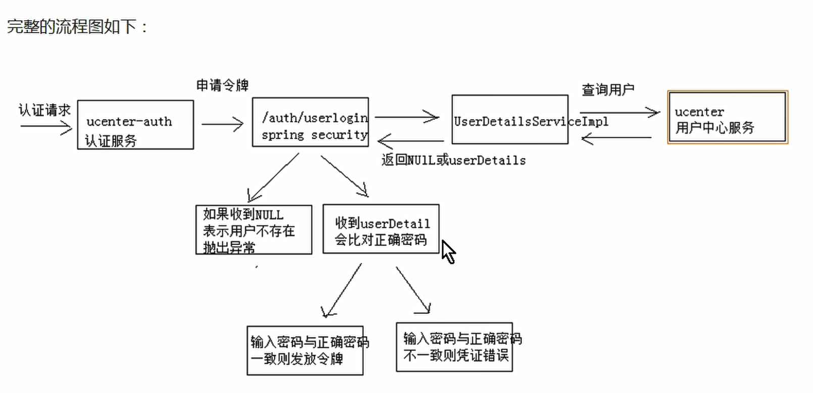
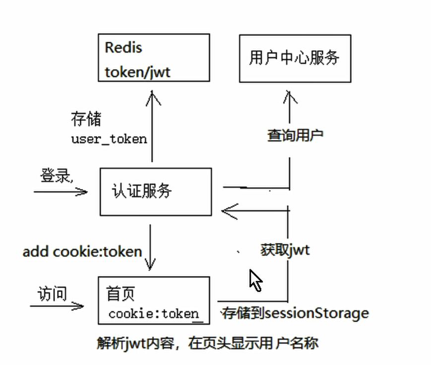

获取令牌

**访问资源测试**

## 密码模式授权

密码模式（Resource Owner Password Credentials）

与授权码模式的区别是申请令牌不再使用授权码，而是直接 通过用户名和密码即可申请令牌。

 测试如下： Post请求：http://localhost:40400/auth/oauth/token 	参数： grant_type：密码模式授权填写password username：账号 password：密码 并且此链接需要使用 http Basic认证。

## 校验令牌

Spring Security Oauth2提供校验令牌的端点，如下： Get: http://localhost:40400/auth/oauth/check_token?token= 参数： token：令牌

## 刷新令牌

刷新令牌是当令牌快过期时重新生成一个令牌，它于授权码授权和密码授权生成令牌不同，刷新令牌不需要授权码 也不需要账号和密码，只需要一个刷新令牌、客户端id和客户端密码。 

测试如下： Post：http://localhost:40400/auth/oauth/token

grant_type： 固定为 refresh_token refresh_token：刷新令牌（注意不是access_token，而是refresh_token）

# 引出JWT

**传统令牌校验**

**JWT**

 

 

JSON Web Token（JWT）是一个开放的行业标准（RFC 7519），它定义了一种简介的、自包含的协议格式，用于 在通信双方传递json对象，传递的信息经过数字签名可以被验证和信任。JWT可以使用HMAC算法或使用RSA的公 钥/私钥对来签名，防止被篡改。

 官网：https://jwt.io/ 

标准：https://tools.ietf.org/html/rfc7519

- JWT令牌的优点： 1、jwt基于json，非常方便解析。 2、可以在令牌中自定义丰富的内容，易扩展。 3、通过非对称加密算法及数字签名技术，JWT防止篡改，安全性高。 4、资源服务使用JWT可不依赖认证服务即可完成授权。 
- 缺点： １、JWT令牌较长，占存储空间比较大。

## 生成秘钥公钥

 JWT令牌生成采用非对称加密算法、 

1、生成密钥证书 下边命令生成密钥证书，采用RSA 算法每个证书包含公钥和私钥

 keytool -genkeypair -alias cjkey -keyalg RSA -keypass chenjkey -keystore xc.keystore -storepass chenjkey

Keytool 是一个java提供的证书管理工具

 -alias：密钥的别名

 -keyalg：使用的hash算法

 -keypass：密钥的访问密码 

-keystore：密钥库（保存了秘钥的一个文件）文件名，xc.keystore保存了生成的证书

 -storepass：密钥库的访问密码 

查询证书信息：

 keytool -list -keystore xc.keystore 

删除别名 keytool -delete -alias xckey -keystore xc.keystore 

2、导出公钥 openssl是一个加解密工具包，这里使用openssl来导出公钥信息。 安装 openssl：http://slproweb.com/products/Win32OpenSSL.html 安装资料目录下的Win64OpenSSL-1_1_0g.exe 配置openssl的path环境变量，本教程配置在D:\OpenSSL-Win64\bin cmd进入xc.keystore文件所在目录执行如下命令：

**SecurityContext**，当用户通过认证之后，就会为这个用户生成一个唯一的`SecurityContext`，里面包含用户的认证信息`Authentication`。通过SecurityContext我们可以获取到用户的标识`Principle`和授权信息`GrantedAuthrity`。在系统的任何地方只要通过`SecurityHolder.getSecruityContext()`就可以获取到`SecurityContext`。在Shiro中通过`SecurityUtils.getSubject()`到达同样的目的。

