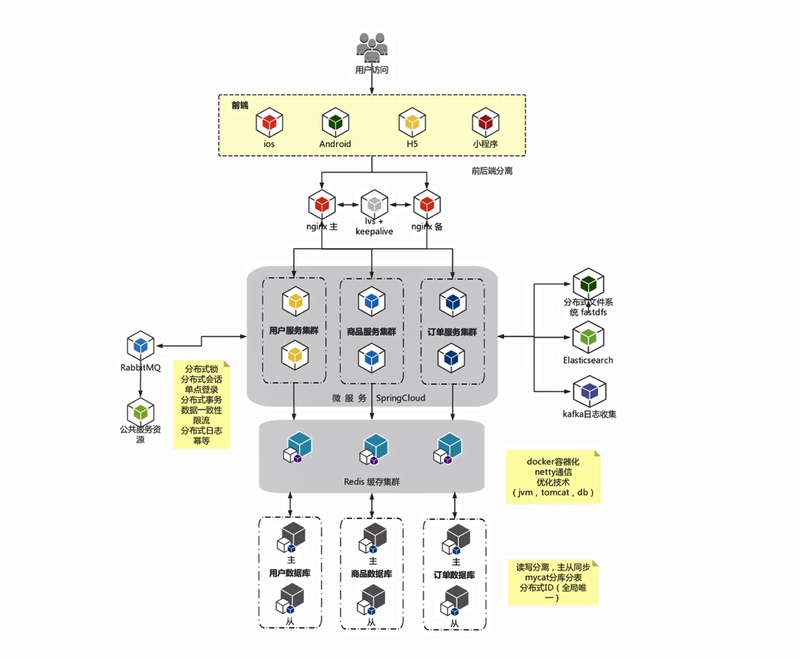
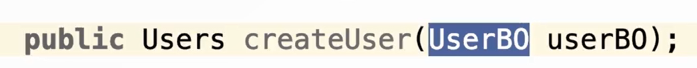
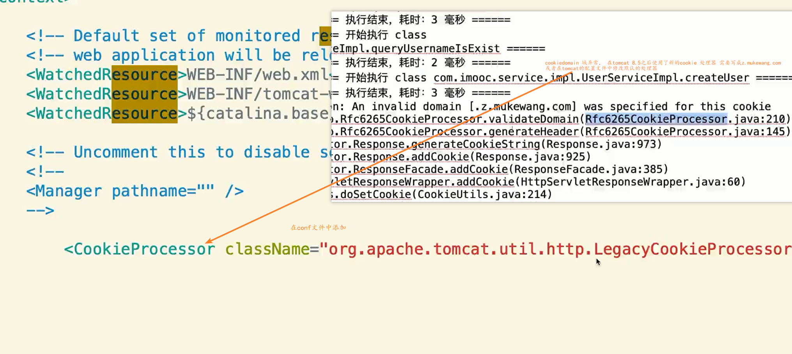

# 核心技术栈

​	  

# 数据库外键

## 分布式为什么不使用外键

- 性能影响

  两个有关系的表之间，有外键。数据库完整性、强一致性，分布式的时候需要对数据库完整性做一个检车，在高并发的时候影响新能

- 热更新

  不停机的维护

- 降低耦合度

  使用逻辑外键

- 数据库分库分表

  耦合度过高会导致分库难

# BO、VO、DTO

前端传递过来的参数为BO

# cookiey异常

