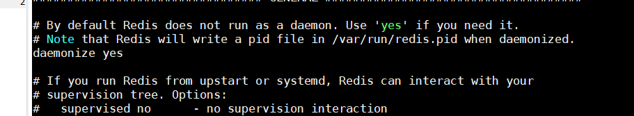
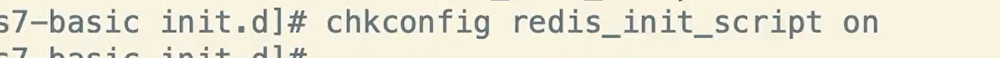

# Redis

文件上传至/home/software 目录，解压缩。 进入解压后的redis目录

安装redis需要依赖gcc-c++ ,需要先安装 `yum install gcc-c++`

编译：`make`     

有可能出现编译失败，原因gcc版本问题

> 安装6版本的redis，gcc版本一定要5.3以上，centos6.6默认安装4.4.7；centos7.5.1804默认安装4.8.5，这里要升级gcc了。

使用scl解决，命令如下

```
[root@emooco redis-6.0.6]# yum -y install centos-release-scl && yum -y install devtoolset-9-gcc devtoolset-9-gcc-c++ devtoolset-9-binutils && scl enable devtoolset-9 bash
```

并使scl(softwar collections)包命令持久化，避免每次显式调用

```
echo "source /opt/rh/devtoolset-9/enable" >>/etc/profile
```

安装 `make install`

进入utils包，拷贝 启动脚本 到  	/etc/init.d/  目录


拷贝redis安装目录中的配置文件redis.conf 到  /usr/local/redis 目录中


进入目录 对该配置文件进行修改

后台方式启动




创建该工作目录


进入前面的redis启动脚本

```bash
cd /etc/init.d
vi redis_init_script
```


这时脚本还不能被执行，需要赋予权限

```
chmod 777 redis_init_script
```

启动

```
./redis_init_script start
```

自启

```
#chkconfig: 22345 10 90
#description: Start and Stop redis
```

 

```
chkconfig redis_init_script on
```




使用脚本关闭 redis


## 常用数据类型

### String


**字符串操作**


**批量操作**


### Hash


**hash直接删删不了，需要一个一个删除里面的键**


### List


**获取指定位置**


**替换某个下标的值**


**向指定元素的前面或后面插入值**


**删除元素，并指定删除个数**


**截取一部分内容进行保留，其他的内容删除**


**删除**


### Set


**删除, 随机出栈**


**从set中随机获取一些值**


**移动值**


**差集**


**交集**


并集


### ZSet


**获取指定数据的下标**


**获取指定数据的分数**


**统计总数**


**统计分数在某一范围内的总数**


**查询分数在某一范围内的数据**


这里都是前闭后闭, 若要使用开区间则使用


还可以分页


**删除**


## 阻塞与非阻塞，IO


## Redis的线程模型


  


