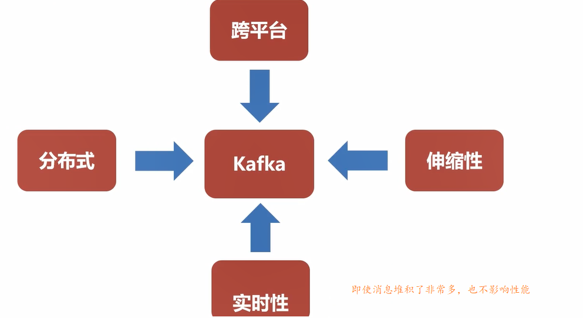
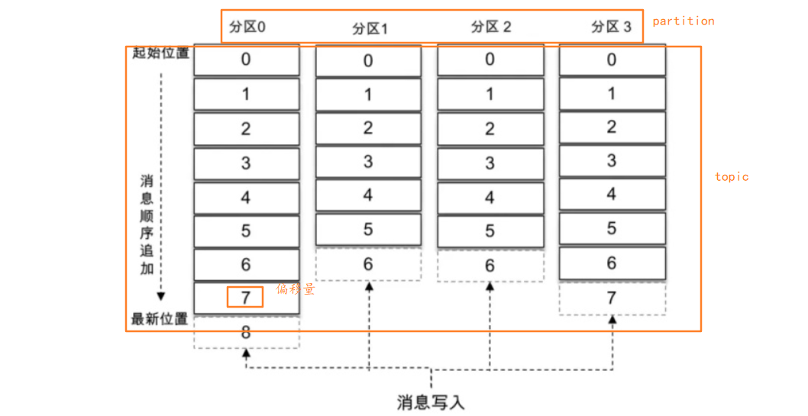
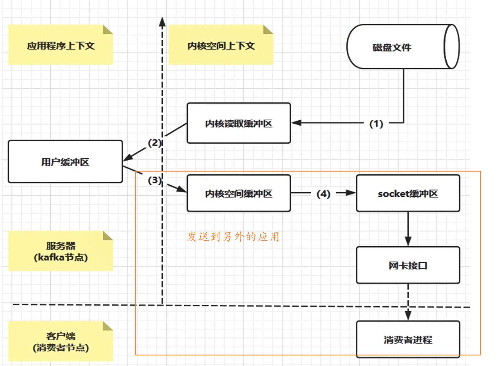
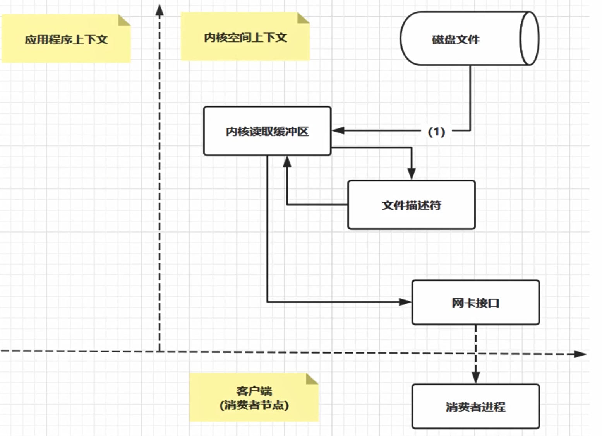
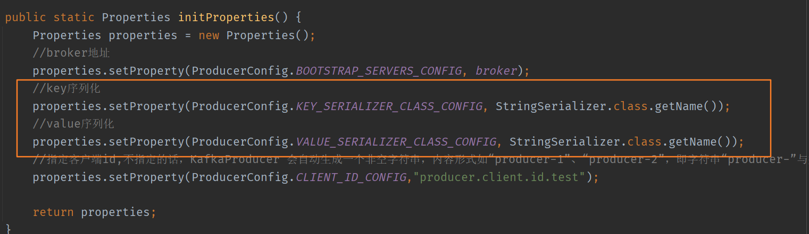
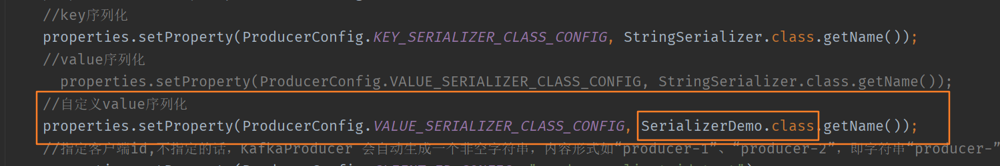
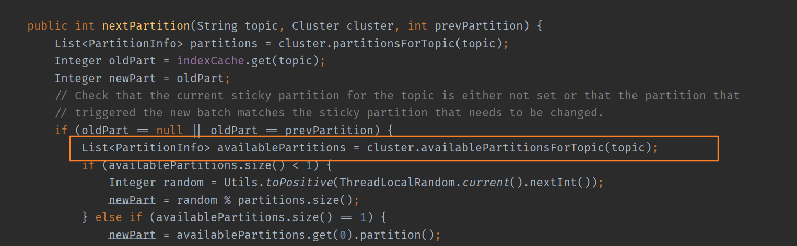

# 简介

>  A distributed streaming platform  分布式的流平台（并不是只是消息队列） 
>
>  Kafka是基于zookeeper的分布式消息系统
>  Kafka具有高吞吐率、高性能、实时及高可靠等特点

==跨平台，支持多种语言，异构==




## **常见命令**

```bash
1、启动Kafka
bin/kafka-server-start.sh config/server.properties &

2、停止Kafka
bin/kafka-server-stop.sh

3、创建Topic
bin/kafka-topics.sh --create --zookeeper localhost:2181 --replication-factor 1 --partitions 1 --topic topicTest

4、查看已经创建的Topic信息
bin/kafka-topics.sh --list --zookeeper localhost:2181

5、发送消息
bin/kafka-console-producer.sh --broker-list 192.168.6.20:9092 --topic jtopicTest

6、接收消息
bin/kafka-console-consumer.sh --bootstrap-server 192.168.6.20:9092 --topic topicTest --from-beginning


{"orderId":"002","price":"80"}
```

AdminClient      					        AdminClient客户端对象

**通过adminClient可以操作:**

NewTopic               					   创建Topic
Create TopicsResult				     创建Topic的返回结果
ListTopicsResult						    查询Topic列表
ListTopicsOptions						 查询Topic列表及选项
DescribeTopicsResult 				  查询Topics
DescribeConfigsResult 				查询Topics配置项

## 基本概念

- Topic:

  Topic即主题，通过对消息指定主题可以将消息分类，消费者可以只关注自己需要的Topic中的消息

  一个虚拟的概念，由1到多个Partitions组成

- Partition:

  分区，实际消息存储单位，Kafka中可以将Topic从物理上划分成一个或多个分区（Partition），每个分区在物理上对应一个文件夹，以”topicName_partitionIndex”的命名方式命名，该文件夹下存储这个分区的所有消息(.log)和索引文件(.index)，这使得Kafka的吞吐率可以水平扩展。

- Producer:

  消息生产者

- Consumer

  消息消费者，一个消费者可以消费多个partition，但是一个partition只能绑定一个消费者

## 分区与主题

partiotion分区的数量可以在主题创建的时候指定，也可以在之后修改。每条消息在发送的时候会根据分区规则被追加到指定的分区中，分区中的每条消息都会被分配一个唯一的序列号，也就是通常所说的偏移量（offset），具有4个分区的主题的逻辑结构见下图。




## 日志

一个分区对应一个日志（**Log**）。为了防止 Log 过大，Kafka 又引入了日志分段（**LogSegment**）的概念，将 Log 切分为多个 LogSegment，向 Log 中追加消息时是顺序写入的，只有最后一个 LogSegment 才能执行写入操作，在此之前所有的 LogSegment 都不能写入数据。为了方便描述，我们将最后一个 LogSegment 称为“activeSegment”，即表示当前活跃的日志分段。随着消息的不断写入，当 activeSegment 满足一定的条件时，就需要创建新的 activeSegment，之后追加的消息将写入新的 activeSegment。

**log**并非一个文件，而是一个文件夹，文件夹中保存了LogSegment，命名方式为  topicName-log-index  例如：有一个名为“topic-log”的主题，此主题中具有4个分区，那么在实际物理存储上表现为“topic-log-0”、“topic-log-1”、“topic-log-2”、“topic-log-3”这4个文件夹。
每个 **LogSegment** 都有一个基准偏移量 baseOffset，用来表示当前 LogSegment 中第一条消息的 offset。偏移量是一个64位的长整型数，日志文件和两个索引文件都是根据基准偏移量（baseOffset）命名的，名称固定为20位数字，没有达到的位数则用0填充。比如第一个 LogSegment 的基准偏移量为0，对应的日志文件为00000000000000000000.log。


## 整体布局

消费者提交的位移是保存在 Kafka 内部的主题__consumer_offsets中的，初始情况下这个主题并不存在，当第一次有消费者消费消息时会自动创建这个主题。


在某一时刻，Kafka 中的文件目录布局如上图所示。每一个根目录都会包含最基本的4个检查点文件（xxx-checkpoint）和 meta.properties 文件。在创建主题的时候，如果当前 broker 中不止配置了一个根目录，那么会挑选分区数最少的那个根目录来完成本次创建任务。


## 高性能的原因

顺序写，Page Cache空中接力，高 效读写。

> CPU如果要访问外部磁盘上的文件，需要首先将这些文件的内容拷贝到内存中，由于硬件的限制，从磁盘到内存的数据传输速度是很慢的，如果现在物理内存有空余，干嘛不用这些空闲内存来缓存一些磁盘的文件内容呢，这部分用作**缓存磁盘文件**的内存就叫做page cache。

后台异步、主动Flush

### zeroCopy

**普通的应用之间传递文件**




**Kafka 的 zeroCopy**




# 安装

zookeeper配置文件参数

```
# ZooKeeper服务器心跳时间，单位为ms
tickTime=2000
# 允许follower连接并同步到leader的初始化连接时间，以tickTime的倍数来表示
initLimit=10
# leader与follower心跳检测最大容忍时间，响应超过syncLimit*tickTime，leader认为
# follower“死掉”，从服务器列表中删除follower
syncLimit=5
# 数据目录
dataDir=/tmp/zookeeper/data
# 日志目录
dataLogDir=/tmp/zookeeper/log
# ZooKeeper对外服务端口
clientPort=2181
```

设置环境变量

```
export ZOOKEEPER_HOME=/home/apache-zookeeper-3.5.7-bin/
export PATH=$PATH:$ZOOKEEPER_HOME/bin
```

使环境变量生效 `source /etc/profile`

默认情况下，Linux 系统中没有/tmp/zookeeper/data 和/tmp/zookeeper/log 这两个目录，所以接下来还要创建这两个目录：

```
mkdir -p /tmp/zookeeper/data
mkdir -p /tmp/zookeeper/log
```

启动  `zkServer.sh start`

查看状态   ` zkServer.sh status`


# 消费者与消费组

> 消费者负责订阅 Kafka 中的主题（Topic），并且从订阅的主题上拉取消息。与其他一些消息中间件不同的是：在 Kafka 的消费理念中还有一层消费组的概念，每个消费者都有一个对应的消费组。当消息发布到主题后，只会被投递给订阅它的每个消费组中的一个消费者，而不是每个消费者。有几个消费组，消息就被投递多少次。

点对点模型（Peer to Peer，P2P）这里面的点对点指的是同一条消息只能被下游的一个消费者消费，其他消费者则不能染指。在 Kafka 中实现这种 P2P 模型的方法就是引入了消费者组（Consumer Group）。所谓的消费者组，指的是多个消费者实例共同组成一个组来消费一组主题。这组主题中的每个分区都只会被组内的一个消费者实例消费，其他消费者实例不能消费它。为什么要引入消费者组呢？主要是为了提升消费者端的吞吐量。多个消费者实例同时消费，加速整个消费端的吞吐量（TPS）

# 基本概念

- 消息：Record。Kafka 是消息引擎嘛，这里的消息就是指 Kafka 处理的主要对象。
- 主题：Topic。主题是承载消息的逻辑容器，在实际使用中多用来区分具体的业务。
- 分区：Partition。一个有序不变的消息序列。每个主题下可以有多个分区。
- 消息位移：Offset。表示分区中每条消息的位置信息，是一个单调递增且不变的值。
- 副本：Replica。Kafka 中同一条消息能够被拷贝到多个地方以提供数据冗余，这些地方就是所谓的副本。副本还分为领导者副本和追随者副本，各自有不同的角色划分。副本是在分区层级下的，即每个分区可配置多个副本实现高可用。
- 生产者：Producer。向主题发布新消息的应用程序。
- 消费者：Consumer。从主题订阅新消息的应用程序。
- 消费者位移：Consumer Offset。表征消费者消费进度，每个消费者都有自己的消费者位移。
- 消费者组：Consumer Group。多个消费者实例共同组成的一个组，同时消费多个分区以实现高吞吐。
- 重平衡：Rebalance。消费者组内某个消费者实例挂掉后，其他消费者实例自动重新分配订阅主题分区的过程。Rebalance 是 Kafka 消费者端实现高可用的重要手段。


## Broker端参数

### 日志

- `log.dirs`：这是非常重要的参数，指定了 Broker 需要使用的若干个文件目录路径。要知道这个参数是没有默认值的，这说明什么？这说明它必须由你亲自指定。
- `log.dir`：注意这是 dir，结尾没有 s，说明它只能表示单个路径，它是补充上一个参数用的。

这两个参数应该怎么设置呢？很简单，你只要设置`log.dirs`，即第一个参数就好了，不要设置`log.dir`。而且更重要的是，在线上生产环境中一定要为`log.dirs`配置多个路径，具体格式是一个 CSV 格式，也就是用逗号分隔的多个路径，比如`/home/kafka1,/home/kafka2,/home/kafka3`这样。如果有条件的话你最好保证这些目录挂载到不同的物理磁盘上。这样做有两个好处：

-  提升读写性能：比起单块磁盘，多块物理磁盘同时读写数据有更高的吞吐量。
- 能够实现故障转移：即 Failover。这是 Kafka 1.1 版本新引入的强大功能。要知道在以前，只要 Kafka Broker 使用的任何一块磁盘挂掉了，整个 Broker 进程都会关闭。但是自 1.1 开始，这种情况被修正了，坏掉的磁盘上的数据会自动地转移到其他正常的磁盘上，而且 Broker 还能正常工作。

### ZooKeeper

下面说说与 **ZooKeeper** 相关的设置。首先 ZooKeeper 是做什么的呢？它是一个分布式协调框架，负责协调管理并保存 Kafka 集群的所有元数据信息，比如集群都有哪些 Broker 在运行、创建了哪些 Topic，每个 Topic 都有多少分区以及这些分区的 Leader 副本都在哪些机器上等信息。

Kafka 与 ZooKeeper 相关的最重要的参数当属`zookeeper.connect`。这也是一个 CSV 格式的参数，比如我可以指定它的值为`zk1:2181,zk2:2181,zk3:2181`。2181 是 ZooKeeper 的默认端口。

现在问题来了，如果我让多个 Kafka 集群使用同一套 ZooKeeper 集群，那么这个参数应该怎么设置呢？这时候 chroot 就派上用场了。这个 chroot 是 ZooKeeper 的概念，类似于别名。

如果你有两套 Kafka 集群，假设分别叫它们 kafka1 和 kafka2，那么两套集群的`zookeeper.connect`参数可以这样指定：`zk1:2181,zk2:2181,zk3:2181/kafka1`和`zk1:2181,zk2:2181,zk3:2181/kafka2`。**切记 chroot 只需要写一次，而且是加到最后**


### 客户端程序或其他 Broker 如何与该 Broker 进行通信的设置。

有以下三个参数：

- `listeners`：学名叫监听器，其实就是告诉外部连接者要通过什么协议访问指定主机名和端口开放的 Kafka 服务。
- `advertised.listeners`：和 listeners 相比多了个 advertised。Advertised 的含义表示宣称的、公布的，就是说这组监听器是 Broker 用于对外发布的。
- `host.name/port`：列出这两个参数就是想说你把它们忘掉吧，压根不要为它们指定值，毕竟都是过期的参数了。

我们具体说说监听器的概念，从构成上来说，它是若干个逗号分隔的三元组，每个三元组的格式为`<协议名称，主机名，端口号>`。这里的协议名称可能是标准的名字，比如 PLAINTEXT 表示明文传输、SSL 表示使用 SSL 或 TLS 加密传输等；也可能是你自己定义的协议名字，比如`CONTROLLER: //localhost:9092`。

一旦你自己定义了协议名称，你必须还要指定`listener.security.protocol.map`参数告诉这个协议底层使用了哪种安全协议，比如指定`listener.security.protocol.map=CONTROLLER:PLAINTEXT表示CONTROLLER`这个自定义协议底层使用明文不加密传输数据。

主机名这个设置中到底使用 IP 地址还是主机名？**最好全部使用主机名，即 Broker 端和 Client 端应用配置中全部填写主机名。** Broker 源代码中也使用的是主机名，如果你在某些地方使用了 IP 地址进行连接，可能会发生无法连接的问题。

### Topic 管理

- `auto.create.topics.enable`：是否允许自动创建 Topic。建议最好设置成 **false**，即不允许自动创建 Topic。要为名为 test 的 Topic 发送事件，但是如果不小心拼写错误了，把 test 写成了 tst，之后启动了生产者程序。恭喜你，一个名为 tst 的 Topic 就被自动创建了。

- `unclean.leader.election.enable`：是否允许 Unclean Leader 选举。只有保存数据比较多的那些副本才有资格竞选，那些落后进度太多的副本没资格做这件事。

  但是，现在出现这种情况了：假设那些保存数据比较多的副本都挂了怎么办？此时这个参数就派上用场了。

  如果设置成 false，坚决不能让那些落后太多的副本竞选 Leader，这个分区就不可用了。反之如果是 true，那么 Kafka 允许你从那些“跑得慢”的副本中选一个出来当 Leader。这样数据有可能就丢失了，因为这些副本保存的数据本来就不全，当了 Leader 之后它本人就变得膨胀了，认为自己的数据才是权威的。

  这个参数在最新版的 Kafka 中默认就是 false，但是比较搞笑的是社区对这个参数的默认值来来回回改了好几版了，所以建议还是显式地把它设置成 false 吧。

- `auto.leader.rebalance.enable`：是否允许定期进行 Leader 选举。

  的影响貌似没什么人提，但其实对生产环境影响非常大。设置它的值为 true 表示允许 Kafka 定期地对一些 Topic 分区进行 Leader 重选举，当然这个重选举不是无脑进行的，它要满足一定的条件才会发生。严格来说它与上一个参数中 Leader 选举的最大不同在于，它不是选 Leader，而是换 Leader！比如 Leader A 一直表现得很好，但若为true，那么有可能一段时间后 Leader A 就要被强行卸任换成 Leader B。

  你要知道换一次 Leader 代价很高的，原本向 A 发送请求的所有客户端都要切换成向 B 发送请求，而且这种换 Leader 本质上没有任何性能收益，因此我建议你在生产环境中把这个参数设置成 false。


### 数据留存

- `log.retention.{hour|minutes|ms}`：这是个“三兄弟”，都是控制一条消息数据被保存多长时间。从优先级上来说 ms 设置最高、minutes 次之、hour 最低。虽然 ms 设置有最高的优先级，但是通常情况下我们还是设置 hour 级别的多一些，比如`log.retention.hour=168`表示默认保存 7 天的数据，自动删除 7 天前的数据。很多公司把 Kafka 当做存储来使用，那么这个值就要相应地调大。
- `log.retention.bytes`：这是指定 Broker 为消息保存的总磁盘容量大小。这个值默认是 -1，表明你想在这台 Broker 上保存多少数据都可以。这个参数真正发挥作用的场景其实是在云上构建多租户的 Kafka 集群：设想你要做一个云上的 Kafka 服务，每个租户只能使用 100GB 的磁盘空间，为了避免有个“恶意”租户使用过多的磁盘空间，设置这个参数就显得至关重要了
- `message.max.bytes`：控制 Broker 能够接收的最大消息大小。默认的 1000012 太少了，还不到 1MB。实际场景中突破 1MB 的消息都是屡见不鲜的，它只是一个标尺而已，仅仅衡量 Broker 能够处理的最大消息大小，即使设置大一点也不会耗费什么磁盘空间的。

## Topic 端参数

>  Topic 级别参数会覆盖全局 Broker 参数的值，而每个 Topic 都能设置自己的参数值，这就是所谓的 Topic 级别参数。

在实际生产环境中，如果为所有 Topic 的数据都保存相当长的时间，这样做既不高效也无必要。更适当的做法是允许不同部门的 Topic 根据自身业务需要，设置自己的留存时间。

- `retention.ms`：规定了该 Topic 消息被保存的时长。默认是 7 天，即该 Topic 只保存最近 7 天的消息。一旦设置了这个值，它会覆盖掉 Broker 端的全局参数值。
- `retention.bytes`：规定了要为该 Topic 预留多大的磁盘空间。和全局参数作用相似，这个值通常在多租户的 Kafka 集群中会有用武之地。当前默认值是 -1，表示可以无限使用磁盘空间。
- `max.message.bytes`。它决定了 Kafka Broker 能够正常接收该 Topic 的最大消息大小。我知道目前在很多公司都把 Kafka 作为一个基础架构组件来运行，上面跑了很多的业务数据。如果在全局层面上，我们不好给出一个合适的最大消息值，那么不同业务部门能够自行设定这个 Topic 级别参数就显得非常必要了。在实际场景中，这种用法也确实是非常常见的。

**修改 Topic 级 max.message.bytes，还要考虑以下两个**
**还要修改 Broker的 replica.fetch.max.bytes 保证复制正常**
**消费还要修改配置 fetch.message.max.bytes**

### 如何设置参数

我们有两种方式可以设置：

- 创建 Topic 时进行设置
- 修改 Topic 时设置

用上面提到的`retention.ms`和`max.message.bytes`举例。设想你的部门需要将交易数据发送到 Kafka 进行处理，需要保存最近半年的交易数据，同时这些数据很大，通常都有几 MB，但一般不会超过 5MB。现在让我们用以下命令来创建 Topic：

```
bin/kafka-topics.sh--bootstrap-serverlocalhost:9092--create--topictransaction--partitions1--replication-factor1--configretention.ms=15552000000--configmax.message.bytes=5242880
```

我们只需要知道 Kafka 开放了`kafka-topics`命令供我们来创建 Topic 即可。对于上面这样一条命令，请注意结尾处的`--config`设置，我们就是在 config 后面指定了想要设置的 Topic 级别参数。

下面看看使用另一个自带的命令`kafka-configs`来修改 Topic 级别参数。假设我们现在要发送最大值是 10MB 的消息，该如何修改呢？命令如下：

```
 bin/kafka-configs.sh --zookeeperlocalhost:2181 --entity-typetopics--entity-nametransaction--alter --add-configmax.message.bytes=10485760
```

## JVM 参数

通用的建议：将你的 JVM 堆大小设置成 6GB 吧，这是目前业界比较公认的一个合理值。我见过很多人就是使用默认的 Heap Size 来跑 Kafka，说实话默认的 1GB 有点小，毕竟 Kafka Broker 在与客户端进行交互时会在 JVM 堆上创建大量的 ByteBuffer 实例，Heap Size 不能太小。

- `KAFKA_HEAP_OPTS`：指定堆大小。
- `KAFKA_JVM_PERFORMANCE_OPTS`：指定 GC 参数。

比如你可以这样启动 Kafka Broker，即在启动 Kafka Broker 之前，先设置上这两个环境变量：

```
$> export KAFKA_HEAP_OPTS=--Xms6g  --Xmx6g
$> export  KAFKA_JVM_PERFORMANCE_OPTS= -server -XX:+UseG1GC -XX:MaxGCPauseMillis=20 -XX:InitiatingHeapOccupancyPercent=35 -XX:+ExplicitGCInvokesConcurrent -Djava.awt.headless=true
$> bin/kafka-server-start.sh config/server.properties
```

## 操作系统参数

- 文件描述符限制 
  - `ulimit -n`，文件描述符系统资源**并没有很昂贵**，设置成一个很大的值也是合理的，比如`ulimit -n 1000000`。不设置的话后果很严重，比如你会经常看到“Too many open files”的错误。
- 文件系统类型
- Swappiness
- 提交时间

文件系统类型的选择。这里所说的文件系统指的是如 ext3、ext4 或 XFS 这样的日志型文件系统。根据官网的测试报告，XFS 的性能要强于 ext4，所以生产环境最好还是使用 XFS。对了，最近有个 Kafka 使用 ZFS 的[数据报告](https://www.confluent.io/kafka-summit-sf18/kafka-on-zfs)，貌似性能更加强劲，有条件的话不妨一试。

第三是 swap 的调优。网上很多文章都提到设置其为 0，将 swap 完全禁掉以防止 Kafka 进程使用 swap 空间。我个人反倒觉得还是不要设置成 0 比较好，我们可以设置成一个较小的值。为什么呢？因为一旦设置成 0，当物理内存耗尽时，操作系统会触发 OOM killer 这个组件，它会随机挑选一个进程然后 kill 掉，即根本不给用户任何的预警。但如果设置成一个比较小的值，当开始使用 swap 空间时，你至少能够观测到 Broker 性能开始出现急剧下降，从而给你进一步调优和诊断问题的时间。基于这个考虑，我个人建议将 swappniess 配置成一个接近 0 但不为 0 的值，比如 1。

最后是提交时间或者说是 Flush 落盘时间。向 Kafka 发送数据并不是真要等数据被写入磁盘才会认为成功，而是只要数据被写入到操作系统的页缓存（Page Cache）上就可以了，随后操作系统根据 LRU 算法会定期将页缓存上的“脏”数据落盘到物理磁盘上。这个定期就是由提交时间来确定的，默认是 5 秒。一般情况下我们会认为这个时间太频繁了，可以适当地增加提交间隔来降低物理磁盘的写操作。当然你可能会有这样的疑问：如果在页缓存中的数据在写入到磁盘前机器宕机了，那岂不是数据就丢失了。的确，这种情况数据确实就丢失了，但鉴于 Kafka 在软
件层面已经提供了多副本的冗余机制，因此这里稍微拉大提交间隔去换取性能还是一个合理的做法。

**在单节点中的解决方法可以看后面的  消息传递保障**


# 拦截器

> 消息在通过 send() 方法发往 broker 的过程中，有可能需要经过拦截（Interceptor）、序列化器（Serializer）和分区器（Partitioner）的一系列作用之后才能被真正地发往 broker。拦截器一般不是必需的，而序列化器是必需的。拦截器既可以用来在消息发送前做一些准备工作，比如按照某个规则过滤不符合要求的消息、修改消息的内容等，也可以用来在发送回调逻辑前做一些定制化的需求，比如统计类工作。
>
> Kafka 一共有两种拦截器：**生产者拦截器**和**消费者拦截器**。
>
> KafkaProducer 在**将消息序列化和计算分区之前**会调用生产者拦截器的onSend() 方法来对消息进行相应的定制化操作。
>
> 生产者使用也很方便，主要是自定义实现 org.apache.kafka.clients.producer. ProducerInterceptor 接口。

ProducerInterceptor 接口与 Partitioner 接口一样，它也有一个同样的父接口 Configurable，具体的内容可以参见 Partitioner 接口的相关介绍。

==**注意：多个拦截器形成拦截链路时，如果有一个出现异常，异常会被捕获，但是不会继续抛出，将会从上一个没出现异常的继续执行**==

1. onSend：该方法会在消息发送之前被调用。如果你想在发送之前对消息“美美容”，这个方法是你唯一的机会。
2. onAcknowledgement：该方法会在消息成功提交或发送失败之后被调用。早于 发送方法中的 callback。

**注意**

**onAcknowledgement  和 onSend 不是在同一个线程中被调用的，因此如果你在这两个方法中调用了某个共享可变对象，一定要保证线程安全**。最好别放一些太重的逻辑进去，否则你会发现你的 Producer TPS 直线下降。

- 自定义发送端拦截器

  ```java
  public class ProducerPrefixInterceptor implements ProducerInterceptor<String, String> {
      private volatile long sendSuccess = 0;
      private volatile long sendFailure = 0;
  
      @Override
      public ProducerRecord<String, String> onSend(ProducerRecord<String, String> record) {
          String modifiedValue = "prefix1-" + record.value();
          return new ProducerRecord<>(record.topic(), record.partition(), record.timestamp(),
                  record.key(), modifiedValue, record.headers());
      }
  
      @Override
      public void onAcknowledgement(RecordMetadata metadata, Exception exception) {
          if (exception != null){
              sendFailure ++;
          }else {
              sendSuccess ++;
          }
      }
  
      @Override
      public void close() {
          double successRatio = (double)sendSuccess / (sendFailure + sendSuccess);
          System.out.println("成功率：" + successRatio * 100 + "%");
      }
  
      @Override
      public void configure(Map<String, ?> configs) {
  
      }
  }
  ```

  

- 消费端拦截器

  1. onConsume：该方法在消息返回给 Consumer 程序之前调用。也就是说在开始正式处理消息之前，拦截器会先拦一道，搞一些事情，之后再返回给你。
  2. onCommit：Consumer 在提交位移之后调用该方法。通常你可以在该方法中做一些记账类的动作，比如打日志等。

## 案例

统计业务消息从被生产出来到最后被消费的平均总时长是多少


在发送消息前更新总的已发送消息数。(没有考虑发送失败的情况)

```java
public class AvgLatencyProducerInterceptor implements ProducerInterceptor<String, String> {
 
    private Jedis jedis; // 省略 Jedis 初始化
 
    @Override
    public ProducerRecord<String, String> onSend(ProducerRecord<String, String> record) {
        jedis.incr("totalSentMessage");
        return record;
    }
 
    @Override
    public void onAcknowledgement(RecordMetadata metadata, Exception exception) {
    }
 
    @Override
    public void close() {
    } 
    @Override
    public void configure(Map<java.lang.String, ?> configs) {
    }
```

在真正消费一批消息前首先更新了它们的总延时，方法就是用当前的时钟时间减去封装在消息中的创建时间，然后累计得到这批消息总的端到端处理延时并更新到 Redis 中。分别别从 Redis 中读取更新过的总延时和总消息数，两者相除即得到端到端消息的平均处理延时。

```java
public class AvgLatencyConsumerInterceptor implements ConsumerInterceptor<String, String> {
 
    private Jedis jedis; // 省略 Jedis 初始化
 
    @Override
    public ConsumerRecords<String, String> onConsume(ConsumerRecords<String, String> records) {
        long lantency = 0L;
        for (ConsumerRecord<String, String> record : records) {
            lantency += (System.currentTimeMillis() - record.timestamp());
        }
        jedis.incrBy("totalLatency", lantency);
        long totalLatency = Long.parseLong(jedis.get("totalLatency"));
        long totalSentMsgs = Long.parseLong(jedis.get("totalSentMessage"));
        jedis.set("avgLatency", String.valueOf(totalLatency / totalSentMsgs));
        return records;
    }
  
    @Override
    public void onCommit(Map<TopicPartition, OffsetAndMetadata> offsets) {
    }
  
    @Override
    public void close() {
    }
 
 
    @Override
    public void configure(Map<String, ?> configs) {
    }
```


# 消息序列化

> 生产者需要用序列化器（Serializer）把对象转换成字节数组才能通过网络发送给Kafka。而在对侧，消费者需要用反序列化器（Deserializer）把从 Kafka 中收到的字节数组转换成相应的对象。



自定义序列化，实现**Serializer**接口

```java
public class SerializerDemo implements Serializer {

    @Override
    public byte[] serialize(String topic, Object data) {
        if (data == null) {
            return null;
        }

        ObjectMapper objectMapper = new ObjectMapper();
        try {
            return objectMapper.writeValueAsBytes(data);
        } catch (JsonProcessingException e) {
            e.printStackTrace();
        }

        return new byte[0];
    }
}
```

**注意设置**




# 分区器

> 消息经过序列化之后就需要确定它发往的分区，如果消息 ProducerRecord 中指定了 partition 字段，那么就不需要分区器的作用，因为 partition 代表的就是所要发往的分区号。
>
> 如果消息 ProducerRecord 中没有指定 partition 字段，那么就需要依赖分区器，根据 key 这个字段来计算 partition 的值。分区器的作用就是为消息分配分区。
>
> Kafka 中提供的默认分区器是 org.apache.kafka.clients.producer.internals.DefaultPartitioner，它实现了 org.apache.kafka.clients.producer.Partitioner 接口，

**注意**

若使用默认分区器。指定了分区则指定发送到改分区，如果 key 不为 null，则将按照可以的hash进行选择；如果key 为 null 并且有可用分区时，那么计算得到的分区号仅为可用分区中的任意一个（轮询的方式），注意两者之间的差别。

ps:**分区没有leader的时候就是unavailable了。某些操作会导致瞬间没有leader，比如分区reassign、换leader等**



自定义分区器

```java
public class PartitionerDemo implements Partitioner {
    private final AtomicInteger counter = new AtomicInteger(0);

    @Override
    public int partition(String topic, Object key, byte[] keyBytes, Object value, byte[] valueBytes, Cluster cluster) {
        int size = cluster.partitionsForTopic(topic).size();
        if (keyBytes == null) {
            //key 为空则采用轮询的方式
            return counter.getAndIncrement() % size;
        } else {
            return Utils.toPositive(Utils.murmur2(keyBytes)) % size;
        }
    }

    @Override
    public void close() {

    }

    @Override
    public void configure(Map<String, ?> configs) {

    }
}
```

**自定义后需要配置**

```java
properties.setProperty(ProducerConfig.PARTITIONER_CLASS_CONFIG, PartitionerDemo.class.getName());
```


# 消息压缩

> 消息（v1叫message，v2叫record）是分批次（batch）读写的，batch是kafka读写（网络传输和文件读写）的基本单位，不同版本，对相同（或者叫相似）的概念，叫法不一样。
> v1（kafka 0.11.0之前）:message set, message
> v2（kafka 0.11.0以后）:record batch,record

Kafka 的消息层次都分为两层：一个消息集合中包含若干条日志项（record item），而日志项才是真正封装消息的地方。Kafka 底层的消息日志由一系列消息集合日志项组成。Kafka 通常不会直接操作具体的一条条消息，它总是在消息集合这个层面上进行写入操作。

V1版本（0.11.0.0 之前） 先将多条消息压缩，再保存到外层的消息集合里面

V2版本  0.11.0.0之后（包括） 将消息的公共部分抽取放到外层的消息集合中，这样就不用每条消息都保存这些信息了。然后再将整个消息集合压缩

## 何时压缩？怎么设置？

在 Kafka 中，压缩可能发生在两个地方：生产者端和 Broker 端。

生产者程序中配置 **compression.type** 参数即表示启用指定类型的压缩算法。比如下面这段程序代码展示了如何构建一个开启 GZIP 的 Producer 对象：

```java
 Properties props = new Properties();
 props.put("bootstrap.servers", "localhost:9092");
 props.put("acks", "all");
 props.put("key.serializer", "org.apache.kafka.common.serialization.StringSerializer");
 props.put("value.serializer", "org.apache.kafka.common.serialization.StringSerializer");
 // 开启 GZIP 压缩
 props.put("compression.type", "gzip");
 
 Producer<String, String> producer = new KafkaProducer<>(props);
```

 props.put(“compression.type”, “gzip”)，它表明该 Producer 的压缩算法使用的是 GZIP，消息先压缩再发送，能较少网络带宽和Broker端的磁盘占用

**有两种例外情况就可能让 Broker 重新压缩消息**

- 情况一：Broker 端指定了和 Producer 端不同的压缩算法。

  先看一个例子。想象这样一个对话。

  Producer 说：“我要使用 GZIP 进行压缩。”

  Broker 说：“不好意思，我这边接收的消息必须使用 Snappy 算法进行压缩。”

  你看，这种情况下，只能解压缩然后使用 Snappy 重新压缩一遍。Broker 端也有一个参数叫 **compression.type**，和上面那个例子中的同名。但是这个参数的默认值是 producer，这表示 Broker 端会“尊重”Producer 端使用的压缩算法。可一旦你在 Broker 端设置了不同的 compression.type 值，就一定要小心了，因为可能会发生预料之外的压缩 / 解压缩操作，通常表现为 Broker 端 CPU 使用率飙升。

- 情况二：Broker 端发生了消息格式转换。

  所谓的消息格式转换主要是为了兼容老版本的消费者程序。还记得之前说过的 V1、V2 版本吧？在一个生产环境中，Kafka 集群中同时保存多种版本的消息格式非常常见。为了兼容老版本的格式，Broker 端会对新版本消息执行向老版本格式的转换。这个过程中会涉及消息的解压缩和重新压缩。一般情况下这种消息格式转换对性能是有很大影响的，除了这里的压缩之外，它还让 Kafka 丧失了引以为豪的 Zero Copy 特性。

## 何时解压缩？

> 通常来说解压缩发生在消费者程序中，也就是说 Producer 发送压缩消息到 Broker 后，Broker 照单全收并原样保存起来。当 Consumer 程序请求这部分消息时，Broker 依然原样发送出去，当消息到达 Consumer 端后，由 Consumer 自行解压缩还原成之前的消息。

Consumer 怎么知道这些消息是用何种压缩算法压缩的呢？。Kafka 会将启用了哪种压缩算法封装进消息集合中，这样当 Consumer 读取到消息集合时，它自然就知道了这些消息使用的是哪种压缩算法。如果用一句话总结一下压缩和解压缩，那么我希望你记住这句话：**Producer 端压缩、Broker 端保持、Consumer 端解压缩。**

- 如果生产者使用了压缩，broker为了crc校验，会启动解压，这个解压过程不可避免；
- v2的broker为了低版本的消费者，会把消息再次解压并进行协议转换。
  所以消费者的兼容成本较大，需要避免这个情况。


# 消息传递保障

## 消息丢失

### 生产者程序丢失

kafka producer 是异步发送消息的，如果使用producer.send(msg) ，他会立即返回，此时不能够知道消息是否发送完成。若此时发生网络抖动，或者消息太大了超过broker设置的限制，都会导致消息无法成功“提交”

**解决方法**

Producer 永远要使用带有回调通知的发送 API，也就是说不要使用 producer.send(msg)，而要使用 producer.send(msg, callback)

### 消费者程序丢失


对于 Consumer A 而言，它当前的位移值就是 9；Consumer B 的位移值是 11。

- 消息还未被消费就提交了位移，这时候未消费的消息就相当于丢失了。解决方法为，**维持先消费消息，再更新位移的顺序**，但是这样容易造成重复消费，比如消费了消息，但是位移提交失败，这种情况可以通过幂等性保障解决。
- consumer  开启多线程处理消息。这时如果有线程处理失败，而又更新了位移，就会造成消息丢失。最好采用经典的消费模式，也就是一个线程维护一个consumer

### 如何保障消息不丢失

**一句话概括，Kafka 只对“已提交”的消息（committed message）做有限度的持久化保证。**

> 传递保障依赖于Producer和Consumer共同实现
> 传递保障主要依赖于Producer


kafka通过producer和broker协同处理单个broker丢失参数的情况。一旦producer发现broker消息丢失，即可自动进行retry。除非retry次数超过阀值（可配置），消息才会丢失。此时需要生产者客户端手动处理该情况。那么producer是如何检测到数据丢失的呢？是通过ack机制，类似于http的三次握手的方式。

- acks=0
  
  - producer不等待broker的响应，效率最高，但是消息很可能会丢。
- acks=1
  
  - leader broker收到消息后，不等待其他follower的响应，即返回ack。也可以理解为ack数为1。此时，如果follower还没有收到leader同步的消息leader就挂了，那么消息会丢失。按照上图中的例子，如果leader收到消息，成功写入PageCache后，会返回ack，此时producer认为消息发送成功。但此时，按照上图，数据还没有被同步到follower。如果此时leader断电，数据会丢失。
- acks=-1  (all)
  - leader broker收到消息后，挂起，等待所有ISR列表中的follower返回结果后，再返回ack。只有leader写入数据到pagecache是不会返回ack的，还需要所有的ISR返回“成功”才会触发ack。如果此时断电，producer可以知道消息没有被发送成功，将会重新发送。如果在follower收到数据以后，成功返回ack，leader断电，数据将存在于原来的follower中。在重新选举以后，新的leader会持有该部分数据。
  - 数据从leader同步到follower，需要2步：
    数据从pageCache被刷盘到disk。因为只有disk中的数据才能被同步到replica。
    数据同步到replica，并且replica成功将数据写入PageCache。在producer得到ack后，哪怕是所有机器都停电，数据也至少会存在于leader的磁盘内。

  

上面第三点提到了ISR的列表的follower，需要配合另一个参数才能更好的保证ack的有效性。ISR是Broker维护的一个“可靠的follower列表”，in-sync Replica列表，broker的配置包含一个参数：min.insync.replicas。该参数表示ISR中最少的副本数。如果不设置该值，ISR中的follower列表可能为空。此时相当于acks=1。

- acks=0，总耗时f(t) = f(1)。
- acks=1，总耗时f(t) = f(1) + f(2)。
- acks=-1，总耗时f(t) = f(1) + max( f(A) , f(B) ) + f(2)。

性能依次递减，可靠性依次升高。

### 解决方法总结

1. 不要使用 producer.send(msg)，而要使用 producer.send(msg, callback)。记住，一定要使用带有回调通知的 send 方法。
2. 设置 acks = all。acks 是 Producer 的一个参数，代表了你对“已提交”消息的定义。如果设置成 all，则表明所有副本 Broker 都要接收到消息，该消息才算是“已提交”。这是最高等级的“已提交”定义。
3. 设置 retries 为一个较大的值。这里的 retries 同样是 Producer 的参数，对应前面提到的 Producer 自动重试。当出现网络的瞬时抖动时，消息发送可能会失败，此时配置了 retries > 0 的 Producer 能够自动重试消息发送，避免消息丢失。
4. 设置 unclean.leader.election.enable = false。这是 Broker 端的参数，它控制的是哪些 Broker 有资格竞选分区的 Leader。如果一个 Broker 落后原先的 Leader 太多，那么它一旦成为新的 Leader，必然会造成消息的丢失。故一般都要将该参数设置成 false，即不允许这种情况的发生。
5. 设置 replication.factor >= 3。这也是 Broker 端的参数。其实这里想表述的是，最好将消息多保存几份，毕竟目前防止消息丢失的主要机制就是冗余。
6. 设置 min.insync.replicas > 1。这依然是 Broker 端参数，控制的是消息至少要被写入到多少个副本才算是“已提交”。当request.required.acks = all时生效。设置成大于 1 可以提升消息持久性。在实际环境中千万不要使用默认值 1。
7. 确保 replication.factor > min.insync.replicas。如果两者相等，那么只要有一个副本挂机，整个分区就无法正常工作了。我们不仅要改善消息的持久性，防止数据丢失，还要在不降低可用性的基础上完成。推荐设置成 replication.factor = min.insync.replicas + 1。
8. 确保消息消费完成再提交。Consumer 端有个参数 enable.auto.commit，最好把它设置成 false，并采用手动提交位移的方式。就像前面说的，这对于单 Consumer 多线程处理的场景而言是至关重要的。

### 拓展

还有一个隐蔽的消息丢失情况。新增分区时，如果producer比consumer更早发现新增的分区，而这时consumer设置的参数·`auto.offset.reset`为 latest（从最新位移处消费，默认值）时，在consumer发现新分区之前的消息就“丢失了”  

可以设置该参数为earliest  来解决 。对于这一参数，在后面的 消费端指定 offset中有提到

## 消息重复发送

当消息成功“提交”但是broker返回ack时出现网络抖动，此是producer没收到ack，如果设置了重试，将重新发送消息。这样就造成了消息的重复发送

- 最多一次（at most once）：消息可能会丢失，但绝不会被重复发送。

- 至少一次（at least once）：消息不会丢失，但有可能被重复发送。
- 精确一次（exactly once）：消息不会丢失，也不会被重复发送。

**目前，Kafka 默认提供的交付可靠性保障是第二种，即至少一次**

对于**生产者**而言，一旦消息被成功提交到kafka的日志文件，由于多副本机制的存在，那么这条消息就不会丢失，但是如果生产者将消息提交到kafka之后由于网络问题导致通信中断，造成消费者无法判断消息是否提交，那么在重试的时候就可能会造成数据的 重复写入，所以在这里kafka提供的消息传输保障为**at least once**。

对于**消费者**而言，传输保障是基于offset的commit顺序，如果消费者拉取完消息之后，应用逻辑先处理消息再提交offset，如果在处理完消息之后，offset提交之前消费者宕机，那么消费者下次消费就会将未提交offset的消息重复进行消费，这样的传输保障属于**at least once**；假如在拉取完消息后，应用在处理消息之前提交offset，假如offset提交成功，消息还未来得及消费,此时消费者宕机，那么此时的传输保障就属于**at most once**。

### 如何做到精准一次？

通过幂等性（Idempotence）或者事务（Transaction）

**幂等性**   

只能实现单分区，单会话的幂等性

在 Kafka 中，Producer 默认不是幂等性的，但我们可以创建幂等性 Producer（0.11.0.0  版本之后）

```java
props.put(ProducerConfig.ENABLE_IDEMPOTENCE_CONFIG， true)
```

它只能保证**单分区**上的幂等性，即一个幂等性 Producer 能够保证某个主题的一个分区上不出现重复消息，它无法实现多个分区的幂等性。其次，它只能实现单会话上的幂等性，不能实现跨会话的幂等性。这里的会话，你可以理解为 Producer 进程的一次运行。当你重启了 Producer 进程之后，这种幂等性保证就丧失了。

**事务**

Kafka 自 0.11 版本开始也提供了对事务的支持，目前主要是在 read committed 隔离级别上做事情。它能保证多条消息原子性地写入到目标分区，同时也能保证 Consumer 只能看到事务成功提交的消息。

- 和幂等性 Producer 一样，开启 enable.idempotence = true。
- 设置 Producer 端参数 transctional. id。最好为其设置一个有意义的名字。

代码中做一些调整

```java
producer.initTransactions();
try {
            producer.beginTransaction();
            producer.send(record1);
            producer.send(record2);
            producer.commitTransaction();
} catch (KafkaException e) {
            producer.abortTransaction();
}
```

和普通 Producer 代码相比，事务型 Producer 的显著特点是调用了一些事务 API，如 initTransaction、beginTransaction、commitTransaction 和 abortTransaction，它们分别对应事务的初始化、事务开始、事务提交以及事务终止。

Record1 和 Record2 被当作一个事务，要么它们全部成功，要么全部失败。实际上即使失败，Kafka 也会把它们写入到底层的日志中，也就是说 Consumer 还是会看到这些消息。因此在 Consumer 端，读取事务型 Producer 发送的消息也是需要一些变更的。修改起来也很简单，设置 isolation.level 参数。当前这个参数有两个取值：

1. read_uncommitted：这是默认值，表明 Consumer 能够读取到 Kafka 写入的任何消息，不论事务型 Producer 提交事务还是终止事务，其写入的消息都可以读取。很显然，如果你用了事务型 Producer，那么对应的 Consumer 就不要使用这个值。
2. read_committed：表明 Consumer 只会读取事务型 Producer 成功提交事务写入的消息。当然了，它也能看到非事务型 Producer 写入的所有消息。


# 五类javaAPI客户端

主要使用的还是前三个

- AdminClient APl:允许管理和检测Topic、broker以及其它Kafka对象
- Producer API:发布消息到1个或多个topic
- Consumer APl:订阅一个或多个topic，并处理产生的消息
- Streams APl:高效地将输入流转换到输出流
- Connector APl:从一些源系统或应用程序中拉取数据到kafka


# KafkaAadmin

## 创建topic

```java
private static AdminClient getAdminClient() {
        Properties properties = new Properties();
        properties.setProperty(AdminClientConfig.BOOTSTRAP_SERVERS_CONFIG, "192.168.6.20:9092");
        AdminClient adminClient = AdminClient.create(properties);
        return adminClient;
    }


    public static void createTopic() throws ExecutionException, InterruptedException {
        AdminClient adminClient = getAdminClient();
        short rs = 1;
        NewTopic newTopic = new NewTopic("topicTest", 1, rs);
        CreateTopicsResult topics = adminClient.createTopics(Arrays.asList(newTopic));
        topics.all().get();
        System.out.println("CreateTopicsResult" + topics);
    }
```

## 查看所有 topic

```java
public static void listTopic() throws ExecutionException, InterruptedException {
    AdminClient adminClient = getAdminClient();

    //是否查看internal
    /*ListTopicsOptions ops = new ListTopicsOptions();
    ops.listInternal(true);
    Set<String> strings = adminClient.listTopics(ops).names().get();*/

    Set<String> strings = adminClient.listTopics().names().get();
    System.out.println(strings);
}
```

## 查看topic信息

```java
public static void describeTopics() throws ExecutionException, InterruptedException {
    AdminClient adminClient = getAdminClient();
    DescribeTopicsResult topicTest = adminClient.describeTopics(Collections.singleton("topicTest"));
    System.out.println(topicTest.all().get());
}
```

## 新增分区（只能加，不能减）

```java
public static void incPartitions(int partitions) throws ExecutionException, InterruptedException {
    NewPartitions newPartitions = NewPartitions.increaseTo(partitions);
    Map<String, NewPartitions> newPartitionsMap = new HashMap<>();
    newPartitionsMap.put("topicTest", newPartitions);

    AdminClient adminClient = getAdminClient();
    adminClient.createPartitions(newPartitionsMap).all().get();
}
```

## 查询消费者组位移

```java
String groupID = "test-group";
try (AdminClient client = AdminClient.create(props)) {
         ListConsumerGroupOffsetsResult result = client.listConsumerGroupOffsets(groupID);
         Map<TopicPartition, OffsetAndMetadata> offsets = 
                  result.partitionsToOffsetAndMetadata().get(10, TimeUnit.SECONDS);
         System.out.println(offsets);
}
```

## 获取 Broker 磁盘占用

```java
DescribeLogDirsResult ret = adminClient.describeLogDirs(Collections.singletonList(0)); // 指定 Broker id
long size = 0L;
for (Map<String, LogDirDescription> logDirInfoMap : ret.allDescriptions().get().values()) {
    size += logDirInfoMap.values().stream().map(logDirInfo -> logDirInfo.replicaInfos()).flatMap(
        topicPartitionReplicaInfoMap ->
        topicPartitionReplicaInfoMap.values().stream().map(replicaInfo -> replicaInfo.size()))
        .mapToLong(Long::longValue).sum();
}
System.out.println(size);
```


# 发送端

> 主要有两个线程。这两个线程分别为主线程和发送线程。在主线程中由 KafkaProducer 创建消息，然后通过可能的拦截器、序列化器和分区器的作用之后缓存到消息收集器（RecordAccumulator，也称为消息累加器）中。发送线程负责从消息收集器中获取消息并将其发送到 Kafka 中。


消息都会被追加到消息收集器的某个**双端队列**（Deque）中，在其的内部为每个分区都维护了一个双端队列，队列中的内容就是ProducerBatch，即 Deque。消息写入缓存时，追加到双端队列的尾部；Sender 读取消息时，从双端队列的头部读取。注意 ProducerBatch 不是 ProducerRecord，ProducerBatch 中可以包含一至多个 ProducerRecord。

通俗地说，ProducerRecord 是生产者中创建的消息，而 ProducerBatch 是指一个消息批次，ProducerRecord 会被包含在 ProducerBatch 中，这样可以使字节的使用更加紧凑。与此同时，将较小的 ProducerRecord 拼凑成一个较大的 ProducerBatch，也可以减少网络请求的次数以提升整体的吞吐量。

ProducerBatch 的大小和 **batch.size** 参数有关。当一条消息流入消息收集器时，会先寻找与消息分区所对应的双端队列（如果没有则新建），再从这个双端队列的尾部获取一个 ProducerBatch（如果没有则新建），查看 ProducerBatch 中是否还可以写入这个 ProducerRecord，如果可以则写入，如果不可以则需要创建一个新的 ProducerBatch。

当batch存满数据后才会发送，当然如果消息数量不够，迟迟存不满，**linger.ms**参数可以设置 最晚的等待时间。例如设为50ms，那么50ms的时候即使还没存满，也会被发送

在新建 ProducerBatch 时评估这条消息的大小是否超过 batch.size 参数的大小，如果不超过，那么就以 batch.size 参数的大小来创建 ProducerBatch，这样在使用完这段内存区域之后，可以通过 BufferPool 的管理来进行复用；如果超过，那么就以评估的大小来创建 ProducerBatch，这段内存区域不会被复用。


## 发送

```java
public class MyProducer {
    public static final String broker = "192.168.6.20:9092";
    public static final String topic = "topicTest";

    public static Properties initProperties() {
        Properties properties = new Properties();
        //broker地址
        properties.setProperty(ProducerConfig.BOOTSTRAP_SERVERS_CONFIG, broker);
        properties.setProperty(ProducerConfig.ACKS_CONFIG, "all");
        properties.setProperty(ProducerConfig.RETRIES_CONFIG, "0");
        properties.setProperty(ProducerConfig.BATCH_SIZE_CONFIG, "16384");
        properties.setProperty(ProducerConfig.BUFFER_MEMORY_CONFIG, "33554432");
        properties.setProperty(ProducerConfig.LINGER_MS_CONFIG, "1");
        //key序列化
        properties.setProperty(ProducerConfig.KEY_SERIALIZER_CLASS_CONFIG, StringSerializer.class.getName());
        //value序列化
        properties.setProperty(ProducerConfig.VALUE_SERIALIZER_CLASS_CONFIG, StringSerializer.class.getName());
        //自定义拦截器  可以制定多个，以逗号隔开
//        properties.setProperty(ProducerConfig.INTERCEPTOR_CLASSES_CONFIG, ProducerPrefixInterceptor.class.getName() + "," +
//                ProducerPrefixSecondInterceptor.class.getName());
        //自定义value序列化
//        properties.setProperty(ProducerConfig.VALUE_SERIALIZER_CLASS_CONFIG, SerializerDemo.class.getName());
        //指定客户端id,不指定的话，KafkaProducer 会自动生成一个非空字符串，内容形式如“producer-1”、“producer-2”，即字符串“producer-”与数字的拼接。
        properties.setProperty(ProducerConfig.CLIENT_ID_CONFIG, "producer.client.id.test");
        //设置自定义分区器
        properties.setProperty(ProducerConfig.PARTITIONER_CLASS_CONFIG, PartitionerDemo.class.getName());
        return properties;
    }
}
```

**同步发送，每次get一下**

```java
public static void main(String[] args) throws ExecutionException, InterruptedException {
    Properties properties = initProperties();
    KafkaProducer<String, String> producer = new KafkaProducer<>(properties);
    ProducerRecord<String, String> record = new ProducerRecord<>(topic, "hello kafka");
    for (int i = 0; i < 10; i++) {
        producer.send(record).get();
}
```

**异步发送，不get（）**

**代带回调函数的**

```java
producer.send(record, new Callback() {
    @Override
    public void onCompletion(RecordMetadata metadata, Exception exception) {
        System.out.println(metadata);
    }
});
```


# 消费端

- 最简单实现（自动提交）

 enable.auto.commit，是否自动提交 默认为 true。如果启用了自动提交，Consumer 端还有个参数就派上用场了：auto.commit.interval.ms。它的默认值是 5 秒，也就是每5s 提交一次

为 true时，Kafka 会保证在开始调用 poll 方法时，**提交上次 poll 返回的所有消息**，也就是如果pool了0-500条，就会提交offset为500（从0开始）

```java
public static void helloWord() {
        Properties props = new Properties();
        props.setProperty("bootstrap.servers", "192.168.6.20:9092");
        props.setProperty("group.id", "test");
        props.setProperty("enable.auto.commit", "true");
        props.setProperty("auto.commit.interval.ms", "1000");
    	//每次拉取最大条数
        props.setProperty("max.poll.records", "3000");
        props.setProperty("key.deserializer", "org.apache.kafka.common.serialization.StringDeserializer");
        props.setProperty("value.deserializer", "org.apache.kafka.common.serialization.StringDeserializer");
        KafkaConsumer<String, String> consumer = new KafkaConsumer<>(props);

        //订阅topic
        consumer.subscribe(Arrays.asList("topicTest"));
        while (true) {
            //定时批量拉取(10000ms 拉取一次）
            ConsumerRecords<String, String> records = consumer.poll(Duration.ofMillis(10000));
            for (ConsumerRecord<String, String> record : records) {
                System.out.printf("partition = %d, offset = %d, key = %s, value = %s%n", record.partition(), record.offset(), record.key(), record.value());
            }
        }

    }
```

## 手动提交

```java
props.setProperty("enable.auto.commit", "false");
```

commitSync()：一个同步操作，即该方法会一直等待，直到位移被成功提交才会返回，会重试

commitASync(): 异步操作，不会等待broker返回，不会重试（因为是异步的，如果第一次提交失败，然后第二次再提交成功。那么在这两次之间消费的数据又会重新消费）

```java
while (true) {
            ConsumerRecords<String, String> records =
                        consumer.poll(Duration.ofSeconds(1));
            process(records); // 处理消息
            try {
                        consumer.commitSync();
            } catch (CommitFailedException e) {
                        handle(e); // 处理提交失败异常
            }
}
```

### 对单个partition进行提交（还是先拉取全部partition），还能指定offset

> 指定提交offset是为了多次提交，如果你拉取了5000条消息，那么肯定不会想等5000条都处理完再提交。这时可以处理一部分然后提交一次offset

==注意，提交的offset为下一次拉取的第一个位置，所以要+1==

```java
private Map<TopicPartition, OffsetAndMetadata> offsets = new HashMap<>();
int count = 0;
……
while (true) {
            ConsumerRecords<String, String> records = 
	consumer.poll(Duration.ofSeconds(1));
            for (ConsumerRecord<String, String> record: records) {
                        process(record);  // 处理消息
                        offsets.put(new TopicPartition(record.topic(), record.partition()),
                                    new OffsetAndMetadata(record.offset() + 1)；
                        if（count % 100 == 0）
                                    consumer.commitAsync(offsets, null); // 回调处理逻辑是 null
                        count++;
	}
}
```

- 对单个partition进行提交（只拉取一个partition）

```java
//订阅partition
TopicPartition partition1 = new TopicPartition(TOPIC_NAME, 0);
consumer.assign(Arrays.asList(partition1));
```

## CommitFailedException 

> Consumer 客户端在提交位移时出现了错误或异常，而且还是那种不可恢复的严重异常

**出现的情况**

- 连续两次调用 poll 方法的时间间隔超过了期望的 max.poll.interval.ms 参数值，消费者实例花费了太长的时间进行消息处理，耽误了调用 poll 方法。

  解决方法

  增加期望的时间间隔 max.poll.interval.ms 参数值。

  减少 poll 方法一次性返回的消息数量，即减少 max.poll.records 参数值。

- 如果应用同时出现了设置相同 group.id 值的消费者组程序和独立消费者程序，那么当独立消费者程序手动提交位移时，Kafka 就会立即抛出 CommitFailedException 异常，因为 Kafka 无法识别这个具有相同 group.id 的消费者实例，于是就向它返回一个错误，表明它不是消费者组内合法的成员。


## 多线程处理

**consumer和producer不一样，consumer不是线程安全的，需要自己解决线程安全的问题**

- 方案1 每个线程内部维护自己的consumer对象（经典模式）

缺点：

更多的TCP连接开销(每个线程都要维护若干个TCP连接)
consumer数受限于topic分区数，扩展性差​
频繁请求导致吞吐量下降​
线程自己处理消费到的消息可能会导致超时，从而造成rebalance

- 方案2 Consumer内部维护自己的worker线程池。这种方式无法提交offset，因为不知道线程中是否成功

缺点：

实现较复杂
线程池容量规划​
限流策略​
优雅关闭


## 手动指定offset的起始位置

### 重设位移策略

1. 位移维度。这是指根据位移值来重设。也就是说，直接把消费者的位移值重设成我们给定的位移值。

2. 时间维度。我们可以给定一个时间，让消费者把位移调整成大于该时间的最小位移；也可以给出一段时间间隔，比如 30 分钟前，然后让消费者直接将位移调回 30 分钟之前的位移值。

   

   - **Earliest** 策略将位移调整到主题当前最早位移处。这个最早位移不一定就是 0，因为在生产环境中，很久远的消息会被 Kafka 自动删除，所以当前最早位移很可能是一个大于 0 的值。

   - **Latest** 策略把位移重设成最新末端位移。如果你总共向某个主题发送了 15 条消息，那么最新末端位移就是 15。

   - **Current** 策略将位移调整成消费者当前提交的最新位移。这样的场景：修改了消费者程序代码，并重启了消费者，结果发现代码有问题，需要回滚之前的代码变更，同时也要把位移重设到消费者重启时的位置，那么，Current 策略就可以实现这个功能。

   - **Specified-Offset** 比较通用的策略，表示消费者把位移值调整到你指定的位移处。**这个策略的典型使用场景是，消费者程序在处理某条错误消息时，你可以手动地“跳过”此消息的处理**。在实际使用过程中，可能会出现 corrupted 消息无法被消费的情形，此时消费者程序会抛出异常，无法继续工作。一旦碰到这个问题，你就可以尝试使用 Specified-Offset 策略来规避。

   - **Shift-By-N**  与Specified-Offset类似，Specified-Offset 指定的是**绝对数值**，Shift-By-N指定的是位移的**相对数值**，即给出要跳过的一段消息的距离即可。可以说是负数。比如，你想把位移重设成当前位移的前 100 条位移处，此时你需要指定 N 为 -100。
   - **DateTime** 允许你指定一个时间，然后将位移重置到该时间之后的最早位移处。想重新消费昨天的数据，可以使用该策略重设位移到昨天 0 点。
   - **Duration** 策略则是指给定相对的时间间隔，然后将位移调整到距离当前给定时间间隔的位移处，具体格式是 PnDTnHnMnS。类似 Java 8 引入的 Duration 类。它就是一个符合 ISO-8601 规范的 Duration 格式，以字母 P 开头，后面由 4 部分组成，即 D、H、M 和 S，分别表示天、小时、分钟和秒。举个例子，如果你想将位移调回到 15 分钟前，那么你就可以指定 PT0H15M0S。

### 关于auto.offset.reset参数值详解

在 Kafka 中，每当消费者组内的消费者查找不到所记录的消费位移或发生位移**越界**时，就会根据消费者客户端参数 auto.offset.reset 的配置来决定从何处开始进行消费，这个参数的默认值为 “latest” 。

auto.offset.reset 的值可以为 earliest、latest 和 none 。关于 earliest 和 latest 的解释，官方描述的太简单，各含义在真实情况如下所示：

- earliest ：当各分区下存在已提交的 offset 时，从提交的 offset 开始消费；无提交的 offset 时，从头开始消费。
- latest ：当各分区下存在已提交的 offset 时，从提交的 offset 开始消费；无提交的 offset 时，消费该分区下新产生的数据。
- none ：topic 各分区都存在已提交的 offset 时，从 offset 后开始消费；只要有一个分区不存在已提交的offset，则抛出异常。

### 各种策略的实现方法

**java API seek()方法 实现**

方法签名

```java
void seek(TopicPartition partition, long offset);
void seek(TopicPartition partition, OffsetAndMetadata offsetAndMetadata);
```

**使用需要注意。如果consumer不是订阅单个分区，而是订阅整个主题，那么必须在seek之前先拉取 poll() 一下**

**，否则会报错。因为seek是指定从分区的某个位置开始，而只有poll之后才会分配分区（pool方法内部分配）。**


还有一点：

**假如某分区的前 100 条数据由于过期，导致被删除，那么此时如果使用 seek() 方法指定 offset 为 0 进行消费的话，是消费不到数据的。因为前 100 条数据已被删除，所以只能从 offset 为 100 ，来进行消费。**


**Current**  KafkaConsumer 的 committed 方法来获取当前提交的最新位移，代码如下：

```java
consumer.partitionsFor(topic).stream().map(info -> 
	new TopicPartition(topic, info.partition()))
	.forEach(tp -> {
	long committedOffset = consumer.committed(tp).offset();
	consumer.seek(tp, committedOffset);
});
```

**Specified-Offset**


**从分区开头或末尾开始消费 seekToBeginning() ，seekToEnd()**

如果消费者组内的消费者在启动的时候能够找到消费位移，除非发生位移越界，否则 auto.offset.reset 参数不会奏效。此时如果想指定从开头或末尾开始消费，也需要 seek() 方法来实现。

如果按照第三节指定位移消费的话，就需要先获取每个分区的开头或末尾的 offset 了。可以使用 beginningOffsets() 和 endOffsets() 方法。

- public Map beginningOffsets(Collection partitions)
- public Map beginningOffsets(Collection partitions, long timeout)
- public Map endOffsets(Collection partitions)
- public Map endOffsets(Collection partitions, long timeout)

其中 partitions 参数表示分区集合，而 timeout 参数用来设置等待获取的超时时间。如果没有指定 timeout 的值，那么 timeout 的值由客户端参数 request.timeout.ms 来设置，默认为 30000 。

**Earliest策略**

指定分区从头消费时，需要了解：一个分区的起始位置是 0 ，但并不代表每时每刻都为 0 ，因为日志清理的动作会清理旧的数据，所以分区的起始位置会自然而然地增加。

手动实现 从头开始消费

```java
consumer.subscribe(Arrays.asList(TOPIC_NAME));
consumer.poll(Duration.ofMillis(100));
Set<TopicPartition> assignment = consumer.assignment();

Map<TopicPartition, Long> beginningOffsets = consumer.beginningOffsets(assignment);
for (TopicPartition topicPartition : assignment) {
    consumer.seek(topicPartition, beginningOffsets.get(topicPartition));
}
```

**使用seekToBeginning** 从头开始消费

```java
consumer.seekToBeginning(assignment);
```

**Latest 策略，和 Earliest  类似**

略

**DateTime策略**

我们可以用 offsetsForTimes() 方法，来获得符合筛选条件的 offset ，然后再结合 seek() 方法来消费指定数据。offsetsForTimes() 方法如下所示：

- public Map<TopicPartition, OffsetAndTimestamp> offsetsForTimes(Map<TopicPartition, Long> timestampsToSearch)

offsetsForTimes() 方法的参数 timestampsToSearch 是一个 Map 类型，其中 key 为待查询的分区，value 为待查询的时间戳，该方法会返回时间戳大于等于查询时间的第一条消息对应的 offset 和 timestamp 。

接下来就以消费2021年 3月 20日,的消息为例，代码片段如下所示：

```java
Set<TopicPartition> assignment = new HashSet<>();
// 在poll()方法内部执行分区分配逻辑，该循环确保分区已被分配。
// 当分区消息为0时进入此循环，如果不为0，则说明已经成功分配到了分区。
while (assignment.size() == 0) {
    consumer.poll(100);
    // assignment()方法是用来获取消费者所分配到的分区消息的
    // assignment的值为：topic-demo-3, topic-demo-0, topic-demo-2, topic-demo-1
    assignment = consumer.assignment();
}

long ts = LocalDateTime.of(2021, 3, 20, 0, 0).toInstant(ZoneOffset.ofHours(8)).getEpochSecond();

//为每个partition设置需要查询的时间
Map<TopicPartition, Long> timeToSearch = consumer.partitionsFor(TOPIC_NAME).stream()
                .map(t -> new TopicPartition(TOPIC_NAME, t.partition()))
                .collect(Collectors.toMap(Function.identity(), t -> ts));
//查询partition在该时间的offset，并通过seek重置
consumer.offsetsForTimes(timeToSearch).forEach((k, v) -> consumer.seek(k, v.offset()));

while (true) {
    ConsumerRecords<String, String> records = consumer.poll(1000);

    System.out.println("##############################");
    System.out.println(records.count());

    // 消费记录
    for (ConsumerRecord<String, String> record : records) {
        System.out.println(record.offset() + ":" + record.value() + ":" + record.partition() + ":" + record.timestamp());
    }
}
```

**Duration** 与 datetime类似  ，比如 调回30分钟之前，需要将 ts 设为 System.currentTimeMillis() - 30 * 1000  * 60

#### 使用命令行方式

```bash
#Earliest 
bin/kafka-consumer-groups.sh --bootstrap-server kafka-host:port --group test-group --reset-offsets --all-topics --to-earliest –execute

#Latest 
bin/kafka-consumer-groups.sh --bootstrap-server kafka-host:port --group test-group --reset-offsets --all-topics --to-latest --execute

#Current 
bin/kafka-consumer-groups.sh --bootstrap-server kafka-host:port --group test-group --reset-offsets --all-topics --to-offset <offset> --execute

#Shift-By-N
bin/kafka-consumer-groups.sh --bootstrap-server kafka-host:port --group test-group --reset-offsets --shift-by <offset_N> --execute

#DateTime 
bin/kafka-consumer-groups.sh --bootstrap-server kafka-host:port --group test-group --reset-offsets --to-datetime 2019-06-20T20:00:00.000 --execute

#Duration 
bin/kafka-consumer-groups.sh --bootstrap-server kafka-host:port --group test-group --reset-offsets --by-duration PT0H30M0S --execute
```


## Rebalance 重平衡

> 重平衡：Rebalance。消费者组内某个消费者实例挂掉后，其他消费者实例自动重新分配订阅主题分区的过程。Rebalance 是 Kafka 消费者端实现高可用的重要手段。

**重平衡过程是如何通知到其他消费者实例的？靠消费者端的心跳线程（Heartbeat Thread）**

Kafka Java 消费者需要定期地发送心跳请求（Heartbeat Request）到 Broker 端的协调者，以表明它还存活着。在 Kafka 0.10.1.0 版本之前，发送心跳请求是在**消费者主线程**完成的，也就是KafkaConsumer.poll 方法的那个线程。问题在于，**消息处理逻辑也是在这个线程中完成的**。因此，一旦消息处理消耗了过长的时间，心跳请求将无法及时发到协调者那里，导致协调者“错误地”认为该消费者已“死”。自 0.10.1.0 版本开始，则使用单独的心跳线程来专门执行心跳请求发送，避免了这个问题。

其实，**重平衡的通知机制正是通过心跳线程来完成的**。当协调者决定开启新一轮重平衡后，它会将“**REBALANCE_IN_PROGRESS**”封装进心跳请求的响应中，发还给消费者实例。当消费者实例发现心跳响应中包含了“REBALANCE_IN_PROGRESS”，就能立马知道重平衡又开始了，这就是重平衡的通知机制。

实际上消费者端参数 heartbeat.interval.ms 虽然设置的是心跳时间间隔，但是他的实际作用还有控制重平衡通知的频率，给这个参数设置一个非常小的值，这样消费者就能更快地感知到重平衡已经开启了。

**Rebalance 发生的时机有三个：**

- 组成员数量发生变化
- 订阅主题数量发生变化
- 订阅主题的分区数发生变化


**新增组员**


 

**组成员崩溃**


**主动离组**


**重平衡时协调者对组内成员提交位移的处理。**

正常情况下，每个组内成员都会定期汇报位移给协调者。当重平衡开启时，协调者会给予成员一段缓冲时间，要求每个成员必须在这段时间内快速地上报自己的位移信息，然后再开启正常的 JoinGroup/SyncGroup 请求发送


### Rebance 能否避免

> Consumer 端应用程序在提交位移时，其实是向 Coordinator 所在的 Broker 提交位移。同样地，当 Consumer 应用启动时，也是向 Coordinator 所在的 Broker 发送各种请求，然后由 Coordinator 负责执行消费者组的注册、成员管理记录等元数据管理操作。

#### Coordinator

所有 Broker 在启动时，都会创建和开启相应的 Coordinator 组件。也就是说，**所有 Broker 都有各自的 Coordinator 组件**

如何确定consumer对应的coordinator在那个broker上？

**两个步骤**

- 确定由位移主题_consumer_offset的哪个分区来保存该 Group 数据：partitionId=Math.abs(groupId.hashCode() % offsetsTopicPartitionCount)。

- 找出该分区 Leader 副本所在的 Broker，该 Broker 即为对应的 Coordinator。

==了解该算法能快速的定位问题，当group出现问题，需要快速排查日志时，可以通过该算法快速找到对应的broker==

**rebance弊端**

- Rebalance 影响 Consumer 端 TPS。在 Rebalance 期间，Consumer 会停下手头的事情，什么也干不了。

- Rebalance 很慢。

- Rebalance 效率不高。当前 Kafka 的设计机制决定了每次 Rebalance 时，Group 下的所有成员都要参与进来，而且通常不会考虑局部性原理，但局部性原理对提升系统性能是特别重要的。
  - 比如一个 Group 下有 10 个成员，每个成员平均消费 5 个分区。假设现在有一个成员退出了，此时就需要开启新一轮的 Rebalance，把这个成员之前负责的 5 个分区“转移”给其他成员。显然，比较好的做法是维持当前 9 个成员消费分区的方案不变，然后将 5 个分区随机分配给这 9 个成员，这样能最大限度地减少 Rebalance 对剩余 Consumer 成员的冲击。
  - 遗憾的是，目前 Kafka 并不是这样设计的，在默认情况下，当 Rebalance 开始时，Group 会打散这 50 个分区（10 个成员 * 5 个分区），由当前存活的 9 个成员重新分配它们。
  - 社区于 0.11.0.0 版本推出了 StickyAssignor，即有粘性的分区分配策略。所谓的有粘性，是指每次 Rebalance 时，尽可能地保留之前的分配方案，尽量实现分区分配的最小变动。但是，这个策略目前还有一些 bug

后面两个通常都是运维的主动操作，所以它们引发的 Rebalance 大都是不可避免的

**因为组成员数量变化而引发的 Rebalance 该如何避免**

- **Consumer实例增加的情况**，可能是出于增加 TPS 或提高伸缩性的需要。总之，它不属于我们要规避的那类“不必要 Rebalance”。此类不需要避免

- **Group 下实例数减少**： 如果是要手动停掉某些 Consumer 实例，那自不必说，关键是在某些情况下，Consumer 实例会被 Coordinator 错误地认为“已停止”从而被“踢出”Group

  完成 Rebalance 之后，每个 Consumer 实例都会定期地向 Coordinator 发送心跳请求，表明它还存活着。如果某个 Consumer 不能及时地发送请求，Coordinator 就会认为该 Consumer 已经“死”了，从而将其从 Group 中移除，然后开启新一轮 Rebalance。Consumer 端有个参数，叫 **session.timeout.ms**，就是被用来表征此事的。该参数的默认值是 10 秒，即如果 Coordinator 在 10 秒之内没有收到 Group 下某 Consumer 实例的心跳，它就会认为这个 Consumer 实例已经挂了。**可以这么说，session.timout.ms 决定了 Consumer 存活性的时间间隔。**

  Consumer 还提供了一个控制发送心跳请求频率的参数，就是 **heartbeat.interval.ms**。这个值设置得越小，频率就越高。频繁地发送心跳请求会额外消耗带宽资源，但好处是能够更加快速地知晓当前是否开启 Rebalance，因为，目前 Coordinator 通知各个 Consumer 实例开启 Rebalance 的方法，就是将 REBALANCE_NEEDED 标志封装进心跳请求的响应体中

  Consumer 端还有一个参数，用于控制 Consumer 实际消费能力对 Rebalance 的影响，即 **max.poll.interval.ms** 参数。它限定了 Consumer 端应用程序两次调用 poll 方法的最大时间间隔。它的默认值是 5 分钟，表示你的 Consumer 程序如果在 5 分钟之内无法消费完 poll 方法返回的消息，那么 Consumer 会主动发起“离开组”的请求，Coordinator 也会开启新一轮 Rebalance。

#### 解决

**第一类非必要 Rebalance 是因为未能及时发送心跳，导致 Consumer 被“踢出”Group 而引发的**。因此，你需要仔细地设置**session.timeout.ms 和 heartbeat.interval.ms**的值。我在这里给出一些推荐数值，你可以“无脑”地应用在你的生产环境中。

- 设置 session.timeout.ms = 6s。
- 设置 heartbeat.interval.ms = 2s。
- 要保证 Consumer 实例在被判定为“dead”之前，能够发送至少 3 轮的心跳请求，即 session.timeout.ms >= 3 * heartbeat.interval.ms。

**第二类非必要 Rebalance 是 Consumer 消费时间过长导致的**    只要为业务处理逻辑留下充足的时间就能解决

如果你按照上面的推荐数值恰当地设置了这几个参数，却发现还是出现了 Rebalance，那么我建议你去排查一下**Consumer 端的 GC 表现**，比如是否出现了频繁的 Full GC 导致的长时间停顿，从而引发了 Rebalance。为什么特意说 GC？那是因为在实际场景中，我见过太多因为 GC 设置不合理导致程序频发 Full GC 而引发的非预期 Rebalance 了。

**主要参数：**

- session.timeout.ms
- heartbeat.interval.ms
- max.poll.interval.ms
- GC 参数


### 重平衡流程

在消费者端，重平衡分为两个步骤：分别是加入组和等待领导者消费者（Leader Consumer）分配方案。这两个步骤分别对应两类特定的请求：**JoinGroup 请求和 SyncGroup 请求**。

在该请求中，每个成员都要将自己订阅的主题上报，这样协调者就能收集到所有成员的订阅信息。一旦收集了全部成员的 JoinGroup 请求后，协调者会从这些成员中选择一个担任这个消费者组的领导者。

通常情况下，第一个发送 JoinGroup 请求的成员自动成为领导者。这里的领导者指的是一个消费者实例。**领导者负责收集所有成员的订阅信息，根据信息分配方案**

选出领导者之后，协调者会把消费者组订阅信息封装进 JoinGroup 请求的响应体中，然后发给领导者，由领导者统一做出分配方案后，进入到下一步：发送 SyncGroup 请求。领导者向协调者发送 SyncGroup 请求，将刚刚做出的分配方案发给协调者。**其他成员也会向协调者发送 SyncGroup 请求**，只不过请求体中并没有实际的内容。主要目的是让协调者接收分配方案，然后统一以 SyncGroup 响应的方式分发给所有成员，这样组内所有成员就都知道自己该消费哪些分区了。


## 多线程处理

> KafkaConsumer 类不是线程安全的 (thread-safe)，简单来说，就是你不能在多个线程中共享同一个 KafkaConsumer 实例，否则程序会抛出 ConcurrentModificationException 异常。除了**wakeup()**，可以在其他线程中安全地调用**KafkaConsumer.wakeup()**来唤醒 Consumer

**解决方案**

- **消费者程序启动多个线程，每个线程维护专属的 KafkaConsumer 实例，负责完整的消息获取、消息处理流程**。

  优势

  - 实现起来简单，因为它比较符合目前我们使用 Consumer API 的习惯。我们在写代码的时候，使用多个线程并在每个线程中创建专属的 KafkaConsumer 实例就可以了。

  - 多个线程之间彼此没有任何交互，省去了很多保障线程安全方面的开销。

  - 每个线程使用专属的 KafkaConsumer 实例来执行消息获取和消息处理逻辑，每个分区都能保证只被一个线程处理，这样就很容易实现分区内的消息消费顺序。

  劣势

  - 每个线程都维护自己的 KafkaConsumer 实例，必然会占用更多的系统资源，比如内存、TCP 连接等。

  - 线程数受限于 Consumer 订阅主题的总分区数。一个消费者组中，每个订阅分区都只能被组内的一个消费者实例所消费。

  - 每个线程完整地执行消息获取和消息处理逻辑。一旦消息处理逻辑很重，造成消息处理速度慢，就很容易出现不必要的 Rebalance，从而引发整个消费者组的消费停滞。

  ```java
  public class KafkaConsumerRunner implements Runnable {
       private final AtomicBoolean closed = new AtomicBoolean(false);
       private final KafkaConsumer consumer;
   
       public void run() {
           try {
               consumer.subscribe(Arrays.asList("topic"));
               while (!closed.get()) {
  			ConsumerRecords records = 
  				consumer.poll(Duration.ofMillis(10000));
                   //  执行消息处理逻辑
               }
           } catch (WakeupException e) {
               // Ignore exception if closing
               if (!closed.get()) throw e;
           } finally {
               consumer.close();
           }
       }
   
       // Shutdown hook which can be called from a separate thread
       public void shutdown() {
           closed.set(true);
           consumer.wakeup();
       }
  ```

  

- **消费者程序使用单或多线程获取消息，同时创建多个消费线程执行消息处理逻辑**。处理消息则交由**特定的线程池**来做，从而实现消息获取与消息处理的真正解耦

  劣势

  - 难度要比方案 1 大得多，毕竟它有两组线程。

  - 因为该方案将消息获取和消息处理分开了，也就是说获取某条消息的线程不是处理该消息的线程，因此无法保证分区内的消费顺序。举个例子，比如在某个分区中，消息 1 在消息 2 之前被保存，那么 Consumer 获取消息的顺序必然是 1 在前， 2 在后，但是，后面的 Worker 线程却有可能先处理消息 2，再处理消息 1，这就破坏了消息在分区中的顺序。

  - 方案 2 引入了多组线程，使得整个消息消费链路被拉长，最终导致正确位移提交会变得异常困难，结果就是可能会出现消息的重复消费

    

# 位移主题

> **位移主题**__consumer_offsets  也是kafka的内部主题（internal topic）


**位移主题的 Key 中应该保存 3 部分内容：<Group ID，主题名，分区号 >**

**当 Kafka 集群中的第一个 Consumer 程序启动时，Kafka 会自动创建位移主题**

位移主题的**分区数**由Broker 端参数 offsets.topic.num.partitions 控制。它的默认值是 50，因此 Kafka 会自动创建一个 50 分区的位移主题。

**副本数或备份因子**是由 Broker 端另一个参数 offsets.topic.replication.factor 控制的。它的默认值是 3。


# 消费进度监控

> 对于 Kafka 消费者来说，最重要的事情就是监控它们的消费进度了，或者说是监控它们消费的滞后程度。这个滞后程度有个专门的名称：消费者 Lag 或 Consumer Lag。
>
> **所谓滞后程度，就是指消费者当前落后于生产者的程度**。比方说，Kafka 生产者向某主题成功生产了 100 万条消息，消费者当前消费了 80 万条消息，那么消费者滞后了 20 万条消息，即 Lag 等于 20 万。

==一般来说lag的单位是消息数，kafka实在分区上监控lag的，但是我们一般都是在主题上讨论lag，所有需要手动将所有分区的lag累加，这样才是最终的lag值==

一个正常工作的消费者，它的 Lag 值应该很小，甚至是接近于 0 的， 若一个lag很大，表示消费者无法跟上生产者。lag可能会越来越大。	**更为重要的是当速度无法匹配的时候，数据极有可能已经不在pageCatch中了，这些数据就失去了zeroCopy的资格，最终将导致消费越来越慢lag越来越大。**

## 监控方法

1. 使用 Kafka 自带的命令行工具 kafka-consumer-groups 脚本。
2. 使用 Kafka Java Consumer API 编程。
3. 使用 Kafka 自带的 JMX 监控指标。

### kafka-consumer-groups.sh

**低版本中该脚本并没有该功能，需要升级，否则不返回任何结果**

```bash
$ bin/kafka-consumer-groups.sh --bootstrap-server <Kafka broker 连接信息 > --describe --group <group 名称 >
```


## Kafka Java Consumer API

**只适用于2.0.0以上**

```java
    public static Map<TopicPartition, Long> lagOf(String groupID, String bootstrapServers) throws TimeoutException {
        Properties props = new Properties();
        props.put(CommonClientConfigs.BOOTSTRAP_SERVERS_CONFIG, bootstrapServers);
        try (AdminClient client = AdminClient.create(props)) {
            //方法获取给定消费者组的最新消费消息的位移
            ListConsumerGroupOffsetsResult result = client.listConsumerGroupOffsets(groupID);
            try {
                //获取订阅分区的最新消息位移
                Map<TopicPartition, OffsetAndMetadata> consumedOffsets = result.partitionsToOffsetAndMetadata().get(10, TimeUnit.SECONDS);
                props.put(ConsumerConfig.ENABLE_AUTO_COMMIT_CONFIG, false); // 禁止自动提交位移
                props.put(ConsumerConfig.GROUP_ID_CONFIG, groupID);
                props.put(ConsumerConfig.KEY_DESERIALIZER_CLASS_CONFIG, StringDeserializer.class.getName());
                props.put(ConsumerConfig.VALUE_DESERIALIZER_CLASS_CONFIG, StringDeserializer.class.getName());
                try (final KafkaConsumer<String, String> consumer = new KafkaConsumer<>(props)) {
                    Map<TopicPartition, Long> endOffsets = consumer.endOffsets(consumedOffsets.keySet());
                    //计算lag
                    return endOffsets.entrySet().stream().collect(Collectors.toMap(entry -> entry.getKey(),
                            entry -> entry.getValue() - consumedOffsets.get(entry.getKey()).offset()));
                }
            } catch (InterruptedException e) {
                Thread.currentThread().interrupt();
                // 处理中断异常
                // ...
                return Collections.emptyMap();
            } catch (ExecutionException e) {
                // 处理 ExecutionException
                // ...
                return Collections.emptyMap();
            } catch (TimeoutException e) {
                throw new TimeoutException("Timed out when getting lag for consumer group " + groupID);
            }
        }
    }
```

## Kafka JMX 监控指标

>  kafka.consumer:type=consumer-fetch-manager-metrics,client-id=“{client-id}”的 JMX 指标，里面有很多属性。其中有两组属性：**records-lag-max 和 records-lead-min**，它们分别表示此消费者在测试窗口时间内曾经达到的最大的 Lag 值和最小的 Lead 值。

**Lead 值是指消费者最新消费消息的位移与分区当前第一条消息位移的差值**，显然lead越大则lag越小

**为什么要引入 Lead** 

当lead越来越小，甚至快要接近于0时，则表示当前消费速度足够慢，慢掉消息都快要被删除了。消息默认存留一周时间，时间到了就删除，删除了lead自然就会减小，lead越小则表示当前分区的第一条消息离删除的时间越近。这时就需要注意了，如果到了消息删除的时候，这条消息还没消费，就会出现消费者重新调整位移值得情况。具体如何调整可以看前面 **auto.offset.reset**参数


**Kafka 消费者还在分区级别提供了额外的 JMX 指标，用于单独监控分区级别的 Lag 和 Lead 值**。JMX 名称为：kafka.consumer:type=consumer-fetch-manager-metrics,partition=“{partition}”,topic=“{topic}”,client-id=“{client-id}”。


# Kafka控制器

> **控制器组件（Controller），是 Apache Kafka 的核心组件。它的主要作用是在 Apache ZooKeeper 的帮助下管理和协调整个 Kafka 集群**。集群中任意一台 Broker 都能充当控制器的角色，但是，在运行过程中，只能有一个 Broker 成为控制器，行使其管理和协调的职责。换句话说，每个正常运转的 Kafka 集群，在任意时刻都有且只有一个控制器。官网上有个名为 activeController 的 JMX 指标，可以帮助我们实时监控控制器的存活状态。

每台 Broker 都能充当控制器，Broker 在启动时，会尝试去 ZooKeeper 中创建 /controller 节点。Kafka 当前选举控制器的规则是：**第一个成功创建 /controller 节点的 Broker 会被指定为控制器**。

**控制器是重度依赖 ZooKeeper 的**

**Apache ZooKeeper 是一个提供高可靠性的分布式协调服务框架**。它使用的数据模型类似于文件系统的树形结构，根目录也是以“/”开始。该结构上的每个节点被称为 znode，用来保存一些元数据协调信息。如果以 znode 持久性来划分，**znode 可分为持久性 znode 和临时 znode**。持久性 znode 不会因为 ZooKeeper 集群重启而消失，而临时 znode 则与创建该 znode 的 ZooKeeper 会话绑定，一旦会话结束，该节点会被自动删除。ZooKeeper 赋予客户端监控 znode 变更的能力，即所谓的 Watch 通知功能。一旦 znode 节点被创建、删除，子节点数量发生变化，抑或是 znode 所存的数据本身变更，ZooKeeper 会通过节点变更监听器 (ChangeHandler) 的方式显式通知客户端。依托于这些功能，ZooKeeper 常被用来实现**集群成员管理、分布式锁、领导者选举**等功能。Kafka 控制器大量使用 Watch 功能实现对集群的协调管理。我们一起来看一张图片，它展示的是 Kafka 在 ZooKeeper 中创建的 znode 分布。你不用了解每个 znode 的作用，但你可以大致体会下 Kafka 对 ZooKeeper 的依赖。


## 控制器作用

- **主题管理（创建、删除、增加分区）**

  对 Kafka 主题的创建、删除以及分区增加的操作。换句话说，当我们执行**kafka-topics 脚本**时，大部分的后台工作都是控制器来完成的。

- **分区重分配**

  **kafka-reassign-partitions 脚本**）提供的对已有主题分区进行细粒度的分配功能。这部分功能也是控制器实现的。

- **Preferred 领导者选举**

  Kafka 为了避免部分 Broker 负载过重而提供的一种换 Leader 的方案，后面的ISR中有选举方法

- **集群成员管理（新增 Broker、Broker 主动关闭、Broker 宕机）**

  包括自动检测新增 Broker、Broker 主动关闭及被动宕机。这种自动检测是依赖于前面提到的 Watch 功能和 ZooKeeper 临时节点组合实现的。控制器组件会利用**Watch 机制**检查 ZooKeeper 的 /brokers/ids 节点下的子节点数量变更。目前，当有新 Broker 启动后，它会在 /brokers 下创建专属的 znode 节点。一旦创建完毕，ZooKeeper 会通过 Watch 机制将消息通知推送给控制器，这样，控制器就能自动地感知到这个变化，进而开启后续的新增 Broker 作业。

  侦测 Broker 存活性则是依赖于刚刚提到的另一个机制：**临时节点**。每个 Broker 启动后，会在 /brokers/ids 下创建一个临时 znode。当 Broker 宕机或主动关闭后，该 Broker 与 ZooKeeper 的会话结束，这个 znode 会被自动删除。同理，ZooKeeper 的 Watch 机制将这一变更推送给控制器，这样控制器就能知道有 Broker 关闭或宕机了，从而进行“善后”。

- **数据服务**

  向其他 Broker 提供数据服务。控制器上保存了最全的集群元数据信息，其他所有 Broker 会定期接收控制器发来的元数据更新请求，从而更新其内存中的缓存数据。值得注意的是，这些数据其实在 ZooKeeper 中也保存了一份。每当控制器初始化时，它都会从 ZooKeeper 上读取对应的元数据并填充到自己的缓存中。有了这些数据，控制器就能对外提供数据服务了。这里的对外主要是指对其他 Broker 而言，控制器通过向这些 Broker 发送请求的方式将这些数据同步到其他 Broker 上。

  

## 控制器故障转移（Failover）

>  只能有一台 Broker 充当控制器的角色，那么这就存在**单点失效**（Single Point of Failure）的风险，kafka为控制器提供故障转移功能，也就是说所谓的 Failover，来应对单点失效

**故障转移指的是，当运行中的控制器突然宕机或意外终止时，Kafka 能够快速地感知到，并立即启用备用控制器来代替之前失败的控制器**。自动完成，无需手动干预


第一个抢注成功的节点，即在 ZooKeeper 上重建了 /controller 节点，就成为新的控制器


# Stream

> Kafka Stream是处理分析存储在Kafka数据的客户端程序库
>
> Kafka Stream通过state store可以实现高效状态操作
>
> 支持原语Processor和高层抽象DSL


**Kafka Stream关键词**

- 流及流处理器
- 流处理拓扑
- 源处理器及Sink处理器


**流程**


# 管理与监控

# 主题管理

**创建主题**

脚本，bin目录中

```bash
bin/kafka-topics.sh --bootstrap-server broker_host:port --create --topic my_topic_name  --partitions 1 --replication-factor 1
```

**2.2 版本开始，社区推荐用 --bootstrap-server 参数替换 --zookeeper 参数，**

1. 使用 --zookeeper 会绕过 Kafka 的安全体系。这就是说，即使 Kafka 集群设置了安全认证，限制了主题的创建，使用 --zookeeper 的命令，依然能成功创建任意主题，不受认证体系的约束。
2. 使用 --bootstrap-server 与集群进行交互，越来越成为使用 Kafka 的标准姿势。换句话说，以后会有越来越少的命令和 API 需要与 ZooKeeper 进行连接。这样，我们只需要一套连接信息，就能与 Kafka 进行全方位的交互，不用像以前一样，必须同时维护 ZooKeeper 和 Broker 的连接信息。

**create表示创建主题，partitions表示一个分区，replication-factor表示每个分区下的副本数。**

**查询主题**

```bash
bin/kafka-topics.sh --bootstrap-server broker_host:port --list
```

**查主题的详细信息**

如果 describe 命令不指定具体的主题名称，那么 Kafka 默认会返回所有“可见”主题的详细数据。

**这里的“可见”，是指发起这个命令的用户能够看到的 Kafka 主题**。这和前面说到主题创建时，使用 --zookeeper 和 --bootstrap-server 的区别是一样的。如果指定了 --bootstrap-server，那么这条命令就会受到安全认证体系的约束，即对命令发起者进行权限验证，然后返回它能看到的主题。否则，如果指定 --zookeeper 参数，那么默认会返回集群中所有的主题详细数据。建议最好统一使用 --bootstrap-server 连接参数。

```bash
bin/kafka-topics.sh --bootstrap-server broker_host:port --describe --topic <topic_name>
```


**修改主题分区**，（只能增加，无法减少）

```bash
bin/kafka-topics.sh --bootstrap-server broker_host:port --alter --topic <topic_name> --partitions < 新分区数 >
```


**修改主题级别参数**

例如设置主题级别参数 max.message.bytes，那么命令如下：

这个脚本就要指定 --zookeeper，而不是 --bootstrap-server， --bootstrap-server 参数，只是它是用来设置**动态**参数的。常规的参数还是使用--zookeeper。

```bash
bin/kafka-configs.sh --zookeeper zookeeper_host:port --entity-type topics --entity-name <topic_name> --alter --add-config max.message.bytes=10485760
```


**变更副本数**


**修改主题限速**

设置 Leader 副本和 Follower 副本使用的带宽。

假设有个主题，名为 test，让该主题各个分区的 Leader 副本和 Follower 副本在处理副本同步时，不得占用超过 100MBps 的带宽。注意是大写 B，即每秒不超过 100MB。

```bash
bin/kafka-configs.sh --zookeeper zookeeper_host:port --alter --add-config 'leader.replication.throttled.rate=104857600,follower.replication.throttled.rate=104857600' --entity-type brokers --entity-name 0

```

这条命令结尾处的 --entity-name 就是 Broker ID。倘若该主题的副本分别在 0、1、2、3 多个 Broker 上，那么还要依次为 Broker 1、2、3 执行这条命令。

还需要为该主题设置要限速的副本。要为所有副本都设置限速，则统一使用通配符 * 来表示，命令如下：

```bash
bin/kafka-configs.sh --zookeeper zookeeper_host:port --alter --add-config 'leader.replication.throttled.replicas=*,follower.replication.throttled.replicas=*' --entity-type topics --entity-name test

```


**主题分区迁移**


**删除主题**

```bash
bin/kafka-topics.sh --bootstrap-server broker_host:port --delete  --topic <topic_name>
```


## 特殊主题管理及运维

Kafka 内部主题 __consumer_offsets 和 __**transaction_state**。这两个内部主题默认都有 50 个分区，因此，分区子目录会非常得多。

**这两个主题，不建议手动创建和修改**

在 Kafka 0.11 之前，当 Kafka 自动创建该主题时，它会综合考虑当前运行的 Broker 台数和 Broker 端参数 offsets.topic.replication.factor 值，然后取两者的较小值作为该主题的副本数，但这就违背了用户设置 offsets.topic.replication.factor 的初衷。有一种情况：集群中有 100 台 Broker，offsets.topic.replication.factor 也设成了 3，为什么 __consumer_offsets 主题只有 1 个副本？其实，这就是因为这个主题是在只有一台 Broker 启动时被创建的。

在 0.11 版本之后，社区修正了这个问题。也就是说，0.11 之后，Kafka 会严格遵守 offsets.topic.replication.factor 值。如果当前运行的 Broker 数量小于 offsets.topic.replication.factor 值，Kafka 会创建主题失败，并显式抛出异常。

**副本数也可以增加，比如当前是1，需要增加到3**

需要创建一个json文件，显式提供 50 个分区对应的副本数。注意，replicas 中的 3 台 Broker 排列顺序不同，目的是将 Leader 副本均匀地分散在 Broker 上。

```json
{"version":1, "partitions":[
 {"topic":"__consumer_offsets","partition":0,"replicas":[0,1,2]}, 
  {"topic":"__consumer_offsets","partition":1,"replicas":[0,2,1]},
  {"topic":"__consumer_offsets","partition":2,"replicas":[1,0,2]},
  {"topic":"__consumer_offsets","partition":3,"replicas":[1,2,0]},
  ...
  {"topic":"__consumer_offsets","partition":49,"replicas":[0,1,2]}
]}`
```

### 查看消费者提交的位移数据

```bash
bin/kafka-console-consumer.sh --bootstrap-server kafka_host:port --topic __consumer_offsets --formatter "kafka.coordinator.group.GroupMetadataManager\$OffsetsMessageFormatter" --from-beginning
```


### 查看消费者组状态信息

```bash
bin/kafka-console-consumer.sh --bootstrap-server kafka_host:port --topic __consumer_offsets --formatter "kafka.coordinator.group.GroupMetadataManager\$GroupMetadataMessageFormatter" --from-beginning

```


对于内部主题 __transaction_state 而言，方法是相同的。只需要指定 kafka.coordinator.transaction.TransactionLog\$TransactionLogMessageFormatter 即可


## 常见错误

**主题删除失败。**

造成主题删除失败的原因有很多，最常见的原因有两个：副本所在的 Broker 宕机了；待删除主题的部分分区依然在执行迁移过程。

不管什么原因，一旦你碰到主题无法删除的问题，可以采用这样的方法：

第 1 步，手动删除 ZooKeeper 节点 /admin/delete_topics 下以待删除主题为名的 znode。

第 2 步，手动删除该主题在磁盘上的分区目录。

第 3 步，在 ZooKeeper 中执行 rmr /controller，触发 Controller 重选举，刷新 Controller 缓存。

在执行最后一步时，你一定要谨慎，因为它可能造成大面积的分区 Leader 重选举。事实上，仅仅执行前两步也是可以的，只是 Controller 缓存中没有清空待删除主题罢了，也不影响使用。


**_consumer_offsets 占用太多的磁盘。**

一旦你发现这个主题消耗了过多的磁盘空间，一定要显式地用**jstack 命令**查看一下 kafka-log-cleaner-thread 前缀的线程状态。通常情况下，这都是因为该线程挂掉了，无法及时清理此内部主题。那我们就只能重启相应的 Broker 了。另外，注意保留出错日志，因为这通常都是 Bug 导致的，最好提交到社区看一下。


# 动态 Broker 参数配置

> 1.1.0 版本中正式引入了动态 Broker 参数（Dynamic Broker Configs）。所谓动态，就是指修改参数值后，无需重启 Broker 就能立即生效，而之前在 server.properties 中配置的参数则称为静态参数（Static Configs）。

 1.1 版本之后（含 1.1）的 Kafka 官网，你会发现[Broker Configs](https://kafka.apache.org/documentation/#brokerconfigs)表中增加了 Dynamic Update Mode 列。该列有 3 类值，分别是 read-only、per-broker 和 cluster-wide。


- read-only。被标记为 read-only 的参数和原来的参数行为一样，只有重启 Broker，才能令修改生效。
- per-broker。被标记为 per-broker 的参数属于动态参数，修改它之后，只会在对应的 Broker 上生效。
- cluster-wide。被标记为 cluster-wide 的参数也属于动态参数，修改它之后，会在整个集群范围内生效，也就是说，对所有 Broker 都生效。你也可以为具体的 Broker 修改 cluster-wide 参数。

## 使用场景

因为不必重启 Broker，动态 Broker 参数的使用场景非常广泛，通常包括但不限于以下几种：

- 动态调整 Broker 端各种线程池大小，实时应对突发流量。
- 动态调整 Broker 端连接信息或安全配置信息。
- 动态更新 SSL Keystore 有效期。
- 动态调整 Broker 端 Compact 操作性能。
- 实时变更 JMX 指标收集器 (JMX Metrics Reporter)。

在这些使用场景中，动态调整线程池大小应该算是最实用的功能了。很多时候，当 Kafka Broker 入站流量（inbound data）激增时，会造成 Broker 端请求积压（Backlog）。有了动态参数，我们就能够动态增加网络线程数和 I/O 线程数，快速消耗一些积压。当突发流量过去后，我们也能将线程数调整回来，减少对资源的浪费。整个过程都不需要重启 Broker。你甚至可以将这套调整线程数的动作，封装进定时任务中，以实现自动扩缩容。

## 如何保存的


==cluster-wide、per-broker 和 static 参数的优先级是这样的：per-broker 参数 > cluster-wide 参数 > static 参数 > Kafka 默认值。==

## 如何配置

Kafka 自带的 kafka-configs 脚本

例如动态调整unclean.leader.election.enable 参数，设置全局值，即设置 cluster-wide 范围值

```bash
bin/kafka-configs.sh --bootstrap-server kafka-host:port --entity-type brokers --entity-default --alter --add-config unclean.leader.election.enable=true
```

**如果要设置 cluster-wide 范围的动态参数，需要显式指定 entity-default**。

查看一下刚才的配置是否成功

```bash
bin/kafka-configs.sh --bootstrap-server 192.168.6.20:9092 --entity-type brokers --entity-default --describe
Default config for brokers in the cluster are:
  unclean.leader.election.enable=true sensitive=false synonyms={DYNAMIC_DEFAULT_BROKER_CONFIG:unclean.leader.election.enable=true}
```

在结果中，注意 sensitive=false 的字眼，它表明我们要调整的参数不是敏感数据。如果我们调整的是类似于密码这样的参数时，该字段就会为 true，表示这属于敏感数据。

**per-broker 范围参数**，还是 unclean.leader.election.enable 参数为例，为 ID 为 1 的 Broker 设置一个不同的值。命令如下：

```bash
bin/kafka-configs.sh --bootstrap-server kafka-host:port --entity-type brokers --entity-name 1 --alter --add-config unclean.leader.election.enable=false
```

查看是否生效

```bash
bin/kafka-configs.sh --bootstrap-server kafka-host:port --entity-type brokers --entity-name 1 --describe
Configs for broker 1 are:
  unclean.leader.election.enable=false sensitive=false synonyms={DYNAMIC_BROKER_CONFIG:unclean.leader.election.enable=false, DYNAMIC_DEFAULT_BROKER_CONFIG:unclean.leader.election.enable=true, DEFAULT_CONFIG:unclean.leader.election.enable=false}
```

**删除 cluster-wide 范围参数或 per-broker 范围参数**，分别执行下面的命令就可以了。

```bash
# 删除 cluster-wide 范围参数
bin/kafka-configs.sh --bootstrap-server kafka-host:port --entity-type brokers --entity-default --alter --delete-config unclean.leader.election.enable
```

```bash
# 删除 per-broker 范围参数
bin/kafka-configs.sh --bootstrap-server kafka-host:port --entity-type brokers --entity-name 1 --alter --delete-config unclean.leader.election.enable
Completed updating config for broker: 1.
```

==直接运行无参数的  kafka-configs.sh 脚本可以看到动态参数有哪些==


## 一些有较大几率被动态调整值的参数

**1.log.retention.ms。**

修改日志留存时间应该算是一个比较高频的操作，毕竟，我们不可能完美地预估所有业务的消息留存时长。虽然该参数有对应的主题级别参数可以设置，但拥有在全局层面上动态变更的能力，依然是一个很好的功能亮点。

**2.num.io.threads 和 num.network.threads。**

这是在前面提到的两组线程池。就我个人而言，我觉得这是动态 Broker 参数最实用的场景了。毕竟，在实际生产环境中，Broker 端请求处理能力经常要按需扩容。如果没有动态 Broker 参数，我们是无法做到这一点的。

**3. 与 SSL 相关的参数。**

主要是 4 个参数（ssl.keystore.type、ssl.keystore.location、ssl.keystore.password 和 ssl.key.password）。能创建那些过期时间很短的 SSL 证书。每当我们调整时，Kafka 底层会重新配置 Socket 连接通道并更新 Keystore。新的连接会使用新的 Keystore，阶段性地调整这组参数，有利于增加安全性。

**4.num.replica.fetchers。**

Follower 副本拉取速度慢，在线上 Kafka 环境中一直是一个老大难的问题。针对这个问题，常见的做法是增加该参数值，确保有充足的线程可以执行 Follower 副本向 Leader 副本的拉取。现在有了动态参数，你不需要再重启 Broker，就能立即在 Follower 端生效。

## 副本机制

> 所谓的副本机制（Replication），也可以称之为备份机制，通常是指分布式系统在多台网络互联的机器上保存有相同的数据拷贝。

1. **提供数据冗余**。即使系统部分组件失效，系统依然能够继续运转，因而增加了整体可用性以及数据持久性。
2. **提供高伸缩性**。支持横向扩展，能够通过增加机器的方式来提升读性能，进而提高读操作吞吐量。
3. **改善数据局部性**。允许将数据放入与用户地理位置相近的地方，从而降低系统延时。

**副本定义**

**所谓副本（Replica），本质就是一个只能追加写消息的提交日志**。根据 Kafka 副本机制的定义，同一个分区下的所有副本保存有相同的消息序列，这些副本分散保存在不同的 Broker 上，从而能够对抗部分 Broker 宕机带来的数据不可用。

一个有 3 台 Broker 的 Kafka 集群上的副本分布情况。


**副本如何同步**

**基于领导者（Leader-based）的副本机制**

- 创建时选举一个leader副本

- 追随者副本是不对外提供服务的，不能读写。所有的读写请求都必须发往领导者副本所在的 Broker。追随者副本不处理客户端请求，它唯一的任务就是从领导者副本**异步拉取**消息，并写入到自己的提交日志中。
- 当领导者副本挂掉了，或者说领导者副本所在的 Broker 宕机时，Kafka 依托于 ZooKeeper 提供的监控功能能够实时感知到，并立即开启新一轮的领导者选举，从追随者副本中选一个作为新的领导者。**老 Leader 副本重启回来后，只能作为追随者副本加入到集群中。**


**为什么这么设计**

- **方便实现“Read-your-writes”**。

所谓 Read-your-writes，顾名思义就是，生产者 API 向 Kafka 成功写入消息后，马上使用消费者 API 去读取刚才生产的消息。

举个例子，比如发完一条微博，肯定是希望能立即看到的，这就是典型的 Read-your-writes 场景。如果允许追随者副本对外提供服务，由于副本同步是异步的，因此有可能出现追随者副本还没有从领导者副本那里拉取到最新的消息，从而使得客户端看不到最新写入的消息。

- **方便实现单调读（Monotonic Reads）**。

  什么是单调读呢？就是对于一个消费者用户而言，在多次消费消息时，它不会看到某条消息一会儿存在一会儿不存在。

### In-sync Replicas（ISR）

> Kafka 要明确地告诉我们，追随者副本到底在什么条件下才算与 Leader 同步。基于这个想法，Kafka 引入了 In-sync Replicas，也就是所谓的 ISR 副本集合。ISR 中的副本都是与 Leader 同步的副本，相反，不在 ISR 中的追随者副本就被认为是与 Leader 不同步的。

Leader 副本天然就在 ISR 中。也就是说，**ISR 不只是追随者副本集合，它必然包括 Leader 副本。甚至在某些情况下，ISR 只有 Leader 这一个副本**。

==事实上是否同步不能单纯的看二者的消息条数差==

**Kafka 判断 Follower 是否与 Leader 同步的标准，不是看相差的消息数**

Broker 端参数 **replica.lag.time.max.ms**    定义了 副本能够落后 Leader 副本的最长时间间隔，当前默认值是 10 秒。这就是说，只要一个 Follower 副本落后 Leader 副本的时间不连续超过 10 秒，那么 Kafka 就认为该 Follower 副本与 Leader 是同步的，即使此时 Follower 副本中保存的消息明显少于 Leader 副本中的消息。

### Unclean 领导者选举（Unclean Leader Election）

通常来说，非同步副本落后 Leader 太多，因此，如果选择这些副本作为新 Leader，就可能出现数据的丢失。毕竟，这些副本中保存的消息远远落后于老 Leader 中的消息。在 Kafka 中，选举这种副本的过程称为 Unclean 领导者选举。**Broker 端参数 unclean.leader.election.enable 控制是否允许 Unclean 领导者选举**。关闭的时候，kafka会等待isr中出现节点，第一个就为leader。

开启能提高可用性，但是会丢失消息，关闭则牺牲的可用性。**但是不建议开启**，还可以通过其他的方式来提升高可用性，为了这点儿高可用性的改善，牺牲了数据一致性，非常不值当了。

==最好手动制定最小ISR==，当小于这个数的时候，producer的消息就发不出去。这样就把异常交给了客户端进行处理，而不是中间件。

# kafka 认证机制


# kafka监控


