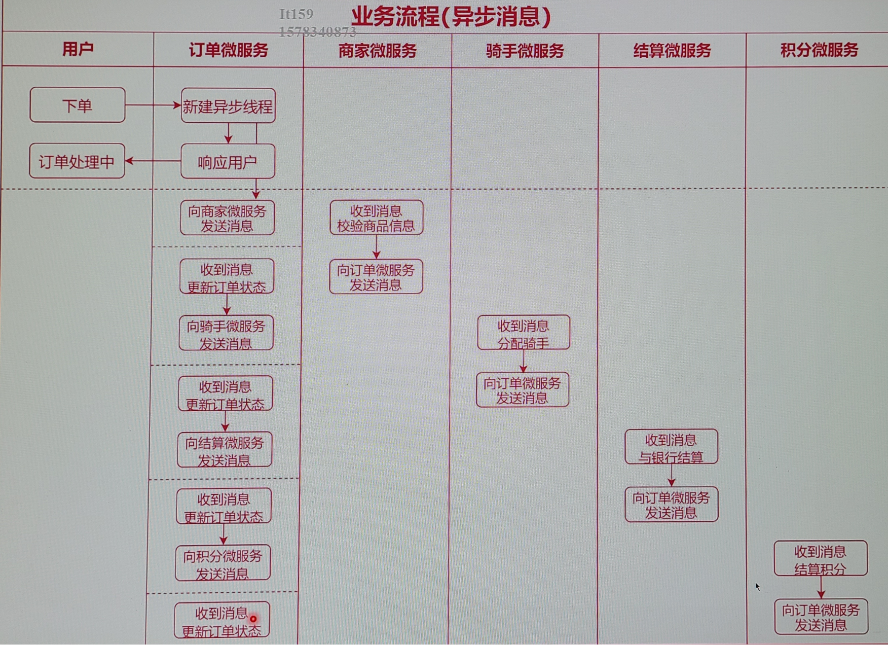
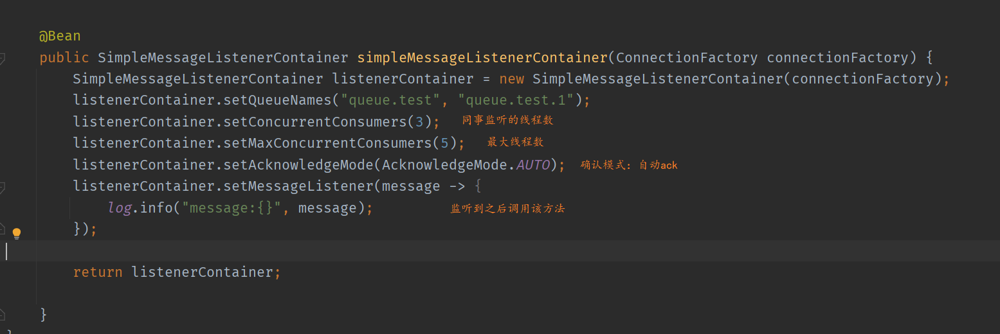

# 消息队列的技术选型


- 各个MQ的性能、优缺点、相应的业务场景
- 集群架构模式，分布式、可扩展、高可用、可维护性
- 综合成本问题，集群规模，人员成本

- 未来的方向、规划、思考

# 分布式消息队列需要注意的问题

**可靠性投递**

**消费幂等性（比如消息只能消费一次）**

**高可用**
**低延迟**

**拓展性**

**可靠性**
**堆积能力**

# 主流消息中间件介绍
**ActiveMQ**

ActiveMQ是Apache出品，最流行的，能力强劲的开源消息总线，并且它一个完全支持JMS规范的消息中间件。其丰富的API、多种集群构建模式使得他成为业界老牌消息中间件，在中小型企业中应用广泛！
MQ衡量指标：服务性能、数据存储、集群架构
**kafka**

==性能好，可拓展，可维护性稍差==

Kafka是Linkedln开源的分布式发布-订阅消息系统，目前归属于Apache顶级项目。Kafka主要特点是基于Pull的模式来处理消息消费，追求高吞吐量，一开始的目的就是用于日志收集和传输。0.8版本开始支持复制，不支持事务，对消息的重复、丢失、错误没有严格要求，适合产生大量数据的互联网服务的数据收集业务。
**RocketMQ**

==性能高（双十一）==

RocketMQ是阿里开源的消息中间件，目前也已经孵化为Apache顶级项目，它是纯Java开发，具有高吞吐量、高可用性、适合大规模分布式系统
应用的特点。RocketMQ思路起源于Kafka，它对消息的可靠传输及事务性做了优化，目前在阿里集团被广泛应用于交易、充值、流计算、消息推
送、日志流式处理、binglog分发等场景

**RabbitMQ**

==可靠性、稳定性好（金融），可拓展性较差==

RabbitMQ是使用Erlang语言开发的开源消息队列系统，基于AMQP协议来实现。AMQP的主要特征是面向消息、队列、路由（包括点对点和发布
/订阅）、可靠性、安全。AMQP协议更多用在企业系统内，对数据一致性、稳定性和可靠性要求很高的场景，对性能和吞吐量的要求还在其次。


# 使用消息中间件的好处



# **介绍**

==跨语言==

RabbitMQ是一个开源的消息代理和队列服务器，用来通过普通协议在完全不同的应用之间共享数据，RabbitMQ是使用Erlang语言来编写的，并且RabbitMQ是基于AMQP协议的。

## **高性能原因**

使用ErLang开发

> 通用的面向并发的编程语言，适用于分布式系统
> 基于虚拟机解释运行，跨平台部署
> 进程间上下文切换效率远高于C语言
> 有着和原生Socket一样的延迟

Erlang语言最初在于交换机领域的架构模式，这样使得RabbitMQ在Broker 之间进行数据交互的性能是非常优秀的Erlang的优点：Erlang有着和原生Socket一样的延迟

## AMPQ高级消息队列协议

> 一种规范
>
> AMQP定义：是具有现代特征的二进制协议。是一个提供统一消息服务的应用层标准高级消息队列协议，是应用层协议的一个开放标准，为面向消息的中间件设计。


### AMQP协议架构

AMQP协议直接定义了RabbitMQ的内部结构和外部行为
我们使用RabbitMQ本质上是在使用AMQP协议
AMQP协议被多种消息中间件使用，可以举一反三


# 核心概念

**Server**:又称Broker接收和分发消息的应用，接受客户端的连接，实现AMQP实体服务

**Virtual host**: 虚拟Broker ，用于进行逻辑隔离（各个不同的业务可以走不同的broker），最上层的消息路由。一个Virtual Host里面可以有若干个Exchange和Queue，同一个VirtualHost 里面不能有相同名称的Exchange或Queue

**Connection**:  publisher/ consumer和broker之间的TCP连接

**Routing key**: 路由键，用来指示消息的路由转发，相当于快递的地址

**Channel**: 网络信道，几乎所有的操作都在Channel中进行，Channel是进行消息读写的通道。Channel:connection内部建立的逻辑连接，通常每个线程创建
单独的channel。这样就能服用TCP网络资源，而且实现了隔离

**Message**:消息，服务器和应用程序之间传送的数据，由Properties和Body组成。Properties可以对消息进行修饰，比如消息的优先级、延迟等高级特性；Body则就是消息体内容。

**Exchange**:交换机，接收消息，根据路由键转发消息到绑定的队列。相当于快的的分拨中心

**Queue**: 消息队列，消息最终被送到这里等待consumer取走

**Binding**:Exchange和Queue之间的虚拟连接，binding中可以包含routing key


## Exchange交换机

- Exchange是AMQP协议和RabbitMQ的核心组件
- Exchange的功能是根据绑定关系和路由键为消息提供路由，将消息转发至相应的队列
- Exchange有4种类型：Direct/Topic/Fanout/Headers,其中Headers使用很少，以前三种为主


### Direct Exchange（直接） 交换机

>  Message中的Routing Key如果和Binding Key一致，Direct Exchange则将message发到对应的queue中


实例：


### Fan Exchange （广播）

> 每个发到Fanout Exchange的message都会分发到所有绑定的queue上去

这里 Routing Key 和Binding Key 都不重要了（虽然不能不设置，但是和他们无关） 


### Topic Exchange  （话题）

> 根据Routing Key及通配规则，Topic Exchange将消息分发到目标Queue中
>
> 全匹配：与Direct类似
> Binding Key中的#：匹配任意个数的word
>
> Binding Key中的*：匹配任意1个word


 


###  headers(不推荐)

headers 类型的交换器不依赖于路由键的匹配规则来路由消息，而是根据发送的消息内容中的 headers 属性进行匹配。在绑定队列和交换器时制定一组键值对，当发送消息到交换器时，RabbitMQ会获取到该消息的 headers（也是一个键值对的形式)'对比其中的键值对是否完全匹配队列和交换器绑定时指定的键值对，如果完全匹配则消息会路由到该队列，否则不会路由到该队列。headers 类型的交换器性能会很差，而且也不实用，基本上不会看到它的存在。


## Message

**本质上就是一段数据,由 Properties和 Payload(Body)组成**
在生产者中：

各种属性含义


在消费者中：


# windows下安装

erlang运行环境： https://www.erlang.org/downloads

rabbitMQ： https://www.rabbitmq.com/install-windows.html

## 安装管理工具

进入安装


# 命令行工具

**使用场景**

生产环境、端口限制等不便打开网页端工具的场景
使用脚本自动化配置RabbitMQ


> 查看状态：rabbitmqctl status
> 查看绑定：rabbitmactl list bindings
> 查看channel：rabbitmactl list channels
>
> 查看connection:rabbitmactl list connections
> 查看消费者：rabbitmqctl ist consumers
> 查看交换机：rabbitmqctl list exchanges
>
> 查看队列：rabbitmqctl list queues
> 删除队列：rabbitmqctl delete queue
> 清空队列：rabbitmqctl purges queue
>
> 新建用户：rabbitmqctl add user
> 修改用户密码：rabbitmqctl change password
> 删除用户：rabbitmqctl delete user
> 查看用户：rabbitmqctl list users
> 设置用户角色：rabbitmqctl rabbitmqctl set user tags
>
> 启动应用：rabbitmqctl start app
> 关闭应用：rabbitmqctl stop_app，保留Erlang虚拟机（暂停）
> 关闭应用：rabbitmqctl stop，并关闭Erlang虚拟机
>
> 加入集群：rabbitmqctl join cluster
> 离开集群：rabbitmqctl reset
>
> 设置镜像队列：rabbitmqctl sync_queue
> 取消镜像队列：rabbitmqctl cancel_sync queue


# 消息是如何流转的


## 消息生产与消费

Connection Factory:获取连接工厂
Connection:一个连接
Channel:数据通信信道,可发送和接收消息
Queue:具体的消息存储队列
Producer& Consumer生产和消费者


**关于basicConsumer（）**
注意：BasicConsume将信道设置为==接收模式==，直到取消队列的订阅为止，在接收模式期间，RabbitMQ会不断地推送消息给消费者，当然推送消息的个数还是会收到basicQos（）的限制。如果只是想从队列获取单条消息而不是订阅，建议用basicGet（）==拉模式== 。 将BasicGet()放在一个循环中代替BasicConsum()是不可取的


# 如何保证消息100%的投递成功
保障消息的成功发出
保障MQ节点的成功接收
发送端收到MQ节点（Broker)确认应答
完善的消息进行补偿机制

- 发送端确认机
- 消费端确认机制
- 消息返回机制
- 消息过期机制
- 消费端限流机制
- 死信队列

## 发送端确认机制

> 消息真的发出去了吗？
> 消息发送后，发送端不知道RabbitMQ是否真的收到了消息，若RabbitMQ异常，消息丢失后，订单处理流程停止，业务异常
> 需要使用RabbitMQ发送端确认机制，确认消息发送

### 理论方式

**方式1**
消息落库,对消息状态进行打标（需要存储数据库，不适合高并发），通过检查数据库消息的状态判断是否成功。发送时status=0，成时status被改为：1；重试3次后则变为2


**方式2**
消息的延迟投递,做二次确认,回调检查（高效，真正很多互联网公司所使用的方式）


### 实现方式

- 单条同步确认

  配置channel，开启确认模式：channel.confirmSelect)
  每发送一条消息，调用channel.waitForConfirms)方法，等待确认

- 多条同步确认

  配置channel，开启确认模式：channel.confirmSelect()
  发送多条消息后，调用channel.waitForConfirms（)方法，等待确认（确认前面的所有是否都成功）

- 异步确认

  配置channel，开启确认模式：channel.confirmSelect)
  在channel上添加监听：addConfirmListener，发送消息后，会回调此方法，通知是否发送成功

  异步确认有可能是单条，也有可能是多条，取决于MQ
  
  实例：
   produce


### Return消息机制(mandatory)

> Return Listener 用于处理一些不可路由的消息！
> 如果我们在发送消息的时候，当前的exchange不存在或者指定的路由key路由不到，这个时候如果我们需要监听这种不可达的消息，就要使用Return Listener！


实例：当routingkey匹配不到的时候  

方式1


方式2 

```java
channel.addReturnListener(new ReturnCallback() {
    @Override
    public void handle(Return returnMessage) {
        
    }
});
```

### 幂等性

 一个幂等操作的特点是其任意多次执行所产生的影响均与一次执行的影响相同。我们实际系统中有很多操作，是不管做多少次，都应该产生一样的效果或返回一样的结果。如：扣款只扣一次，发消息只发一次。
### 如何避免消息重复消费
消费端实现幂等性,就意味着,我们的消息永远不会消费多次,即使我们收到了多条一样的消息。
**业界主流的幂等性操作:**
 - 唯一ID+指纹码机制,利用数据库主键去重

- 利用 Redis的原子性去实现（set 或者自增）


## 消费端

### 自定义监听
我们一般就是在代码中编写 While循环,进行 consumer. nextDelivery方法进行获取下一条消息,然后进行消费处理!
但是我们使用自定义的Consumer更加的方便,解耦性更加的强,也是在实际工作中最常用的使用方式！
只需要继承一个类然后实现方法就行。
创建一个consumer类继承DefaultConsumer

```java
public class MyConsumer extends DefaultConsumer {
    public MyConsumer(Channel channel) {
        super(channel);
    }

    @Override
    public void handleDelivery(String consumerTag, Envelope envelope, AMQP.BasicProperties properties, byte[] body) throws IOException {
        //签收
        getChannel().basicAck(envelope.getDeliveryTag(), false);
    }
}
```
在consumer中使用


### 消息限流

> 假设一个场景，首先，我们Rabbitmq服务器有上万条未处理的消息，我们随便打开一个消费者客户端，会出现下面情况：
> 巨量的消息瞬间全部推送过来，但是我们单个客户端无法同时处理这 么多数据！

RabbitMQ提供了一种qos（服务质量保证）功能，即在非自动确认消息的前提下，如果一定数目的消息（通过基于consume或者channel设置Qos的值）**未被确认**前，不进行消费新的消息。

```java
void BasicQos(uint prefetchSize,ushort prefetchCount,bool global);
```

prefetchSize（消息大小限制）: 一般设置为0，表示不限制，但是一般会在生产端进行限制
prefetchCount:会告诉RabbitMQ不要同时给一个消费者推送多于N个消息，即一旦有N个消息还没有ack，则该consumer将block掉，直到有消息ack
global: true\false 是否将上面限流设置应用于channel，默认为false。简单点说，就是上面限制是channel级别的还是consumer级别


在MyConsumer中手动签收


### 消费端ACK与重回队列机制
消费端重回队列是为了对没有处理成功的消息,把消息重新会递给Broker
般我们在实际应用中,都会关闭重回队列,也就是设置为 False

**消费端的手工ACK和NACK**
- 消费端进行消费的时候,如果由于业务异常我们可以进行日志的记录,然后进行补偿!

- 如果由于服务器宕机等严重问题,那我们就需要手工进行ACK保障消费端消费成功

  发送端：

  

  设置为需要重回队列

  

  结果  （重回队列： 将nack的消息重新放入队列的尾部）

  
### TTL

> TTL是Time To Live的缩写，也就是生存时间RabbitMQ支持消息的过期时间，在消息发送时可以进行指定RabbitMQ支持队列的过期时间，从消息入队列开始计算，只要超过了队列的超时时间配置，那么消息会自动的清除。

- 在队列上设置：

   

- 直接对消息设置

  ```java
   AMQP.BasicProperties properties = new AMQP.BasicProperties().builder()
                          .deliveryMode(2)
                          .contentEncoding("UTF-8")
                          .headers(head)
                          .expiration("1000")//设置为10s后过期
                          .build();
  
                  channel.basicPublish(exchange, routingKey, true, properties, body.getBytes());
  ```

  

### 死信队列  DLX,Dead-Letter-Exchange

> 为了防止消息爆满，需要设置过期时间，当消息过期则删除。但是删除的消息无法对系统发出警报，于是引入死信队列机制，收集过期队列。

> 当消息在一个队列中变成死信（dead message)之后，
> 它能被重新publish到另一个Exchange，这个Exchange就是DLX

**消息变成死信有一下几种情况**
- 消息被拒绝( basic. reject,/ basic.nack)并且 requeue= false (不需要重回队列时)
- 消息TTL过期
- 队列达到最大长度

**死信设置**
首先需要设置死信队列的 exchange和 queue,然后进行绑定：
Exchange: dlx. exchange 
Queue: dlx.queue 	监听
Routing key:#	  任何routingkey都能路由

- 然后我们进行正常声明交换机、队列、绑定,只不过我们需要在队列加上一个参数即可: arguments.put(" X-dead-letter-exchange",dIx. exchange")

```java
		//用于接受死信
        channel.exchangeDeclare("exchange.dlx", BuiltinExchangeType.TOPIC, true, false, false, null);
        channel.queueDeclare("queue.dlx", true, false, false, null);
        channel.queueBind("queue.dlx", "exchange.dlx", "#", null);


        Map<String, Object> arguments = new HashMap<>();
        //过期时间
        arguments.put("x-message-ttl", 5000);
        //指定过期时（死信）需要转发到的交换机
        arguments.put("x-dead-letter-exchange", "exchange.dlx");
        channel.exchangeDeclare("exchange.test.dlx", BuiltinExchangeType.TOPIC, true, false, false, null);
        //argument
        channel.queueDeclare("queue.test.dlx", true, false, false, arguments);
        channel.queueBind("queue.test.dlx", "exchange.test.dlx", "key.#", null);
        //发送消息
        String message = "测试";
        channel.basicPublish("exchange.test.dlx",
                "key.a", null, message.getBytes());
```

在queue.dlx 中查看消息


# Spring AMQP

## 利用RebbitAdmin快速配置RabbitMQ服务

- declareExchange: 创建交换机
- deleteExchange: 删除交换机
- declareQueue: 创建队列
- deleteQueue: 删除队列

- purgeQueue: 清空队列
- declareBinding: 新建绑定关系
- removeBinding: 删除绑定关系
- getQueueProperties: 查询队列属性

==删除的操作一定要善用，最好是运维去做==

**创建CachingConnectionFactory**

==这里需要显示的声明用户名和密码==

```java
@Bean
    public ConnectionFactory connectionFactory() {
        CachingConnectionFactory connectionFactory = new CachingConnectionFactory();
        connectionFactory.setHost("localhost");
        connectionFactory.setPort(5672);
        connectionFactory.setUsername("guest");
        connectionFactory.setPassword("guest");

        return connectionFactory;
    }

```

创建

> DestinationType: 目的地类型，  交换机可以和队列绑定，也可以和其他的交换机绑定


但是一般不直接声明，而是交给容器：

**简化配置Rabbit的流程**

将Exchange、Queue、Binding声明为Bean
再将RabbitAdmin声明为Bean
Exchange、Queue、Binding即可自动创建


注意一定要加  ==rabbitAdmin.setAutoStartup(true)==

> autoStartup必须要设置为true,这样才会自动搜索容器中@Queue  @Exchange 等bean 并自动声明
>
> RabbitAdmin底层实现就是从Spring容器中获取Exchange，Bingding,Routing以及Queue的@Bean声明
>
> 然后使用RabbitTemplate的execute方法执行对应的声明，修改，删除等一系列RabbitMQ基础功能操作

> 还可以设置 rabbitAdmin.setIgnoreDeclarationExceptions(true);
>
> 默认情况下，当任何异常发生时，RabbitAdmin将立即停止处理所有声明;这可能会导致下游问题——例如，由于没有声明另一个队列(在错误队列之后定义的)，侦听器容器无法初始化


```java
@Bean
public Binding binding() {
        return BindingBuilder.bind(testQueue()).to(testExchange()).with("key.#").noargs();
}
```


## RabbitTemplate

==注意OrderMessageDTO 需要实现序列化接口 Serializable== 


## 发送确认和消息返回

**注意添加 **     `rabbitTemplate.setMandatory(true);`


添加了返回和确认之后，发现并没有被调用，原因是没有开启


在使用SIMPLE模式的时候，可以发现确认消息时，无法确认是哪条消息被确认了（确认消息的线程于发消息的线程不是统一个，是异步的）


这时候需要使用CORRELATED模式


并且在发送的时候添加CorrelationData对象


这时候就能确认了


### SimpleMessageListenerContainer简单消息监听容器

- 设置同时监听多个队列、自动启动、自动配置RabbitMQ-
- 设置消费者数量（最大数量、最小数量、批量消费）==并不是指监听队列的数量，而是线程池有多少个并发的线程一起去监听消息==
- 设置消息确认模式、是否重回队列、异常捕获设置是否独占、其他消费者属性等

- 设置具体的监听器、消息转换器等支持动态设置，运行中修改监听器配置




**手动确认**


**重回队列**

```java
//重回队列
listenerContainer.setDefaultRequeueRejected(false);
```


**设置消费端tag标签**


**限流**

```java
listenerContainer.setPrefetchCount(1);
```

## MessageListenerAdapter(处理消息）

处理业务的代码必须叫  handleMessage


  ==若处理业务的方法不叫handleMessage,需要进行其他设置==


### MessageConvert

**如果处理消息的方法接收的参数不是 byte[]  而是java对象，这时候就需要进行转换**
**最佳方案**


其他方法

- 根据类的类型进行转换

  ==注意设置defaultJackson2JavaTypeMapper.setTrustedPackages("*");==，否则会报错

  ```java
  Jackson2JsonMessageConverter messageConverter = new Jackson2JsonMessageConverter();
  DefaultJackson2JavaTypeMapper defaultJackson2JavaTypeMapper = new DefaultJackson2JavaTypeMapper();
  defaultJackson2JavaTypeMapper.setTrustedPackages("*");
  messageConverter.setJavaTypeMapper(defaultJackson2JavaTypeMapper);
  ```

  ```java
  MessageProperties messageProperties = new MessageProperties();
  //这里注意一定要修改contentType为 application/json
  messageProperties.setContentType("application/json");
  //添加typeid 与类的全路径
  messageProperties.getHeaders().put("__TypeId__","com.imooc.food.dto.OrderMessageDTO");
  Message message = new Message(json.getBytes(), messageProperties);
  
  ```

- 根据多个类的类型进行转换

  ```java
  Jackson2JsonMessageConverter messageConverter = new Jackson2JsonMessageConverter();
  DefaultJackson2JavaTypeMapper defaultJackson2JavaTypeMapper = new DefaultJackson2JavaTypeMapper();
  defaultJackson2JavaTypeMapper.setTrustedPackages("*");
  Map<String, Class<?>> idClassMapping = new HashMap<>();
  //设置标签  
  idClassMapping.put("order", OrderMessageDTO.class);
  defaultJackson2JavaTypeMapper.setIdClassMapping(idClassMapping);
  messageConverter.setJavaTypeMapper(defaultJackson2JavaTypeMapper);
  ```

  ```
  //这里注意一定要修改contentType为 application/json
  messageProperties.setContentType("application/json");
  //添加typeid 与类标签
  messageProperties.getHeaders().put("__TypeId__", "order");
  ```

- 还可以根据属性的类型调用不同的MessageConver（基本不用）

```java
//全局的转换器：
ContentTypeDelegatingMessageConverter convert=new ContentTypeDelegatingMessageConverter();
//TextMessageConverter、ImageMessageConverter、PDEMessageConverter为自定义的转换器  实现 MessageConvert
TextMessageConverter textConvert =new TextMessageConverter();
convert.addDelegate("text",textConvert);
convert.addDelegate("html/text",textConvert);
convert.addDelegate("xml/text",textConvert);
convert.addDelegate("text/plain",textConvert);
Jackson2JsonMessageConverter jsonConvert =new Jackson2JsonMessageConverter();
convert.addDelegate("json",jsonConvert);
convert.addDelegate("application/json",jsonConvert);
ImageMessageConverter imageConverter=new ImageMessageConverter();
convert.addDelegate("image/png",imageConverter);
convert.addDelegate("image",imageConverter);
PDEMessageConverter pdfConverter =new PDEMessageConverter();
convert.addDelegate("application/pdf",pdfConverter);
```

```java
public class ImageMessageConverter implements MessageConverter {
    @Override
    public Message toMessage(Object object, MessageProperties messageProperties) throws MessageConversionException {
        throw new MessageConversionException("convert error !");
    }

    @SneakyThrows
    @Override
    public Object fromMessage(Message message) throws MessageConversionException {
        System.err.println("------—-Image MessageConverter-----—-");
        Object _extName = message.getMessageProperties().getHeaders().get("extName");
        String extName = _extName == null ? "png" : _extName.toString();
        byte[] body = message.getBody();
        String fileName = UUID.randomUUID().toString();
        String path = "d:/010 test/" + fileName + "." + extName;
        File f = new File(path);
        Files.copy(new ByteArrayInputStream(body), f.toPath());
        return f;

```


## @RabbitLintener 快速实现消息处理器

**@Rabbitlistener是一个组合注解，可以嵌套以下注解：**

- Exchange: 自动声明Exchange
- @Queue: 自动声明队列
- @QueueBinding: 自动声明绑定关系


**创建RabbitListenerContainerFactory**

```java
@Bean
    public RabbitListenerContainerFactory rabbitListenerContainerFactory(ConnectionFactory connectionFactory){
        SimpleRabbitListenerContainerFactory containerFactory = new SimpleRabbitListenerContainerFactory();
        containerFactory.setConnectionFactory(connectionFactory);

        return containerFactory;
    }
```

这时 SimpleMessageListenerContainer 就可以不用了。但是不用 SimpleMessageListenerContainer  如何处理消息呢？  两种方法

- 方法1

  

- 方法2

  


#### 在 @RabbitLintener 中声明 交换机、队列、绑定


### 在YML中配置

```yaml
spring:
    rabbitmq:
        username: guest
        password: guest
        publisher-confirm-type: correlated
        listener:
            simple:
                acknowledge-mode: manual
                concurrency: 5
                max-concurrency: 10
        template:
            mandatory: true
```

# Spring Cloud Stream整合

   

- Barista接口：Barista接口是定义来作为后面类的参数，这一接口定义来通道类型和通道名称，通道名称是作为配置用，通道类型则决定了app会使用这一通道进行发送消息还是从中接收消息

- @Output:输出注解，用于定义发送消息接口
- @lnput:输入注解，用于定义消息的消费者接口
- @StreamListener:用于定义监听方法的注解

**使用Spring Cloud Stream非常简单，只需要使用好这3个注解即可，在实现高性能消息的生产和消费的场景非常适合，但是使用SpringCloudStream框架有一个非常大的问题就是不能实现可靠性的投递，也就是没法保证消息的100%可靠性，会存在少量消息丢失的问题**

**这个原因是因为SpringCloudStream框架为了和Kafka兼顾所以在实际工作中使用它的目的就是针对高性能的消息通信的！这点就是在当前版本Spring Cloud Stream的定位**