#   rabbitMQ集群架构

## 使用集群的优势

- 拓展

  一般的基础架构中，单机扩容（Scale-Up）很难实现，需要扩容时尽量使用扩展数量实现（Scale-Out)，RabbitMQ集群可以方便地通过Scale-Out扩展规模

- 保证数据冗余

  对于单节点RabbitMQ，如果节点宕机，内存数据丢失，对于单节点RabbitMQ，如果节点损坏，磁盘数据丢失，RabbitMQ集群可以通过镜像队列，将数据沉余至多个节点

- 高可用

  如果单节点RabbitMQ宕机，服务不可用，RabbitMQ集群可以通过负载均衡，将请求转移至可用节点

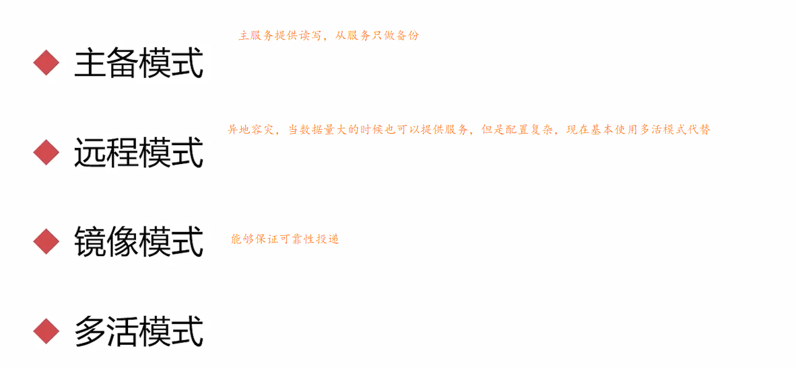

### 主备模式（业务量不大的时候适合使用该模式）

> 又被称为：warren(兔子窝），备份节点什么也不能做（读写都不能）。一个主/备方案（主节点如果挂了，从节点提供服务，和ActiveMQ利用Zookeeper做主/备一样）。
>
> 主备模式：实现RabbitMQ的高可用集群，一般在并发和数据量不高的情况下，这种模型非常的好用且简单。主备模式也称之为Warren模式
>
> RabbitMQ通过HaProxy进行切换和热备份

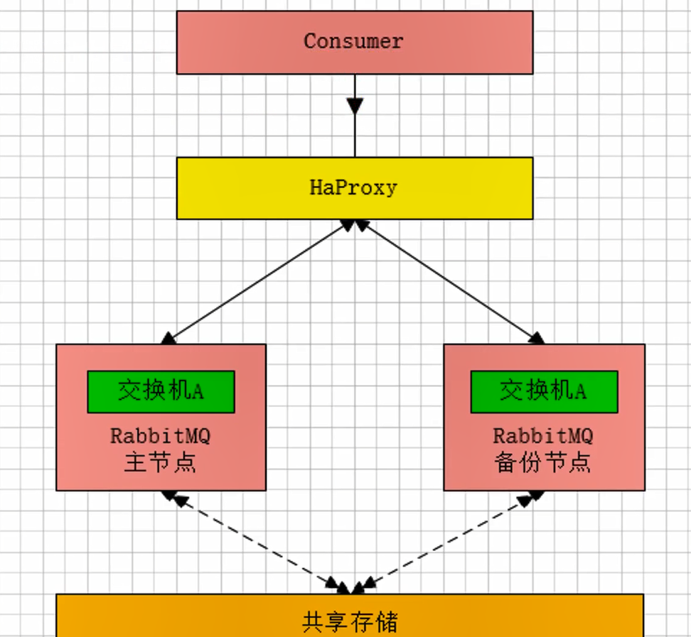

**haProxy 配置**

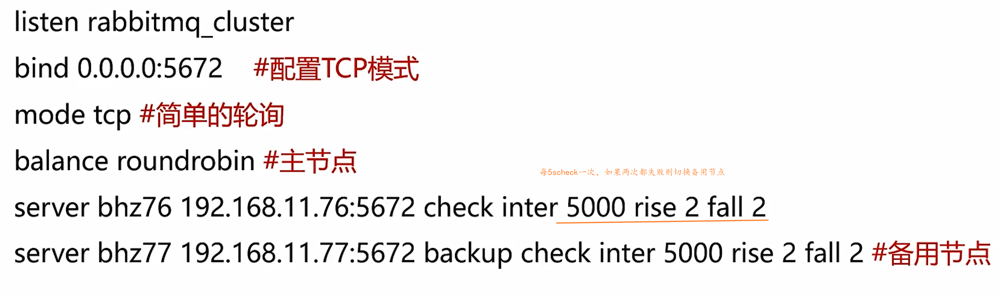

### 远程模式

> 远距离通信和复制，可以实现双活的一种模式，简称Shovel模式，所谓Shovel就是我们可以把消息进行不同数据中心的复制工作，可以跨地域的让两个mq集群互联。
>
> 当消息处理不过来了可以使用远程的节点

### 镜像模式（现在一般使用的模式）

**高可靠**

**数据同步**

**3节点**

==扩展性差，增加节点则需要多同步一个节点，官方推荐3个为好。==

> 集群模式非常经典的就是Mirror镜像模式，保证100%数据不丢失在实际工作中用的最多，并且实现集群非常的简单，一般互联网大厂都会构建这种镜像集群模式
>
> Mirror镜像队列，目的是为了保证rabbitmq数据的高可靠性解决方案，主要就是实现数据的同步，一般来讲是2-3个节点实现数据同步（对于100%数据可靠性解决方案一般是3节点）

集群架构如下：

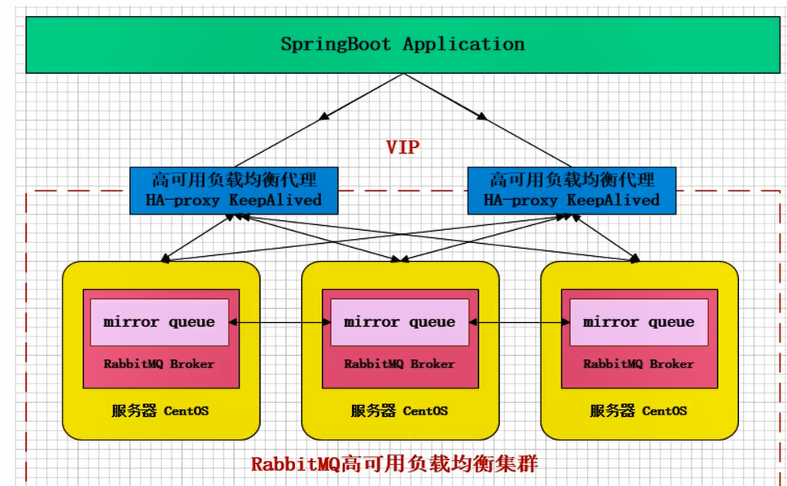

### 多活模式

> 这种模式也是实现异地数据复制的主流模式，因为Shovel模式配置比较复杂，所以一般来说实现异地集群都是使用这种双活或者多活模型来实现的。这种模型需要依赖RabbitMQ的federation插件，可以实现持续的可
> 靠的AMQP数据通信，多活模式实际配置与应用非常简单
>
> RabbitMQ部署架构采用双中心模式（多中心），那么在两套（或多
> 套）数据中心中各部署一套RabbitMQ集群，各中心的RabbitMQ
> 服务除了需要为业务提供正常的消息服务外，中心之间还需要实现部
> 分队列消息共享。

多活集群架构如下：

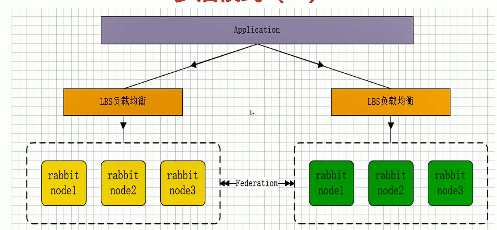

**Federation 插件**

Federation 插件是一个不需要构建 Cluster，而在Brokers 之间传输消息的高性能插件，Federation 插件可以在Brokers或者Cluster之间传输消息，连接的双方可以使用不同的 users 和virtual hosts，双方也可以使用版本不同的RabbitMQ和Erlang。Federation 插件使用AMQP协议通讯，可以接受不连续的传输

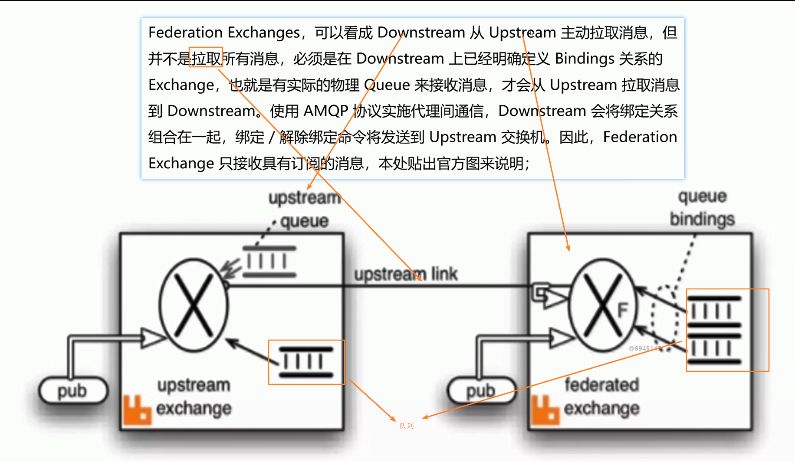

# 故障与恢复

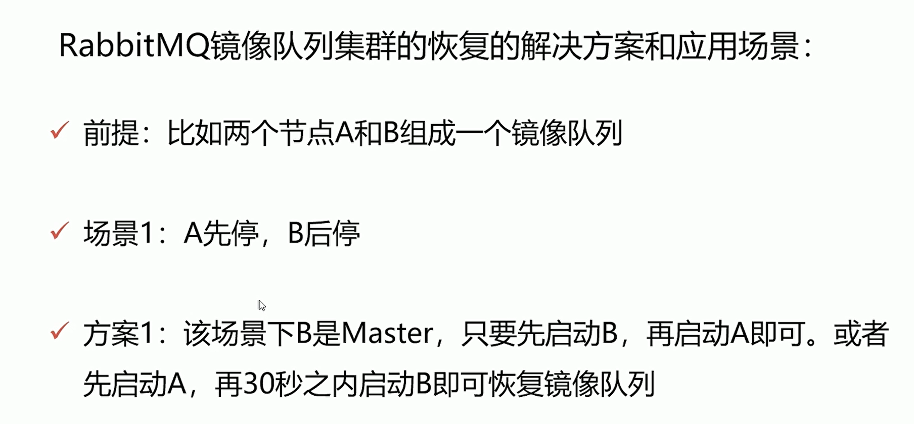

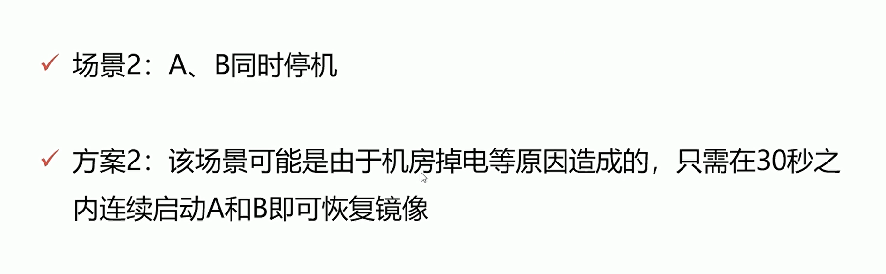

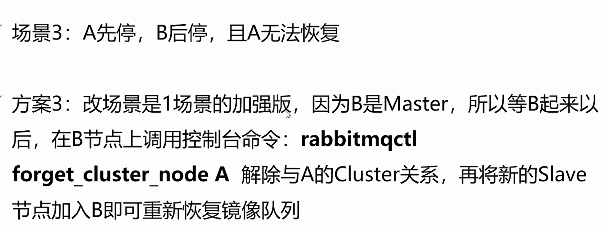

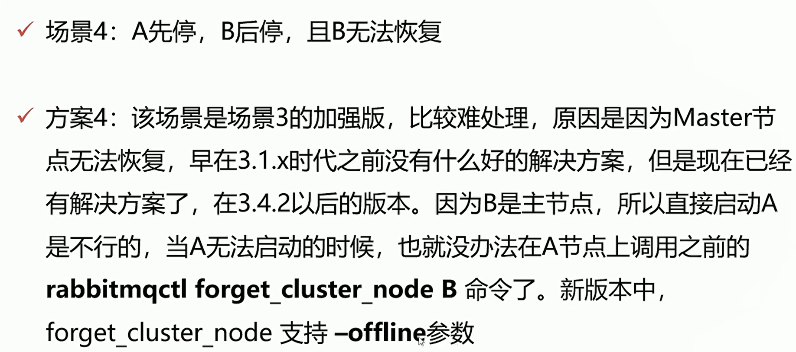

**--offline**

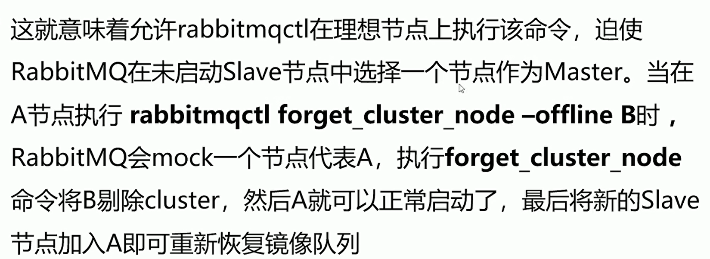

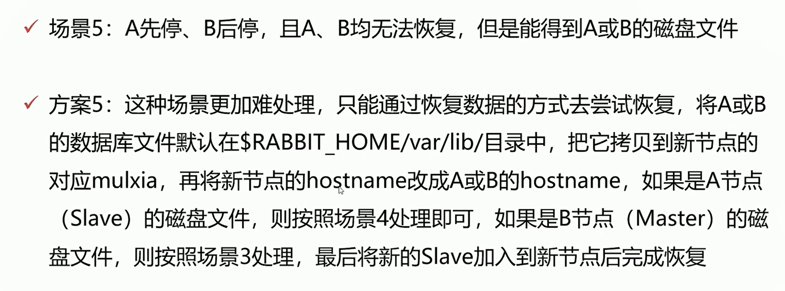

# 延迟插件

> 消息的延迟推送、定时任务（消息）的执行。包括一些消息重试策
> 略的配合使用，以及用于业务削峰限流、降级的异步延迟消息机制，都
> 是延迟队列的实际应用场景

# BAT/TMD大厂单元化架构设计衍变之路（一）

随着大型互联网公司业务的多元化发展，就拿滴滴、美团等大厂来讲，如滴滴打车、单车、外卖、酒店、旅行、金融等业务持续高速增长，单个大型分布式体系的集群，通过加机器+集群内部拆分（kv、mq、MySQL等），虽然
具备了一定的可扩展性。但是，随着业务量的进一步增长，整个集群规模逐渐变得巨大，从而一定会在某个点上达到瓶颈，无法满足扩展性需要，并且大集群内核心服务出现问题，会影响全网所有用户。

以滴滴打车、美团外卖举例来说：
打车业务体量巨大，尤其是在早晚高峰期。全年订单量已越10亿。
外卖业务体量庞大，目前单量已突破1700W/天，对于如此庞大的单
个大型分布式集群，会面临以下问题：
√1、容灾问题
√2、资源扩展问题
√3、大集群拆分问题

1、容灾问题
√核心服务（比如订单服务）挂掉，会影响全网所有用户
，导致整个业务不可用；
√数据库主库集中在一个IDC，主机房挂掉，会影响全网
所有用户，整个业务无法快速切换和恢复；

2、资源扩展问题
√单IDC的资源（机器、网络带宽等）已经没法满足，扩展IDC时，存
在跨机房访问时延问题（增加异地机房时，时延问题更加严重）；
√数据库主库单点，连接数有限，不能支持应用程序的持续扩展；

3、大集群拆分问题
√核心问题：分布式集群规模扩大后，会相应的带来资源扩展、
大集群拆分以及容灾问题。
√所以出于对业务扩展性以及容灾需求的考虑，我们需要一套从
底层架构彻底解决问题的方案，业界主流解决方案：
√单元化架构方案（阿里、支付宝、饿了么、微信等）

同城“双活”架构介绍：
目前很多大型互联网公司的业务架构可以理解为同城“双活”架构，
注意这里的“双活”是加引号的，具体可以这样理解：

业务层面上已经做到真正的双活（或者多活），分别承担部分流量；

存储层面比如定时任务、缓存、持久层、数据分析等都是主从架构，
会有跨机房写；
一个数据中心故障，可以手动切换流量，部分组件可以自动切换；

两地三中心架构介绍：
使用灾备的思想，在同城“双活”的基础上，在异地部署一套
灾备数据中心，每个中心都具有完备的数据处理能力，只有当
主节点故障需要容灾的时候才会紧急启动备用数据中心；

SET化方案目标：
√业务：解决业务遇到的扩展性和容灾等需求，支撑业务的高速发展
√通用性：架构侧形成统一通用的解决方案，方便各业务线接入使用

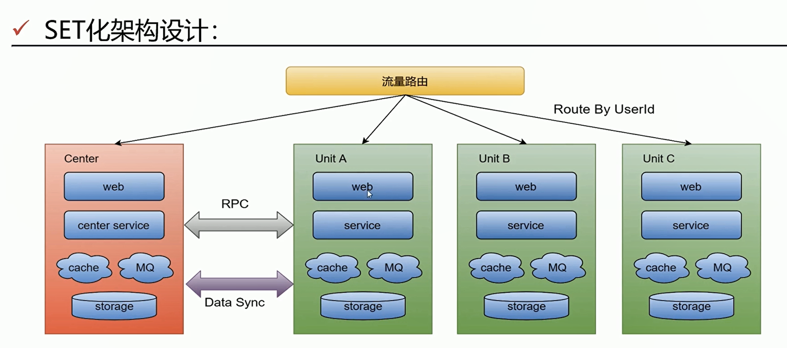

**SET化架构策略**
√流量路由：
√按照特殊的key（通常为userid)进行路由，判断某次
请求该路由到中心集群还是单元化集群；

中心集群：
未进行单元化改造的服务（通常不在核心交易链路，比如
供应链系统）称为中心集群，跟当前架构保持一致。

单元化集群：
每个单元化集群只负责本单元内的流量处理，以实现流量
拆分以及故障隔离;

每个单元化集群前期只存储本单元产生的交易数据，后续
会做双向数据同步，实现容灾切换需求；

中间件（RPC、KV、MQ等）：
RPC：对于SET服务，调用封闭在SET内；对于非SET服务，沿
用现有路由逻辑；
KV:支持分SET的数据生产和查询；
MQ：支持分SET的消息生产和消费；

**数据同步：**
全局数据（数据量小且变化不大，比如商家的菜品数据）部署
在中心集群，其他单元化集群同步全局数据到本单元化内；
未来演变为异地多活架构时，各单元化集群数据需要进行双向
同步来实现容灾需要

**SET化路由策略及其能力：**
异地容灾：
通过SET化架构的流量调度能力，将SET分别部署在不同
地区的数据中心，实现跨地区容灾支持

高效本地化服务:
利用前端位置信息采集和域名解析策略，将流量路由到最近的
SET,提供最高效的本地化服务；
比如O2O场景天然具有本地生产，本地消费的特点，更加需
要SET化支持(在哪下单路由到哪里)

集装箱式扩展：
SET的封装性支持更灵活的部署扩展性，比如SET一键创
建/下线，SET一键发布等

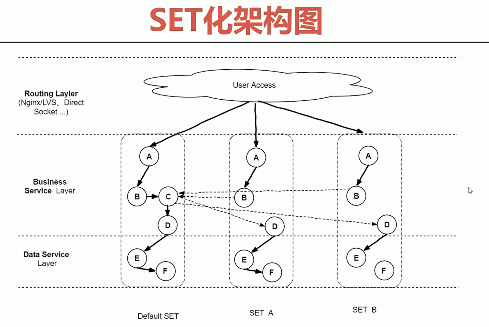

**SET化重要的原则：**

- SET切分规则：
  理论上，切分规则由业务层面按需定制；

  实现上，建议优先选最大的业务维度进行切分；
  比如海量用户的O2O业务，按用户位置信息进行切分。此外，接入层、逻辑层和数据层可以有独立的SET切分规则，有利于实现部署和运维成本的最优化。

- 部署规范原则：
  一个SET并不一定只限制在一个机房，也可以跨机房或者跨地区部署；为保证灵活性，单个SET内机器数不宜过多（如不超过1000台物理机）。

