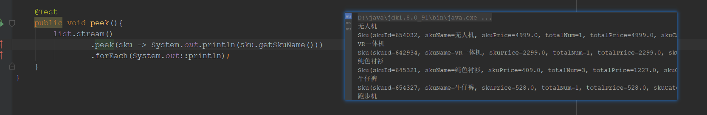
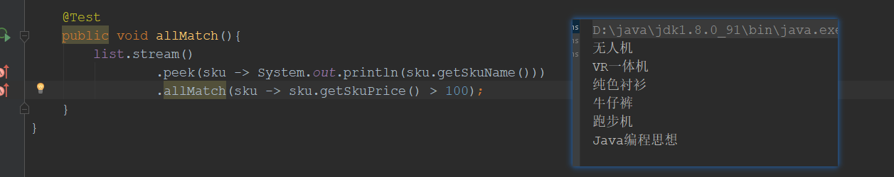
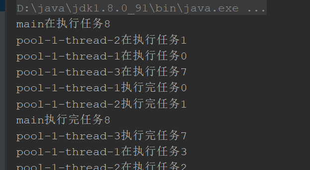
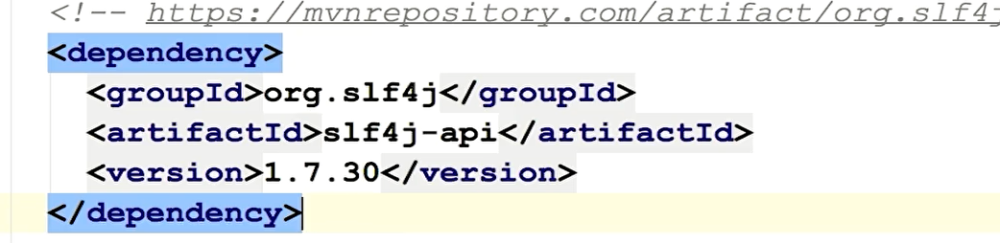
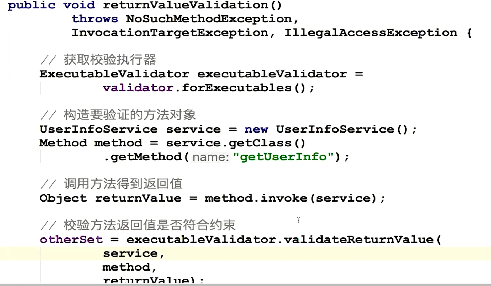
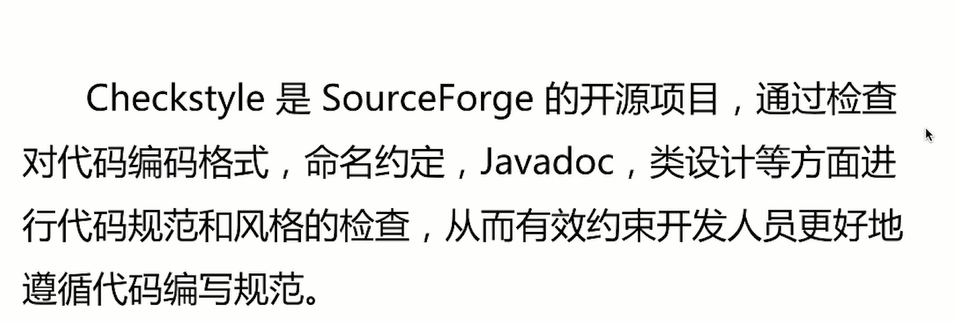

[TOC]

# 函数式编程

## Lambda

- Java8引入函数式编程风格

- 可以理解为一种匿名函数的代替（可以代替原来匿名函数所做的所有事情）

- 通过行为参数化传递代码

**构成**

(parameters) ->  expression 

(parameters) ->  {statement; }

- 形式1：没有参数

   （）-> System. out. println( "Hello World! ")

- 形式2：只有一个参数

  name ->  System. out. println( "Hello World! " + name)

- 形式3：没有参数，形式复杂

  ```java
  f（）->  {
      System. out. println( "Hello");
      System. out. println( "Word");
  }
  ```

- 形式4：包含2个参数的方法

  ```java
  BinaryOperator<Long> functionAdd =(x, y) -> X+y 
  Long result functionAdd apply(1L, 2L)
  ```

- 形式5：对参数显示声明

  ```java
  BinaryOperator<Long> functionAdd =( Long x, Long y) -> X+y 
  Long result= function Add apply(1L, 2L);
  ```

**函数式接口**
==接口只有一个抽象方法==

Java8的函数式接口注解:@ FunctionInterface（并不是一定要写，只是为了让编译器帮助校验，同@Override）

函数式接口的抽象方法签名:函数描述符

常用函数接口


例如


**方法引用**


## 流操作

**先来看看实战案例**

商品类

```java
@Data
@AllArgsConstructor
public class Sku {
    //编号
    private Integer skuId;
    //商品名称
    private String skuName;
    //单价
    private Double skuPrice;
    //购买个数
    private Integer totalNum;
    //总价
    private Double totalPrice;
    //类型
    private Enum skuCategory;

}
```

枚举类

```java
/**
 * 商品类型枚举
 */
@AllArgsConstructor
public enum SkuCategoryEnum {
    CLOTHING(10, "服装类"),
    ELECTRONICS(20, "数码类"),
    SPORTS(30, "运动类"),
    BOOKS(40, "图书类");

    // 商品类型的编号
    private Integer code;
    // 商品类型的名称
    private String name;
}
```

准备一个集合，简单的购物车

```java
   // 加入到购物车中的商品信息
    private static List<Sku> cartSkuList =
            new ArrayList<Sku>() {
                {
                    add(new Sku(654032, "无人机",
                            4999.00, 1,
                            4999.00, SkuCategoryEnum.ELECTRONICS));

                    add(new Sku(642934, "VR一体机",
                            2299.00, 1,
                            2299.00, SkuCategoryEnum.ELECTRONICS));

                    add(new Sku(645321, "纯色衬衫",
                            409.00, 3,
                            1227.00, SkuCategoryEnum.CLOTHING));

                    add(new Sku(654327, "牛仔裤",
                            528.00, 1,
                            528.00, SkuCategoryEnum.CLOTHING));

                    add(new Sku(675489, "跑步机",
                            2699.00, 1,
                            2699.00, SkuCategoryEnum.SPORTS));

                    add(new Sku(644564, "Java编程思想",
                            79.80, 1,
                            79.80, SkuCategoryEnum.BOOKS));

                    add(new Sku(678678, "Java核心技术",
                            149.00, 1,
                            149.00, SkuCategoryEnum.BOOKS));

                    add(new Sku(697894, "算法",
                            78.20, 1,
                            78.20, SkuCategoryEnum.BOOKS));

                    add(new Sku(696968, "TensorFlow进阶指南",
                            85.10, 1,
                            85.10, SkuCategoryEnum.BOOKS));
                }
            };
```

> 需求：
>
> ```
> /**
>  * 需求
>  * 1 想看看购物车中都有什么商品
>  * 2 图书类商品都给买
>  * 3 其余的商品中买两件最贵的
>  * 4 只需要两件商品的名称和总价
>  */
> ```

```java
 @Test
    public void test(){
        //拿出购物车中所有的商品
        List<Sku> list = CartService.getCartSkuList();
        //lambda 能使用的变量
        AtomicReference<Double> money = new AtomicReference<>(Double.valueOf(0.0));
        
        List<String> buyList = list.stream()
            	//打印
                .peek(System.out::println)
            	//过滤书籍
                .filter(sku -> !SkuCategoryEnum.BOOKS.equals(sku.getSkuCategory()))
            	//按照价格降序  reversed()
                .sorted(Comparator.comparing(Sku::getSkuPrice).reversed())
            	//拿出价格最高的两个
                .limit(2)
            	//计算总价
                .peek(sku -> money.set(money.get() + sku.getSkuPrice()))
                .map(Sku::getSkuName)
            	//最后收集处理之后的结果
                .collect(Collectors.toList());

        buyList.forEach(System.out::println);
        System.out.println(money.get());
    }
```

### 什么是流

- JDK1.8引入的新成员，以声明式方式处理集合

- 数据将基础操作链接起来，完成复杂的数据处理流水线

- 提供透明的并行处理


**组成**


==使用分类==	


### 中间操作

- filter   

  **==注意注意  filter中为true 的不过被过滤！！！！==**


- map==这里map并不是集合的意思，而是映射，使用java8提供的函数式接口Function<T, R>== （传入一个值，返回另一个值）


案例


- limit	截取流

  ```java
  // limit方法用于获取指定数量的流。例如下面演示取出学习成绩大于70的5个人
  List<Student> students2 = students.stream().filter(student -> student.getScore() > 70)
          .limit(5).collect(Collectors.toList());
  students2.forEach(System.out::println);
  // 跳过第一个再取2个
  List<Student> students8 = students.stream().skip(1).limit(2).collect(Collectors.toList());
  // 获取5个int随机数,按从小到大排序
  Random random = new Random();
  random.ints().limit(5).sorted().forEach(System.out::println);
  ```
  
  
  
- flatMap

  > 一般用于获取一个对象中的集合属性并将其转为一个新的流，比如List<String, List<String>> 这种情况

```java
List<String> list = Arrays.asList("a-b-c-d", "g-h-i");
List<String> list1 = list.stream().flatMap(s -> Arrays.stream(s.split("-"))).collect(Collectors.toList());
System.out.println(list1);

// 输出结果
[a, b, c, d, g, h, i]
```


- peek，对元素进行遍历，与foreach类似，但是与foreach不同的在于peek不是终端操作，流不会销毁

  可以发现peek和foreach交替执行
  
  

==看看有状态操作==

- sort

  > 可以看到在使用有状态操作之后，peek和foreach又不是交替执行了，这是因为sort是有状态操作，必须得到左右数据才能继续。

  

- distinct

  > ==注意注意：  distinct 使用equals 进行比较==

其他就不一一列举了

### 终端操作

**短路操作**

- allMatch, 全匹配，只要有一个不符合就返回false，销毁流

  

其他不一一列举了

==findFirst 和 findAny 的区别==

在串行上都是一样的，在并行上findFist有限制， findAny没有，any会更快些

**非短路终端操作**

- max

  获取总价高的价格

  


### 流的构建

-  由值创建流

- 由数组创建流

- 由文件生成流

- 由函数生成流（无限流）

```java
 /**
     * @description 通过值生成流
     * @param
     * @Return void
     */
    @Test
    public void streamFromValue(){
        Stream<Integer> integerStream = Stream.of(1, 2, 3, 4, 5, 6);

        integerStream.forEach(System.out::println);
    }

    /**
     * @description 通过数组生成流
     * @param
     * @Return void
     */
    @Test
    public void streamFromArray(){
        int[] numbers = {1, 2, 3, 4, 5, 6};
        IntStream stream = Arrays.stream(numbers);

        stream.forEach(System.out::println);
    }

    @Test
    public void  streamFromFile() throws IOException {
        Stream<String> stringStream = Files.lines(Paths.get("D:\\idealProject\\n996\\src\\test\\java\\com\\jc\\up\\n996\\stream\\StreamConstructor.java"));

        //只打印第一行
        System.out.println(stringStream.findFirst().get());     //输出:   package com.jc.up.n996.stream;
    }


    /**
     * @description 通过函数生成流（无限流）
     * @param
     * @Return void
     */
    @Test
    public void streamFromFunction(){
 		//方法1
        //Stream<Integer> iterate = Stream.iterate(0, n -> n + 1);
        //iterate.forEach(System.out::println);

        //方法2
        Stream<Double> generate = Stream.generate(Math::random);
        generate.limit(100).forEach(System.out::println);

     }
```

### 收集器


**预定义收集器Collectors**

- 将流元素归约和汇总为一个值
- 将流元素分组
- 将流元素分区

使用方式

```java
public class StreamCollector {
    List<Sku> list;

    @BeforeEach
    public void init() {
        list = CartService.getCartSkuList();
    }

    /**
     * @description 集合收集器
     * @param
     * @Return void
     */
    @Test
    public void toList() {
        List<Sku> skuList = list.stream()
                .filter(sku -> sku.getSkuPrice() > 100)
                .collect(Collectors.toList());

        skuList.forEach(System.out::println);
    }

    /**
     * @description 分组收集器, 按商品类型分组
     * @param
     * @Return void
     */
    @Test
    public void groupCollector() {
        Map<Enum, List<Sku>> enumListMap = list.stream()
                .collect(Collectors.groupingBy(Sku::getSkuCategory));

        System.out.println(JSON.toJSONString(enumListMap, true));
    }

    /**
     * @description 分区收集器(为true的在一个分区,false的一个分区
     * @param
     * @Return void
     */
    @Test
    public void partition() {
        Map<Boolean, List<Sku>> collect = list.stream()
                .filter(sku -> sku.getSkuPrice() > 2500)
                .collect(Collectors.partitioningBy(sku -> sku.getSkuPrice() > 3000));

        System.out.println(JSON.toJSONString(collect, true));
    }
}

```

其中partition() 输出如下


### 归约与汇总

- 归约（reduce）：将Stream流中元素转换成一个值
- 汇总（collect）：将Stream流中元素转换成一个容器


**归约**


==示意图==


其中并行计算示意图如下


案例

```java
    @Test
    public void reduceTest() {
        //订单对象
        @Data
        @AllArgsConstructor
        class Order {
            //订单编号
            private Integer id;
            //商品数量
            private Integer productCount;
            //消费总金额
            private BigDecimal totalAmount;
        }

        //准备数据
        ArrayList<Order> list = Lists.newArrayList();
        list.add(new Order(1, 2, new BigDecimal("25.12")));
        list.add(new Order(2, 5, new BigDecimal("257.23")));
        list.add(new Order(3, 3, new BigDecimal("23332.12")));

        Order reduce = list.stream()
                .parallel()
                .reduce(
                        new Order(0, 0, new BigDecimal(0)),

                        //两个元素的逻辑计算
                        (order1, order2) -> {
                            log.info("执行计算逻辑");
                            int productCount = order1.getProductCount() + order1.getProductCount();
                            BigDecimal totalAmount = order1.getTotalAmount().add(order2.getTotalAmount());

                            return new Order(0, productCount, totalAmount);
                        },

                        //并行的情况下合并
                        (order1, order2) -> {
                            log.info("执行合并操作");
                            int productCount = order1.getProductCount() + order1.getProductCount();
                            BigDecimal totalAmount = order1.getTotalAmount().add(order2.getTotalAmount());

                            return new Order(0, productCount, totalAmount);
                        });

        System.out.println(JSON.toJSONString(reduce, true));
    }
```

执行结果


==发现并没有进入合并==

需要添加 `.parallel()`


结果


**汇总**

> 将Stream流中的元素转换成一个容器！！！ 就是汇总


先来看一个复杂的，三个参数的collect

案例，同样需要注意，需要使用并行，则需添加`.parallel()`

```java
    public void collectTest(){
        //订单对象
        @Data
        @AllArgsConstructor
        class Order {
            //订单编号
            private Integer id;
            //账号名
            private String account;
            //商品数量
            private Integer productCount;
            //消费总金额
            private BigDecimal totalAmount;
        }

        //准备数据
        ArrayList<Order> list = Lists.newArrayList();
        list.add(new Order(1, "chenj", 2, new BigDecimal("25.12")));
        list.add(new Order(2, "guanc", 5, new BigDecimal("257.23")));
        list.add(new Order(3, "chenj",3, new BigDecimal("23332.12")));

        HashMap<String, Order> collect = list.stream()
                .parallel()
                .collect(
                        () -> {
                            log.info("初始化容器");
                            return new HashMap<String, Order>();
                        },
                        (HashMap<String, Order> map, Order order) -> {
                            log.info("添加元素到容器");
                            if (map.containsKey(order.getAccount())) {
                                Order ordOrder = map.get(order.getAccount());

                                order.setProductCount(ordOrder.getProductCount() + order.getProductCount());
                                order.setTotalAmount(ordOrder.getTotalAmount().add(order.getTotalAmount()));

                                map.put(order.getAccount(), order);
                            } else {
                                //如果不存在,直接将订单存入
                                map.put(order.getAccount(), order);
                            }
                        },
                        (HashMap<String, Order> map1, HashMap<String, Order> map2) -> {
                            log.info("并行结果合并");
                            map2.forEach((key, value) -> {
                                //TODO 注意: 一定要用map1进行merge,因为最后collect方法返回的是map1这个集合
                                map1.merge(key, value, (order1, order2) -> {

                                    return new Order(0, key,
                                            order1.getProductCount()
                                                    + order2.getProductCount(),
                                            order1.getTotalAmount()
                                                    .add(order2.getTotalAmount()));
                                });
                            });
                        });

        System.out.println(JSON.toJSONString(collect, true));
    }

```

```java
HashSet<String> userIds = list.stream().map(TaskSimpleVO::getEditors).filter(CollectionUtils::isNotEmpty)
        .collect(HashSet::new,
                (HashSet<String> idsCollect, List<String> ids) -> {
                    if (CollectionUtils.isNotEmpty(ids)) idsCollect.addAll(ids);
                },
                AbstractCollection::addAll);
```


==一般不建议自己定义并行汇总，因为涉及到原子、线程、很容易出错，大部分情况使用jdk提供的就能完成需求==


Collectors类中定义了很多常用的汇总操作，例如上面介绍的Collectors中的一些方法

### 案例1.分组

> 一个比较有意思的案例：传入一组账号,按账号分组返回订单信息

```java

/**
 *@Author 陈建
 *@Date 2020/9/17 0:14
 *Description 传入一组账号,按账号分组返回订单信息
 */
public class CaseTwo {
    @Data
    @AllArgsConstructor
    class Order {
        /**
         * 订单编号
         */
        private Integer orderId;
        /**
         * 账户编号
         */
        private String accountId;
    }

    /**
     * 模拟数据库查询
     * @param accountIds
     * @return
     */
    public List<Order> selectFromDB(List<String> accountIds) {
        List<Order> orderList = new ArrayList<>();
        for (int i = 0; i < 10; i++) {
            orderList.add(
                    new Order(i,
                            accountIds.get(i % accountIds.size())));
        }
        return orderList;
    }


    public Map<String, List<Order>> getOrderGroup(List<String> list){
        //新建一个Optional对象,若接收的参数(selectFromDB(list))不为null则对象的value为该参数,否则返回一个空的optional对象
        return Optional.ofNullable(selectFromDB(list))
                 .map(List::stream)
                //接受到Option对象,若对象的value不为null则返回对象的value,否则进行函数接口的实现中的方法(Stream::empty为函数接口Supplier的实现,用于提供一个对象)
                .orElseGet(Stream::empty)
                .collect(Collectors.groupingBy(Order::getAccountId));
    }

    @Test
    public  void groupTest(){
        Map<String, List<Order>> orderGroup = getOrderGroup(Lists.newArrayList("张三", "李四", "王五"));

        System.out.println(JSON.toJSONString(orderGroup, true));
    }
}

```

返回结果


**分组2**

```java
// 按条件学生成绩是否大于等于60，划分为2个组
Map<Boolean, List<Student>> studentScorePart = students.stream()
        .collect(Collectors.partitioningBy(student -> student.getScore() >= 60));
```


### 案例2. 多条件排序

> 在股票中，撮合交易的原则是一段时间内的交易申请，价格越高的先成交；价格一样，下单时间最早的先成交；价格和时间一致，交易量大的先成交；如果价格、时间和、交易量都一致，机构优先成交，散户最后成交。
> 现有一批交易申请数据，需要确认交易先后顺序。

```java
public class CaseThree {

    /**
     * 交易实体类型
     */
    @Data
    @AllArgsConstructor
    class Trade {
        // 下单价格
        private BigDecimal price;
        // 下单时间
        private LocalDateTime time;
        // 下单量
        private Integer count;
        // 下单类型：机构 / 个人
        private String type;
    }

    /**
     * 一段时间内的交易申请
     */
    List<Trade> trades;

    /**
     * 制造数据
     */
    @BeforeEach
    public void init() {
        trades = new ArrayList<>();

        trades.add(new Trade(new BigDecimal(100),
                // 在当前时间的基础上添加 1 秒
                LocalDateTime.now().plusSeconds(1),
                500, "机构"));
        trades.add(new Trade(new BigDecimal(101),
                LocalDateTime.now().plusSeconds(2),
                1, "个人"));
        trades.add(new Trade(new BigDecimal(101),
                LocalDateTime.now().plusSeconds(1),
                1, "个人"));
        trades.add(new Trade(new BigDecimal(100),
                LocalDateTime.now().plusSeconds(1),
                500, "个人"));
        trades.add(new Trade(new BigDecimal(100),
                LocalDateTime.now().plusSeconds(0),
                2, "个人"));
        trades.add(new Trade(new BigDecimal(100),
                LocalDateTime.now().plusSeconds(0),
                100, "机构"));
    }


    @Test
    public void test() {

        System.out.println(JSON.toJSONString(trades, true));

        List<Trade> tradesSorted = trades.stream()
                .sorted(
                        Comparator
                                .comparing(Trade::getPrice, Comparator.reverseOrder())
            					//
                                .thenComparing(Trade::getTime)
                                .thenComparing(Trade::getCount, Comparator.reverseOrder())
                                .thenComparing(Trade::getType, (type1, type2) -> {
                                    if ("机构".equals(type1) && "个人".equals(type2)) {
                                        return -1;
                                    } else if ("机构".equals(type2) && "个人".equals(type1)) {
                                        return 1;
                                    } else {
                                        return 0;
                                    }
                                }))
                .collect(Collectors.toList());

        System.out.println("排序后");
        System.out.println(JSON.toJSONString(tradesSorted, true));
    }
}

```

# 资源关闭

java7之后的方法   try-catch-resource

## 资源关闭的特殊情况

- 资源对象被return的情况下，由调用方关闭

- ByteArraylnputStream等不需要检查关闭的资源对象

   可以查看源码 发现 close的方法中没有做任何操作

- 使用Socket获取的InputStream和OutputStream对象不需要关闭，因为如果关闭的话回导致Socket关闭

  正确的关闭方式为使用 socket 的 shutdownInput（） 方法来关闭


### 关闭顺序


# Google Guava 工具集

> Guava工程包含了若干被Google的Java项目广泛依赖的核心库，例如：集合、缓存、原生类型支持、并发库、通用注解、字符串处理、I/O等等。
> 所有这些工具每天都在被Google的工程师应用在产品服务中。

## Optional

> 大多数情况下，使用null表明的是某种缺失情况。
> Guaval入Optional<T>表明可能为null的T类型引用。
> Optional实例可能包含非nul的引用（引用存在），也可能什么也不包括（引用缺失）。

 ==实际上正是受到Guava的启发，Java 8将Optional类做为一个新特性引入进Java8的类库。==

可以直接使用java8的Optional

**实例**

```java
public class OptionalTest {

    @Test
    public void test() throws Throwable {
        /**
         * 三种创建Optional对象方式
         */

        // 创建空的Optional对象
        Optional.empty();

        // 使用非null值创建Optional对象
        Optional.of("chenj");

        // 使用任意值创建Optional对象
        Optional optional = Optional.ofNullable("zhangxiaoxi");

        /**
         * 判断是否引用缺失的方法(建议不直接使用), 因为若是这样使用就和 直接使用 !=null 没有区别了,实际意义不大
         */
        optional.isPresent();

        /**
         * 当optional引用存在时执行
         * 类似的方法：map filter flatMap
         */
        optional.ifPresent(System.out::println);


        /**
         * 当optional引用缺失时执行
         */
        optional.orElse("引用缺失");
        optional.orElseGet(() -> {
            // 自定义引用缺失时的返回值
            return "自定义引用缺失";
        });
        optional.orElseThrow(() -> {
            throw new RuntimeException("引用缺失异常");
        });
    }

    public static void stream(List<String> list) {
        //list.stream().forEach(System.out::println);

        Optional.ofNullable(list)
                //list不为空时执行()中方法
                .map(List::stream)
                .orElseGet(Stream::empty)
                .forEach(System.out::println);

    }

}
```

##  不可变集合

> 创建对象的不可变拷贝是一项很好的防御性编程技巧。
> Guava为所有JDK标准集合类型和Guava新集合类型都提供了简单易用的不可变版本。

**优点**

- 当对象被不可信的库调用时，不可变形式是安全的
- 不可变对象被多个线程调用时，不存在竞态条件问题
- 不可变集合不需要考虑变化，因此可以节省时间和空间。
- 不可变对象因为有固定不变，可以作为常量来安全使用。

 **java也提供了创建不可变集合的方法  unmodifiableXXX**

不过它们并不好用

- 笨重而且累赘、不安全、低效

### 为什么使用不可变对象更安全

看个例子

```java
 public static void remove(List<Integer> list){
        list.remove(0);
    }
    @Test
    public void test(){
        List<Integer> list = Lists.newArrayList();
        list.add(1);
        list.add(2);
        list.add(3);

        remove(list);

        System.out.println(list);
    }
```

**使用java自带的方法创建不可变对象**

对对象进行修改将会抛出异常


**使用guava工具创建不可变对象**

三种

```java
ImmutableList<Integer> integers1 = ImmutableList.copyOf(list);
ImmutableList<Integer> integers2 = ImmutableList.of(1, 2, 3);
ImmutableList<Object> integers3 = ImmutableList.builder().add(1).addAll(list).add(2).build();
```

## 新集合类型

### Multiset

看一张图


可以看成是

**没有元素限制的ArrayList**

- add（E)：添加单个给定元素
- iterator()：返回一个迭代器，包含Multiset所有元素（包括重复元素）
- size（):  返回所有元素的总个数（包括重复元素）

**Map<E,Integer>, 键为元素，值为计数**

- count(Object):返回给定元素的计数

-  entrySet)：返回Set<Multiset.Entry<E>>,和Map的entrySet类似 

- elementSet)：返回所有不重复元素的Set<E>，和Map的keySet类似 

  > 与Map的区别：
  >
  > 元素计数只能是正数
  >
  > multiset.size()返回集合大小
  >
  > multiset.interator()会迭代重复元素
  >
  > multiset支持直接设置元素的计数
  >
  > 没有的元素multiset.count(E) 为0


**multiset接口的实现类** 

- HashMultiset
- ConcurrentHashMultiset 
- TreeMultiset
- ImmutableMultiset 
- LinkedHashMultiset


案例：

#### HashMultise

> 查询一段话中某个字出现的频率

```java
private static final String text =
            "《南陵别儿童入京》" +
                    "白酒新熟山中归，黄鸡啄黍秋正肥。" +
                    "呼童烹鸡酌白酒，儿女嬉笑牵人衣。" +
                    "高歌取醉欲自慰，起舞落日争光辉。" +
                    "游说万乘苦不早，著鞭跨马涉远道。" +
                    "会稽愚妇轻买臣，余亦辞家西入秦。" +
                    "仰天大笑出门去，我辈岂是蓬蒿人。";

    @Test
    public void handle(){
        HashMultiset<Character> multiset = HashMultiset.create();
        char[] chars = text.toCharArray();

        Chars.asList(chars).stream()
                .forEach(character -> {
                    multiset.add(character);
                });

        System.out.println(multiset.count('人'));
    }
```


## 集合工具类

> Guava为集合类提供了许多工具方法。这也是Guava最流行和成熟的部分之一。
> 常见的集合工具类如：Lists，Sets，Maps等。

 

```java
  /**
     * Sets  交集、并集、差集、子集、笛卡尔积
     */

    public static final Set set1 = Sets.newHashSet(1, 2, 3);
    public static final Set set2 = Sets.newHashSet(3, 4, 5);

    @Test
    public void setsTest() {
        //差集
        Sets.SetView integerSet = Sets.intersection(set1, set2);
        //并集
        Sets.SetView union = Sets.union(set1, set2);
        //交集  在set1 中存在, 在set2中不存在
        Sets.SetView difference = Sets.difference(set1, set2);
        //相对差集, 在set1中存在并且set2中不存在, 或者 在set2中存在并且set1中不存在
        Sets.SetView symmetricDifference = Sets.symmetricDifference(set1, set2);
        System.out.println("相对差集" + symmetricDifference);
        //所有子集
        Set set = Sets.powerSet(symmetricDifference);
        //笛卡尔积
        Set cartesianProduct = Sets.cartesianProduct(set1, set2);
    }
    /**
     * Lists  反转 拆分
     */
    @Test
    public void listsTest() {
        LinkedList<Integer> linkedList = Lists.newLinkedList();

        linkedList.add(1);
        linkedList.add(2);
        linkedList.add(3);
        linkedList.add(4);
        linkedList.add(5);
        linkedList.add(6);
        linkedList.add(7);

        //反转
        List<Integer> reverse = Lists.reverse(linkedList);
        System.out.println(JSON.toJSONString(reverse));

        //拆分 为3个值 为一组的List集合, 适用于 比如某个方法一次只能处理3条记录
        List<List<Integer>> partition = Lists.partition(linkedList, 3);

        //输出结果  [[1,2,3],[4,5,6],[7]]
        System.out.println(JSON.toJSONString(partition));
    }
```


## IO

- ByteStreams：提供对InputStream/OutputStream的操作 
- CharStreams：提供对Reader/Writer的操作

**对源（Source)与汇（Sink)的抽象、屏蔽掉流的创建，更方便的关闭资源**

- 源是可读的：ByteSource/CharSource 

- 汇是可写的：ByteSink/CharSink


**文件复制、追加的例子**

 

```java
        //复制1
        CharSource charSource = Files.asCharSource(new File("field.text"), Charsets.UTF_8);
        CharSink charSink = Files.asCharSink(new File("field.text"), Charsets.UTF_8);
        charSource.copyTo(charSink);
        //复制2
        Files.copy(new File("field.text"), new File("field2.text"));

        //追加
        Files.asCharSink(new File("field.text"), Charsets.UTF_8, FileWriteMode.APPEND).write("\n哈哈哈");
```

**按行读取文件**

```java
List<String> strings = Files.readLines(new File(to), Charsets.UTF_8);
```

**按行读取并按条件过滤**

```java
 ArrayList<String> strings = Files.asCharSource(new File("b.txt"), Charsets.UTF_8).readLines(new LineProcessor<ArrayList<String>>() {
            ArrayList<String> result = Lists.newArrayList();

            @Override
            public boolean processLine(String line) throws IOException {
                if (line.trim().contains("b")){
                    return false;
                }else {
                    result.add(line);
                    return true;
                }
            }

            @Override
            public ArrayList<String> getResult() {
                return result;
            }
        });

        System.out.println(JSON.toJSONString(strings,true));
```


# 线程池

## 简单的线程池设计

**需要考虑**

池？ 用来存储线程

初始化（多少个线程）、关闭

怎么获取线程、归还？

稍加改进


## 线程池核心参数


## 处理流程

**需要注意只有当阻塞队列满的时候才会创建新线程**


### 可选的阻塞队列

> 阻塞队列其实就是支持 两个附加操作的队列
>
> 阻塞的插入和移除的队列

- 无界队列
- 有界队列
- 同步移交队列

==使用put操作才是阻塞添加==

**无界队列**

```java
LinkedBlockingQueue<Integer> linkedBlockingQueue = new LinkedBlockingQueue<>();

```

**有界队列**

```java
//基于数组的阻塞队列
ArrayBlockingQueue<Integer> arrayBlockingQueue = new ArrayBlockingQueue<Integer>(5);
//基于链表的阻塞队列
LinkedBlockingQueue<Integer> linkedBlockingQueue = new LinkedBlockingQueue<>(10);
for (int i = 0; i < 10; i++) {
    System.out.println(i);
    arrayBlockingQueue.put(i);
}
```

**同步移交队列**

```java
//同步移交阻塞队列..无法存储元素,只有阻塞删除后才能插入（一个任务就要对应的有一个线程去消费）
    @Test
    public void synchronousQueue() throws InterruptedException {
        SynchronousQueue<Integer> synchronousQueue = new SynchronousQueue<>();
        new Thread(() -> {
            try {
                System.out.println("添加");
                synchronousQueue.put(1);
            } catch (InterruptedException e) {
                e.printStackTrace();
            }
        }).start();

        new Thread(() -> {
//            try {
//                System.out.println("删除");
//                synchronousQueue.take();
//            } catch (InterruptedException e) {
//                e.printStackTrace();
//            }
        }).start();

        Thread.sleep(1000 * 10);
    }
```


### 线程池可选的饱和策略

- AbortPolicy终止策略（默认） 
- DiscardPolicy抛弃策略 
- DiscardOldestPolicy抛弃旧任务策略 
- CallerRunsPolicy调用者运行策略

可以查看源码


**AbortPolicy终止策略（默认）** 

抛出异常


**DiscardPolicy抛弃策略 **

不做操作、相当于此次用户操作丢弃


**DiscardOldestPolicy抛弃旧任务策略 **

抛弃久的任务，将新的插入


**CallerRunsPolicy调用者运行策略**

使用调用者自己的run方法运行，相当于调用方自己执行该任务


==实例==

创建线程池


```java
public class PolicyTest {
    private static ThreadPoolExecutor executor;
    static {
        executor = new ThreadPoolExecutor(
                //核心线程数
                2,
                //等待队列
                3,
                //存活时间
                60L, TimeUnit.SECONDS,
                //阻塞队列
                new LinkedBlockingQueue<Runnable>(5));
    }

    class Task implements Runnable{
        private String taskName;

        public Task(String taskName){
            this.taskName = taskName;
        }

        @SneakyThrows
        @Override
        public void run() {
            System.out.println(Thread.currentThread().getName() + "在执行" + taskName);
            Thread.sleep(1000 * 5);
            System.out.println(Thread.currentThread().getName() + "执行完" + taskName);
        }
    }

    @Test
    public void abortPolicy(){
        //重置饱和策略为 终止策略
        executor.setRejectedExecutionHandler(new ThreadPoolExecutor.AbortPolicy());
        for (int i = 0; i < 10; i++) {
            try {
                executor.execute(new Task("任务" + i));
            } catch (Exception e) {
                System.err.println(e);
            }
        }
    }
    
    @Test
    public void discardPolicy(){
        //重置饱和策略 抛弃策略(任务8 9 丢失)
        executor.setRejectedExecutionHandler(new ThreadPoolExecutor.DiscardPolicy());
        for (int i = 0; i < 10; i++) {
            try {
                executor.execute(new Task("任务" + i));
            } catch (Exception e) {
                System.err.println(e);
            }
        }

        executor.shutdown();
    }

    @Test
    public void discardOldestPolicy(){
        //重置饱和策略 抛弃旧任务策略(阻塞队列中最老的任务丢弃) 
        executor.setRejectedExecutionHandler(new ThreadPoolExecutor.DiscardOldestPolicy());
        for (int i = 0; i < 10; i++) {
            try {
                executor.execute(new Task("任务" + i));
            } catch (Exception e) {
                System.err.println(e);
            }
        }

        executor.shutdown();
    }
    

    //主线程等待一会,以便查看结果
    @After
    public void after() throws InterruptedException {
        Thread.sleep(1000 * 20);
    }
```

终止


调用者运行（多出的任务会直接由调用者运行）直接运行run方法，而不是start方法，不会创建线程




## 两种提交方式

**submit**

能拿到线程池的返回结果

```java
ExecutorService threadPool = Executors.newCachedThreadPool();

Future<Integer> future = threadPool.submit(() -> {
    Thread.sleep(1000 * 5);
    return 3 * 3;
});

//若在外部调用了 future的 get 方法,将会阻塞主线程
System.out.println(future.get());
```

**execute**

```java
 ExecutorService threadPool = Executors.newCachedThreadPool();

threadPool.execute(() -> {
    try {
        Thread.sleep(1000 * 5);
    } catch (InterruptedException e) {
        e.printStackTrace();
    }
    System.out.println(3 * 5);
});
```

## 线程池的状态


# Lombook


# 日志

中间三个黄色的为日志体系的api接口，只作为标准，图中红色的为日志桥接包

比如，如果我的项目使用的是logback，而引入的第三方jar包使用的是log4j，那我可以使用`log4j-over-slf4j`这个桥接包转为 SLF4J，再使用`logback-classic`转为logback。


引入jar包



使用jdk自带的实现

引入sl4j-jdk14


# 验证框架BeanValidation

## 传统分层验证和JavaBean验证

**分层验证**

每一层都有验证，很多代码重复


**JavaBean验证**


## BeanValidation

==Bean Validation为JavaBean 验证定义了相应的元数据模型和API。==

### JCP和JSE简介

**JCP**

> JCP（Java Community Process)成立于1998年，是使有兴趣的各方参与定义Java的特征和未来版本的正式过程。

**JSR**    

> JCP使用JSR（Java规范请求，Java Specification Requests)作为正式规范文档，描述被提议加入到Java体系中的的规范和技术。


### Bean Validation与Hibernate Validator

Bean Validation 1.0参考实现：Hibernate Validator 4.3.1.Final
Bean Validation 1.1参考实现：Hibernate Validator 5.1.1.Final								
Bean Validation 2.0参考实现：Hibernate Validator 6.0.1.Final

并且进行了拓展

### Hibernate Validator与Spring Validation

Spring Validation在Hibernate Validator的基础上，对其进行了二次封装，以满足在Spring环境中更简单、高效的对数据进行验证。

## 常用注解及使用


**引入依赖**

```xml
        <dependency>
            <groupId>javax.validation</groupId>
            <artifactId>validation-api</artifactId>
        </dependency>
        <dependency>
            <groupId>org.hibernate</groupId>
            <artifactId>hibernate-validator</artifactId>
            <version>6.0.16.Final</version>
        </dependency>
        <dependency>
            <groupId>javax.el</groupId>
            <artifactId>javax.el-api</artifactId>
            <version>3.0.0</version>
        </dependency>
        <dependency>
            <groupId>org.glassfish.web</groupId>
            <artifactId>javax.el</artifactId>
            <version>2.2.6</version>
        </dependency>
```

> 这里引入el是因为在junit中使用，平常spring的web自带了el就不用引入el的依赖了


### **级联验证**

> 既要验证自己本身，也要验证自己属性中引用的对象


### **分组验证**

> 对于某些字段在不同的应用场景，有时需要验证，有时不需要，比如用户id不为空，在注册的时候不需要验证。这就需要分组验证来完成

创建两个接口作为分组，在注解中使用groups分组


验证方法


### **组序列**

> 对要验证的组进行排序，比如先验证注册组，在验证登录组。。一般用于有些组的验证很耗时的时候，可以将这个组放到后面。一旦前面的不通过，就会直接跳出


## 高级约束注解

### 对输入、输出参数、构造函数进行校验、


**输入**


**输出**





**构造方法**


## 自定义约束注解

定义注解

```java
@Documented
//注解的作用目标
@Target({ElementType.FIELD})
//注解的保留策略
@Retention(RetentionPolicy.RUNTIME)
//与约束注解关联的验证器
@Constraint(validatedBy = PhoneValidator.class)
public @interface Phone {

    //验证失败时返回的错误信息
    String message() default "手机号必须为176开头";

    //约束注解在验证时所属的组别
    Class<?>[] groups() default {};

    //有效负载
    Class<? extends Payload>[]payload() default {};
}
```

创建关联的验证器

```java
public class PhoneValidator implements ConstraintValidator<Phone, String> {

    /**
     * 自定义验证逻辑的方法
     * @param value
     * @param context
     * @return
     */
    @Override
    public boolean isValid(String value, ConstraintValidatorContext context) {


        return false;
    }
}
```

## 整合controller层

> 入下这种基础类型的校验，除了添加 @NotNull， 还不够，还需要在Controller类上添加注解@Validated


至于其他类型加上@Validated即可


# 实现本地缓存

## **集成CaffeineCache缓存功能**

**相关注解**

@cacheable：缓存数据，一般用在查询方法上。将查询到的数据进行缓存
@cachePut：更新方法上，将数据从缓存中进行更新
@CacheEvict：删除缓存
**pom.xml cache相关的jar包支持**

```xml
<dependency>
    <groupId>org.springframework</groupId>
    <artifactId>spring-context-support</artifactId>
</dependency>
<!-- Caffeine Cache支持 -->
<dependency>
    <groupId>com.github.ben-manes.caffeine</groupId>
    <artifactId>caffeine</artifactId>
</dependency>
```

3.CacheManager Bean

```java
@Configuration
@EnableCaching
public class CaffeineCacheConfig {

    @Bean
    public CacheManager cacheManager(){
        SimpleCacheManager cacheManager = new SimpleCacheManager();

        ArrayList<CaffeineCache> caches = Lists.newArrayList();

        caches.add(new CaffeineCache("users-cache",
                Caffeine.newBuilder()
                        .maximumSize(1000)
                        //最后一次访问之后120s过期
                        .expireAfterAccess(120, TimeUnit.SECONDS)
                        .build()));

        cacheManager.setCaches(caches);

        return cacheManager;
    }
}
```

4.使用注解，标识我们的方法哪些需要缓存

allEntries = true  表示清除所有缓存

```java
@CacheEvict(cacheNames = "users-cache", allEntries = true)
@PostMapping
public ResponseResult save(
        @Validated(InsertValidationGroup.class)
        @RequestBody UserDTO userDTO) {
    int save = userService.save(userDTO);

    if (save == 1) {
        return ResponseResult.success("新增成功！");
    } else {
        return ResponseResult.failure(ErrorCodeEnum.INSERT_FAILURE);
    }
}
```


# 使用TraceId实现系统请求跟踪


# Ideal

### SequenceDiagram

> 生成方法调用的时序图

### String Manipulation

> 字符串处理，提供驼峰、下划线，base64、md5等字符处理功能

## **Rainbow Brackets**

> 彩虹颜色的括号 看着很舒服 敲代码效率变高

#### Code Glance

> Sublime Text右侧的预览区相信很多人都用过吧， 此插件就实现了代码编辑区迷你缩放功能, 达到代码全局预览

Key promoter X

Free Mybatis plugin

Maven Helper

JUnitGenerat

CamelCase

JSON转领域对象工具：GsonFormat

领域对象转JSON工具：POJO to JSON

序列化版本ID生成器：GenerateSerialVersionUID

生成对象set方法：GenerateAllSetter 

可执行SQL：Mybatis Log Plugin  （对mybatis 输出的sql进行整合


**对参数重命名**


**修改方法签名**     ctrl + f6


# 静态代码分析

静态代码分析是指无需运行被测代码，仅通过分析或检查源程序的语法、结构、过程、接口等来检查程序的正确性，找出代码隐藏的错误和缺陷，如参数不匹配，有歧义的嵌套语句，错误的递归，非法计算，可能出现的空指
针引用等等。

- CheckStyle 

  ​	 

- FindBugs 

  

- PMD

  

区别


**ideal插件**


# Mybatis系统级字段自动填充功能

**1.公共元数据处理器
2.为xxxDo配置注解**

# 				

 创建一个类实现MetaObjectHander接口


在do类中添加注解


==注意：需要实现版本号的功能，也就是乐观锁的功能，需要另外添加配置类==


乐观锁使用的规则

1.如果更新数据中不带有version字段：不使用乐观锁，并且version不会累加

2.如果更新字段中带有version,但与数据库中不一致，更新失败

3.如果带有version,并且与数据库中一致，更新成功，并且version会累加

# 实现本地缓存

使用缓存避免查询直接打到数据库，能够有效提高吞吐量

**集成CoffeineCache缓存功能**

@cacheable：缓存数据，一般用在查询方法上。将查询到的数据进行缓存

@CachePut：更新方法上，将数据从缓存中进行更新

@CacheEvict：删除缓有I


引入jar

```xml
<dependency>
    <groupId>org.springframework</groupId>
    <artifactId>spring-context-support</artifactId>
</dependency>
<!-- Caffeine Cache支持 -->
<dependency>
    <groupId>com.github.ben-manes.caffeine</groupId>
    <artifactId>caffeine</artifactId>
</dependency>
```


配置缓存管理器

 

```java
@Configuration
@EnableCaching
@Slf4j
public class CaffeineCacheConfig1 {
    /**
     * CacheManager实现类
     * @return
     */
    @Bean("cacheManager")
    public CacheManager cacheManager() {
        SimpleCacheManager cacheManager = new SimpleCacheManager();

        // 缓存集合
        ArrayList<CaffeineCache> caches = new ArrayList<>();

        // 对缓存key属性做设置
        caches.add(new CaffeineCache("users-cache",
                Caffeine.newBuilder()

                        // 指定Key下的最大缓存数据量
                        .maximumSize(1000)

                        // 最后一次访问之后 120秒 过期
                        .expireAfterAccess(120, TimeUnit.SECONDS)

                        .build()));

        cacheManager.setCaches(caches);

        return cacheManager;
    }
}
```


使用： 在查询接口设置注解

会将所有的查询参数做一个hash 然后将这个值作为 缓存的key 存入缓存当中


 

当有数据更新或者删除的时候可以将缓存的数据都清空


# 使用Guava令牌桶完成全局限流

> 令牌桶的理解：
>
> 假设有一个桶，我们往这个桶里按照一定的速率扔令牌。另一边有人不停的在拿令牌，当拿不到的时候，就相当于这次请求是无效的。可以通过调整令牌的发放速度来控制流量

**使用**

1.先pom.xm1引入Guava工具包的支持
2.定义一个拦截器，实现令牌的发放和获取
3.将拦截器配置到web系统中

pom

```xml
<!-- Guava支持 -->
<dependency>
    <groupId>com.google.guava</groupId>
    <artifactId>guava</artifactId>
    <version>28.0-jre</version>
</dependency>
```

拦截器

```java
@Component
@Slf4j
public class RateLimitInterceptorTest implements HandlerInterceptor {

    private static final RateLimiter rateLimiter = RateLimiter.create(2);

    @Override
    public boolean preHandle(HttpServletRequest request, HttpServletResponse response, Object handler) throws Exception {

        if (rateLimiter.tryAcquire()){
            log.error("系统已被限流");

            throw new  RuntimeException("系统繁忙,请稍后重试");
        }

        return true;
    }
}
```

将拦截器配置到web系统中

```java
@Configuration
@EnableWebMvc
@Slf4j
public class WebConfig implements WebMvcConfigurer {

    /**
     * 全局限流拦截器
     */
    @Resource
    private RateLimitInterceptor rateLimitInterceptor;

    /**
     * 向Web中添加拦截器
     * @param registry
     */
    @Override
    public void addInterceptors(InterceptorRegistry registry) {

        // 配置限流拦截器，拦截所有以/api/开头的请求
        registry.addInterceptor(rateLimitInterceptor)
                .addPathPatterns("/api/**");
    }

    /**
     * 静态资源配置  这里的资源不会被拦截
     * @param registry
     */
    @Override
    public void addResourceHandlers(ResourceHandlerRegistry registry) {

        // 配置本地文件夹目录映射
        registry.addResourceHandler("/uploads/**")
                .addResourceLocations("file:/Users/if/Desktop/MOOC/" +
                        "04-告别996系列" +
                        "/百度网盘/版本管理代码/all-learning/uploads/");

        // Swagger2做的映射
        registry.addResourceHandler("/swagger-ui.html")
                .addResourceLocations("classpath:/META-INF/resources/");
        registry.addResourceHandler("/webjars/**")
                .addResourceLocations("classpath:/META-INF/resources/webjars/");
    }
}

```

# 使用traceId 完成请求跟踪

建立一个过滤器，在过滤器中给线程设置设置TraceId

将日志的配置文件进行修改，将TraceId打印到日志中

```java
@WebFilter(urlPatterns = "/*")
@Order(1)
public class TraceIdFilter implements Filter {

    /**
     * TraceId常量
     */
    private static final String TRACE_ID = "traceId";

    @Override
    public void doFilter(ServletRequest servletRequest, ServletResponse servletResponse, FilterChain filterChain) throws IOException, ServletException {
        // 尝试从请求信息中获取TraceId信息
        String traceId = servletRequest.getParameter(TRACE_ID);

        // 为空设置默认值
        if (StringUtils.isEmpty(traceId)) {
            traceId = UUID.randomUUID().toString();
        }

        // 在MDC中放入traceId
        MDC.put(TRACE_ID, traceId);

        filterChain.doFilter(servletRequest, servletResponse);
    }


}
```

# 集成EasyExcel实现数据导出

pom

```xml
<!-- EasyExcel相关支持 -->
<dependency>
    <groupId>com.alibaba</groupId>
    <artifactId>easyexcel</artifactId>
    <version>2.1.6</version>
</dependency>
<dependency>
    <groupId>org.ow2.asm</groupId>
    <artifactId>asm-all</artifactId>
    <version>5.2</version>
</dependency>
```

1. pom.xml把相关的jar配置好
2. UserController新增加数据导出的方法
3. 要实现数据导出的功能
    * 定义导出实体
    * 分批加载数据，分批使用EasyExcel导出
    * 将导出的文件上传


需要导出的字段， 导出的顺序为字段定义的顺序，value的值表示表格的列名

```java
@Data
public class UserExportDTO implements Serializable {

    /**
     * serialVersionUID
     */
    private static final long serialVersionUID = -1933919487755303928L;

    /**
     * String 类型
     */
    @ExcelProperty(value = "用户名")
    private String username;

    /**
     * Integer 类型
     */
    @ExcelProperty(value = "年龄")
    private Integer age;

    /**
     * Long 类型
     */
    @ExcelProperty(value = "版本号")
    private Long version;

    /**
     * LocalDateTime 类型
     */
    @ExcelProperty(value = "创建时间",
            converter = LocalDateTimeStringConverter.class)
    @DateTimeFormat("yyyy年MM月dd日HH时mm分ss秒SSS毫秒")
    private LocalDateTime created;
}
```

==注意日期类型的是不支持直接导出的，需要使用转换器进行转换==

转换器

```java
@Slf4j
public class LocalDateTimeStringConverter
        implements Converter<LocalDateTime> {

    @Override
    public Class supportJavaTypeKey() {
        return LocalDateTime.class;
    }

    @Override
    public CellDataTypeEnum supportExcelTypeKey() {
        return CellDataTypeEnum.STRING;
    }

    /**
     * 导入时使用
     * @param cellData
     * @param excelContentProperty
     * @param globalConfiguration
     * @return
     * @throws Exception
     */
    @Override
    public LocalDateTime convertToJavaData(
            CellData cellData,
            ExcelContentProperty excelContentProperty,
            GlobalConfiguration globalConfiguration) throws Exception {
        return null;
    }

    /**
     * 导出时使用
     * @param localDateTime
     * @param excelContentProperty
     * @param globalConfiguration
     * @return
     * @throws Exception
     */
    @Override
    public CellData convertToExcelData(
            LocalDateTime localDateTime,
            ExcelContentProperty excelContentProperty,
            GlobalConfiguration globalConfiguration) throws Exception {

        if (excelContentProperty == null ||
                excelContentProperty.getDateTimeFormatProperty() == null) {

            // 默认格式化格式
            return new CellData(DateTimeFormatter.ISO_LOCAL_DATE_TIME
                    .format(localDateTime));
        } else {

            // 自定义格式化格式
            return new CellData(DateTimeFormatter.ofPattern(
                    excelContentProperty
                    .getDateTimeFormatProperty().getFormat())
                    .format(localDateTime));
        }
    }
}

```


关键代码

```java
// step1. 需要创建一个EasyExcel导出对象 这里是写入输出流，方便上传，也可以直接写入一个文件
ExcelWriter excelWriter = EasyExcelFactory.write(
            outputStream,
            UserExportDTO.class)
        .build();

// step2. 分批加载数据

do {
    //…………………………

    // 将数据写入到不同的sheet页中
    WriteSheet writeSheet = EasyExcelFactory.writerSheet(pageNo,
            "第" + pageNo + "页").build();
    excelWriter.write(userExportDTOList, writeSheet);

    log.info("结束导出第[ {} ]页数据！", pageNo);

    // 总页数 大于 当前页 说明还有数据，需要再次执行
} while(pageResult.getPageNum() > pageNo);

// step4. 收尾，执行finish，才会关闭Excel文件流
excelWriter.finish();

log.info("完成导出！");
```


## 使用线程池异步导出

创建线程池，是shring提供的方法

```java
@Configuration
@EnableAsync
@Slf4j
public class ExecutorConfig {

    /**
     * 定义导出服务线程池
     * @return
     */
    @Bean("exportServiceExecutor")
    public Executor exportServiceExecutor() {

        ThreadPoolTaskExecutor executor = new ThreadPoolTaskExecutor();

        // 核心线程数量：当前机器的核心数
        executor.setCorePoolSize(
                Runtime.getRuntime().availableProcessors());

        // 最大线程数
        executor.setMaxPoolSize(
                Runtime.getRuntime().availableProcessors() * 2);

        // 队列大小
        executor.setQueueCapacity(Integer.MAX_VALUE);

        // 线程池中的线程名前缀
        executor.setThreadNamePrefix("export-");

        // 拒绝策略：直接拒绝
        executor.setRejectedExecutionHandler(
                new ThreadPoolExecutor.AbortPolicy());

        // 执行初始化
        executor.initialize();

        return executor;
    }

}

```


```java
/**
     * 借助@Async注解，使用线程池执行方法
     * @param query
     * @param filename
     */
@Async("exportServiceExecutor")
@Override
public void asyncExport(UserQueryDTO query, String filename) {
    export(query, filename);
}
```


